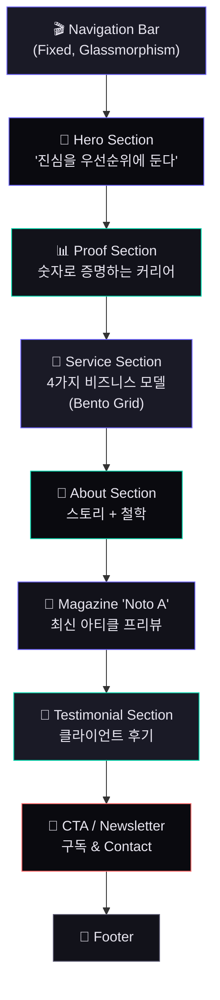

# PriSincera 공식 홈페이지 — 메인 페이지 제작 계획서

> **"복잡한 비즈니스, 진심을 담아 우선순위를 설계합니다."**
>
> — The Archive of Priority

---

## 1. 프로젝트 개요

| 항목 | 내용 |
|------|------|
| **프로젝트명** | PriSincera 공식 홈페이지 |
| **사이트 컨셉** | The Archive of Priority |
| **페르소나** | "혼돈 속의 우선순위 설계자" |
| **1차 목표** | 메인(Hero) 페이지 — 방문 3초 내 신뢰감 전달 |
| **타겟 오디언스** | 시리즈 A~B 스타트업 대표, 웹 프로덕트 고도화가 필요한 중견기업 CTO/CPO, 주니어/미들 PM |
| **핵심 톤앤매너** | 프리미엄 다크 모드 + 시네마틱 스크롤 + 절제된 화려함 |

---

## 2. 레퍼런스 사이트 분석

### 2-1. 인터랙션 & 모션 레퍼런스

| 사이트 | 핵심 특징 | PriSincera 적용 포인트 |
|--------|-----------|----------------------|
| **[Dennis Snellenberg](https://dennissnellenberg.com)** | 유려한 GSAP 스크롤 애니메이션, 커스텀 커서, 고품질 레이아웃 트랜지션 | Hero 텍스트 키네틱 타이포그래피, 섹션 전환 애니메이션의 벤치마크 |
| **[Bruno Simon](https://bruno-simon.com)** | Three.js 기반 3D 인터랙티브 환경, 게이미피케이션 | 게임 업계 경력을 반영한 인터랙티브 요소 영감 (과도한 3D는 지양) |
| **[Lusion](https://lusion.co)** | WebGL 기반 몰입감 있는 히어로, 부드러운 화면 전환 | 히어로 섹션의 시네마틱 진입 연출 참고 |
| **[Locomotive](https://locomotive.ca)** | 스무스 스크롤 + 패럴랙스의 정석, 정제된 다크 테마 | Lenis 기반 스크롤 물리감 + 패럴랙스 레이어링 기법 |

### 2-2. 컨설팅 / 퍼스널 브랜드 레퍼런스

| 사이트 | 핵심 특징 | PriSincera 적용 포인트 |
|--------|-----------|----------------------|
| **[McKinsey & Company](https://mckinsey.com)** | 절제된 타이포그래피 중심 디자인, 극한의 여백 활용, "Restrained Authority" | About/Service 섹션의 정보 밀도와 위계 설계 |
| **[Bain & Company](https://bain.com)** | 명확한 Value Proposition, Thought Leadership 콘텐츠 전면 노출 | Magazine 'Noto A' 섹션과의 연계 구조 |
| **[Pentagram](https://pentagram.com)** | 프로젝트 중심 그리드 레이아웃, 흑백 기반 + 단일 악센트 컬러 | 포트폴리오/케이스 스터디 그리드 구성 참고 |
| **[Raoul Gaillard](https://raoul-gaillard.com)** | Fractional CTO 개인 브랜드, 깔끔한 About + CTA 구조 | 1인 전문가 포지셔닝의 구조적 레퍼런스 |

### 2-3. 디자인 시스템 & 트렌드 레퍼런스

| 트렌드 | 설명 | 적용 계획 |
|--------|------|-----------|
| **Bento Grid Layout** | Apple HIG 스타일의 모듈형 카드 레이아웃 | Service 섹션에 4개 비즈니스 모델을 벤토 그리드로 배치 |
| **Glassmorphism** | 반투명 글라스 효과 + backdrop-blur | 네비게이션 바, 카드 오버레이에 적용 |
| **Kinetic Typography** | 스크롤 연동 텍스트 애니메이션 (SplitText) | Hero 카피라이팅 등장 연출 |
| **Dark Mode Toggle** | 게임 업계 아이덴티티를 반영한 다크/라이트 전환 | 글로벌 토글 (기본: 다크 모드) |
| **Micro-interactions** | 호버, 클릭, 포커스 시 미세한 피드백 애니메이션 | 모든 인터랙티브 요소에 일관성 있게 적용 |

---

## 3. 디자인 방향성

### 3-1. 컬러 팔레트

```
┌──────────────────────────────────────────────────────────┐
│  PriSincera Color System                                  │
├──────────────────────────────────────────────────────────┤
│                                                          │
│  🌑 Background (Primary)    #0A0A0F   (Deep Midnight)    │
│  🌑 Background (Secondary)  #12121A   (Charcoal Navy)    │
│  🌑 Surface                 #1A1A26   (Elevated Dark)    │
│                                                          │
│  💎 Accent (Primary)        #6C63FF   (Electric Violet)  │
│  💎 Accent (Secondary)      #00D4AA   (Emerald Glow)     │
│  💎 Accent (Warm)           #FF6B6B   (Coral Signal)     │
│                                                          │
│  📝 Text (Primary)          #E8E6F0   (Soft White)       │
│  📝 Text (Secondary)        #9896A8   (Muted Lavender)   │
│  📝 Text (Tertiary)         #5A5870   (Faded Slate)      │
│                                                          │
│  ✨ Gradient (Hero)          #6C63FF → #00D4AA            │
│  ✨ Gradient (CTA)           #6C63FF → #FF6B6B            │
│                                                          │
└──────────────────────────────────────────────────────────┘
```

> [!NOTE]
> 순수 검정(#000) 대신 Deep Midnight (#0A0A0F)를 사용하여 눈의 피로를 줄이고, Electric Violet을 주 악센트로 하여 게임/테크 업계의 감성을 전달합니다.

### 3-2. 타이포그래피

| 용도 | 폰트 | 비중 |
|------|-------|------|
| **영문 헤드라인** | **Outfit** (Google Fonts) — Geometric, Modern | Display / Bold |
| **영문 본문** | **Inter** (Google Fonts) — Neutral, Highly Legible | Regular / Medium |
| **한글 헤드라인** | **Pretendard** — 한글 + 영문 통합 가독성 최적 | Bold / ExtraBold |
| **한글 본문** | **Pretendard** | Regular / Medium |
| **코드/수치** | **JetBrains Mono** — 테크 업계 아이덴티티 | Regular |

### 3-3. 디자인 원칙

1. **"Restrained Authority"** — 화려하되 절제. 모션은 의미 있을 때만 사용
2. **"Show, Don't Tell"** — 경력은 숫자와 비주얼로 증명 (20+년, 글로벌 유저 수, 프로젝트 수)
3. **"Conversion-First"** — 모든 섹션의 마지막엔 다음 행동(CTA)으로 자연스럽게 유도
4. **"Game Industry DNA"** — 커스텀 커서, 인터랙티브 요소, 다크 모드 등으로 게임 업계 출신의 감성 반영

---

## 4. 메인 페이지 섹션 구조



### 4-1. Navigation Bar (GNB)

| 요소 | 상세 |
|------|------|
| **스타일** | Fixed top, `backdrop-filter: blur(20px)`, 반투명 다크 배경 |
| **로고** | "PriSincera" 워드마크 (Outfit Bold, Accent Gradient) |
| **메뉴** | About · Service · Noto A · Contact (최대 5개) |
| **CTA** | "Let's Talk" 버튼 (Gradient border, hover glow) |
| **다크 모드 토글** | 🌙 / ☀️ 아이콘 토글 (smooth transition) |
| **스크롤 비헤이비어** | 스크롤 다운 시 축소 · 스크롤 업 시 복원 |

### 4-2. Hero Section — "The First 3 Seconds"

> [!IMPORTANT]
> 비즈니스 문서에 명시된 핵심 목표: **"방문 3초 내에 신뢰감을 주는 카피라이팅과 프로페셔널한 인물 사진 배치"**

| 요소 | 상세 |
|------|------|
| **메인 카피** | `"복잡한 비즈니스,"`<br/>`"진심을 담아"`<br/>`"우선순위를 설계합니다."` |
| **서브 카피** | `"20+ years in Global IT · Fractional CPO · Priority Designer"` |
| **비주얼** | 고품질 인물 사진 (또는 추상적 3D 그래픽) + 파티클 / 그라디언트 오버레이 |
| **CTA** | "서비스 알아보기" + "이력 보기" (듀얼 CTA) |
| **애니메이션** | 텍스트 라인별 Stagger 페이드인 → 배경 패럴랙스 → CTA 바운스인 |
| **기술** | GSAP SplitText + ScrollTrigger, CSS backdrop gradient |

**Hero 인터랙션 시퀀스:**
```
[0.0s] 페이지 로드 → 배경 그라디언트 서서히 활성화
[0.3s] 메인 카피 1행 "복잡한 비즈니스," 아래에서 위로 페이드인
[0.6s] 메인 카피 2행 "진심을 담아" 글자별 stagger reveal
[0.9s] 메인 카피 3행 "우선순위를 설계합니다." 그라디언트 컬러 적용
[1.2s] 서브 카피 fade in (opacity 0 → 1)
[1.5s] CTA 버튼 2개 scale(0.9→1) + opacity 등장
[1.8s] 배경 파티클 / 오브 애니메이션 활성화
[2.0s] 스크롤 힌트 인디케이터 bounce 시작
```

### 4-3. Proof Section — "숫자로 말하는 커리어"

스크롤 시 카운터 애니메이션과 함께 등장하는 핵심 수치.

```
┌──────────┐  ┌──────────┐  ┌──────────┐  ┌──────────┐
│   20+    │  │   50+    │  │  100M+   │  │    5+    │
│  Years   │  │ Projects │  │  Users   │  │ Countries│
│ IT경력    │  │ 프로젝트  │  │ 글로벌유저 │  │ 글로벌경험 │
└──────────┘  └──────────┘  └──────────┘  └──────────┘
```

| 요소 | 상세 |
|------|------|
| **레이아웃** | 4-column 수평 배열 (모바일: 2×2 그리드) |
| **애니메이션** | IntersectionObserver 또는 ScrollTrigger → 숫자 카운트업 (0→목표) |
| **디자인** | 각 수치 위에 가는 accent 라인, 하단에 짧은 설명 텍스트 |

### 4-4. Service Section — "4가지 비즈니스 모델" (Bento Grid)

비즈니스 문서의 4가지 모델을 벤토 그리드 카드로 배치.

```
┌──────────────────────────┬──────────────┐
│                          │              │
│   Fractional CPO         │   Planning   │
│   / Super PM             │   Only       │
│   (자문형) ⭐ FEATURED    │   Agency     │
│                          │   (실무형)    │
├─────────────┬────────────┴──────────────┤
│             │                           │
│  '진심'      │   Global Web Service      │
│  리더십 &    │   Launching &             │
│  PM 코칭     │   Localization            │
│  (교육형)    │   (전략형)                 │
│             │                           │
└─────────────┴───────────────────────────┘
```

| 요소 | 상세 |
|------|------|
| **카드 디자인** | Glassmorphism 카드, 호버 시 border glow + elevation 증가 |
| **아이콘** | 각 서비스별 custom SVG 아이콘 (gradient fill) |
| **호버 인터랙션** | 카드 tilt (3D perspective) + 내부 콘텐츠 slide-up reveal |
| **CTA** | 각 카드 내 "자세히 보기 →" 링크 |

### 4-5. About Section — "혼돈 속의 우선순위 설계자"

| 요소 | 상세 |
|------|------|
| **레이아웃** | 좌: 인물 사진 (parallax), 우: 스토리 텍스트 |
| **스토리** | 82년생 웹 총괄의 여정을 타임라인 형식으로 축약 |
| **철학 인용문** | `"PriSincera — 진심을 우선순위에 둔다"` (대형 타이포, accent gradient) |
| **애니메이션** | 스크롤 시 사진 패럴랙스 + 텍스트 블록 순차 등장 |
| **타임라인** | 커리어 마일스톤 5~7개를 수직 타임라인으로 시각화 |

### 4-6. Magazine 'Noto A' Section — 최신 아티클 프리뷰

| 요소 | 상세 |
|------|------|
| **헤드라인** | `"Noto A — 정답에 가까운 태도와 민첩함을 기록하다"` |
| **카테고리 탭** | Directing Note · Sincere PM · Future Work |
| **카드 레이아웃** | 3-column 가로 스크롤 또는 그리드 (최신 3~4개) |
| **카드 구성** | 썸네일 이미지 + 카테고리 태그 + 제목 + 읽는 시간(Read Time) |
| **호버** | 이미지 스케일업 + 오버레이 fade-in |
| **CTA** | "모든 아티클 보기 →" |

### 4-7. CTA / Newsletter Section

| 요소 | 상세 |
|------|------|
| **헤드라인** | `"비즈니스 우선순위에 대한 인사이트를 받아보세요."` |
| **폼 구성** | 이메일 입력 + 구독 버튼 (한 줄 인라인) |
| **Contact CTA** | `"프로젝트를 논의하고 싶으신가요?"` → "Contact" 페이지로 연결 |
| **디자인** | 풀폭 gradient 배경 + 중앙 정렬 |
| **애니메이션** | 배경 그라디언트 slow shift + 폼 등장 애니메이션 |

### 4-8. Footer

| 요소 | 상세 |
|------|------|
| **구성** | 로고 + 네비게이션 링크 + SNS 링크 (LinkedIn, Brunch) + 저작권 |
| **디자인** | 미니멀, 충분한 여백, accent 컬러 링크 |

---

## 5. 인터랙션 디자인 명세

### 5-1. 스크롤 기반 애니메이션

| 기법 | 적용 위치 | 구현 방법 |
|------|-----------|-----------|
| **Smooth Scroll** | 전체 페이지 | Lenis (lerp: 0.07~0.1) |
| **Parallax Layering** | Hero 배경, About 이미지 | GSAP ScrollTrigger (scrub: 1) |
| **Stagger Reveal** | 텍스트 블록, 카드 그리드 | GSAP with stagger delay |
| **Counter Animation** | Proof 섹션 숫자 | IntersectionObserver + requestAnimationFrame |
| **Pin & Scale** | Hero → Proof 전환 | GSAP ScrollTrigger pin |
| **Horizontal Scroll** | Noto A 매거진 카드 | ScrollTrigger + x-transform |

### 5-2. 마이크로 인터랙션

| 요소 | 인터랙션 |
|------|----------|
| **커스텀 커서** | 기본: 작은 원형 dot / 호버: 확대 + 배경 블러 / 클릭: 축소 bounce |
| **버튼 호버** | Gradient border shimmer + subtle scale(1.02) |
| **카드 호버** | 3D tilt (perspective transform) + glow border |
| **링크 호버** | Underline slide animation (left → right) |
| **네비게이션** | Active section indicator sliding bar |
| **다크모드 토글** | Sun/Moon morph animation |

### 5-3. 페이지 진입 연출

```
[Loading]  → 로고 모핑 애니메이션 (2초)
[Reveal]   → 커튼 효과로 Hero 노출 (clip-path 또는 scale)
[Interact] → 마우스 움직임에 반응하는 배경 그라디언트
```

---

## 6. 기술 스택

| 카테고리 | 선택 | 선정 이유 |
|----------|------|-----------|
| **빌드 도구** | **Vite** (Vanilla JS Template) | 빠른 HMR, 가벼운 번들, 프레임워크 불필요 |
| **언어** | HTML + CSS + **Vanilla JavaScript** | 경량, 완전한 제어, 외부 의존성 최소화 |
| **스무스 스크롤** | **Lenis** | 업계 표준, GSAP과 완벽 호환 |
| **애니메이션** | **GSAP** (ScrollTrigger, SplitText) | 가장 안정적이고 성능 좋은 웹 애니메이션 라이브러리 |
| **폰트** | Google Fonts (Outfit, Inter) + Pretendard (CDN) | 무료, 고품질, 한/영 혼합 지원 |
| **아이콘** | Custom SVG + Lucide Icons | 경량, 커스터마이징 가능 |
| **배포** | 정적 호스팅 (추후 결정) | Vite 빌드 결과물은 정적 파일 |

> [!TIP]
> Vite + Vanilla JS를 선택함으로써 React/Next.js 등의 프레임워크 오버헤드 없이, 순수 웹 기술로 최고급 인터랙션을 구현합니다. GSAP + Lenis 조합은 Awwwards 수상작에서도 가장 많이 사용되는 업계 표준 스택입니다.

### 6-1. 프로젝트 구조 (예상)

```
prisincera/www/
├── index.html
├── vite.config.js
├── package.json
├── public/
│   ├── fonts/
│   ├── images/
│   │   ├── hero-portrait.webp
│   │   └── og-image.jpg
│   └── favicon.svg
├── src/
│   ├── main.js              # 엔트리: Lenis 초기화, 모듈 로드
│   ├── styles/
│   │   ├── index.css         # 디자인 시스템 (CSS Variables)
│   │   ├── reset.css         # CSS Reset
│   │   ├── typography.css    # 타이포그래피 스타일
│   │   ├── components.css    # 공통 컴포넌트 스타일
│   │   └── sections/
│   │       ├── hero.css
│   │       ├── proof.css
│   │       ├── service.css
│   │       ├── about.css
│   │       ├── magazine.css
│   │       ├── cta.css
│   │       └── footer.css
│   ├── animations/
│   │   ├── hero.js           # Hero 섹션 GSAP 타임라인
│   │   ├── scroll.js         # 스크롤 기반 애니메이션
│   │   ├── counters.js       # 숫자 카운트업
│   │   └── cursor.js         # 커스텀 커서
│   ├── components/
│   │   ├── navbar.js         # 네비게이션 로직
│   │   ├── darkmode.js       # 다크모드 토글
│   │   └── newsletter.js     # 뉴스레터 폼
│   └── utils/
│       ├── splitText.js      # 텍스트 분리 유틸
│       └── observer.js       # IntersectionObserver 래퍼
└── docs/
    └── PriSincera_Business.md
```

---

## 7. SEO & 메타데이터

```html
<title>PriSincera — 진심을 우선순위에 둔다 | Fractional CPO & PM Consulting</title>
<meta name="description" content="20년 이상의 글로벌 IT·게임 산업 경험을 바탕으로, 
    비즈니스 우선순위를 설계하는 Fractional CPO 컨설팅 서비스. PriSincera." />
<meta property="og:title" content="PriSincera — The Archive of Priority" />
<meta property="og:description" content="복잡한 비즈니스, 진심을 담아 우선순위를 설계합니다." />
<meta property="og:image" content="/images/og-image.jpg" />
<meta property="og:type" content="website" />
```

---

## 8. 반응형 브레이크포인트

| 명칭 | 범위 | 레이아웃 변화 |
|------|------|---------------|
| **Desktop XL** | ≥1440px | 풀 레이아웃, 최대 콘텐츠 폭 1200px |
| **Desktop** | 1024–1439px | 동일, 여백 축소 |
| **Tablet** | 768–1023px | 2-column → 1-column, 네비게이션 햄버거 |
| **Mobile** | ≤767px | 단일 열, 터치 최적화, 축소된 애니메이션 |

> [!WARNING]
> 모바일 환경에서는 Lenis 스무스 스크롤의 `lerp` 값을 높여(0.15~0.2) 네이티브에 가까운 감촉을 제공하고, 복잡한 3D tilt / 파티클 효과는 `prefers-reduced-motion` 및 디바이스 성능에 따라 자동 비활성화합니다.

---

## 9. 접근성 & 퍼포먼스

| 항목 | 목표 |
|------|------|
| **Lighthouse Performance** | ≥90 |
| **Lighthouse Accessibility** | ≥95 |
| **First Contentful Paint** | < 1.5초 |
| **Largest Contentful Paint** | < 2.5초 |
| **`prefers-reduced-motion`** | 모션 비활성화 fallback 지원 |
| **키보드 네비게이션** | 모든 인터랙티브 요소 Tab 접근 가능 |
| **시맨틱 HTML** | `<header>`, `<main>`, `<section>`, `<footer>` 적극 활용 |
| **이미지 최적화** | WebP 포맷, lazy loading, srcset 반응형 |

---

## 10. 개발 로드맵

### Phase 1: 기반 세팅 (Day 1)
- [ ] Vite 프로젝트 초기화 (`npm create vite@latest`)
- [ ] GSAP, Lenis 설치 및 초기 연결
- [ ] CSS 디자인 시스템 구축 (Variables, Reset, Typography)
- [ ] 기본 HTML 구조 (시맨틱 마크업)

### Phase 2: Hero & Navigation (Day 2~3)
- [ ] Glassmorphism 네비게이션 바 구현
- [ ] Hero 섹션 레이아웃 & 카피라이팅 배치
- [ ] Hero 진입 애니메이션 시퀀스 (GSAP Timeline)
- [ ] 커스텀 커서 구현
- [ ] 다크 모드 토글 구현

### Phase 3: 콘텐츠 섹션 (Day 4~5)
- [ ] Proof 섹션 (숫자 카운터 애니메이션)
- [ ] Service 섹션 (Bento Grid + 카드 인터랙션)
- [ ] About 섹션 (패럴랙스 + 타임라인)

### Phase 4: 매거진 & CTA (Day 6)
- [ ] Noto A 매거진 프리뷰 섹션
- [ ] Newsletter / CTA 섹션
- [ ] Footer

### Phase 5: 폴리싱 (Day 7~8)
- [ ] 전체 스크롤 애니메이션 튜닝
- [ ] 반응형 디자인 최적화 (Tablet, Mobile)
- [ ] `prefers-reduced-motion` 대응
- [ ] Lighthouse 성능 최적화
- [ ] OG 이미지 및 SEO 메타데이터 최종 세팅

### Phase 6: 배포 & QA (Day 9~10)
- [ ] 크로스 브라우저 테스트 (Chrome, Safari, Firefox, Edge)
- [ ] 모바일 디바이스 실기 테스트
- [ ] 최종 콘텐츠 교정
- [ ] 프로덕션 빌드 & 배포

---

## 11. 참고: 핵심 의사결정 필요 사항

> [!IMPORTANT]
> 아래 항목은 개발 착수 전 확인이 필요합니다.

| # | 항목 | 질문 |
|---|------|------|
| 1 | **인물 사진** | Hero/About에 사용할 프로페셔널 인물 사진이 준비되어 있나요? 없을 경우 추상적 비주얼로 대체합니다. |
| 2 | **로고** | PriSincera 워드마크/심볼 로고가 있나요? 없으면 텍스트 기반으로 제작합니다. |
| 3 | **언어** | 사이트 기본 언어는 한국어인가요? 영문 병기 비율은 어느 정도인가요? |
| 4 | **도메인** | prisincera.com 등 도메인이 확보되어 있나요? |
| 5 | **Noto A 콘텐츠** | 매거진에 올릴 초기 아티클이 준비되어 있나요? 더미로 시작할까요? |
| 6 | **연락처 양식** | Typeform 등 외부 폼 서비스를 연동할 계획인가요, 자체 구현인가요? |
| 7 | **뉴스레터** | 이메일 수집 후 어떤 서비스로 발송할 예정인가요? (Mailchimp, Stibee 등) |
| 8 | **호스팅** | 기존 서버를 사용할 건가요, 별도 호스팅(Vercel, Netlify 등)을 사용할 건가요? |

---

> **다음 단계:** 위 의사결정 사항 확인 후, Phase 1부터 순차적으로 개발을 진행합니다.
> 
> 피드백을 주시면 디자인 방향이나 구조를 조정하겠습니다.
