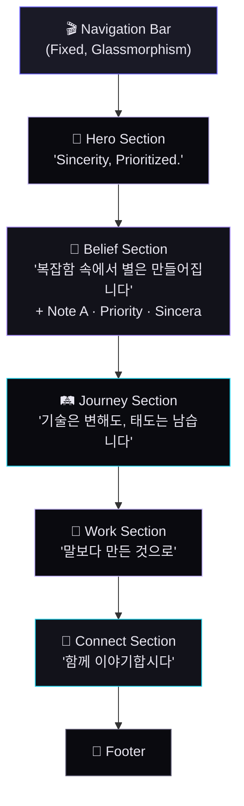

# PriSincera 공식 홈페이지 — 메인 페이지 제작 계획서

> **"진심을 우선순위에 둔다."**
>
> — 나 = PriSincera

---

## 1. 프로젝트 개요

| 항목 | 내용 |
|------|------|
| **프로젝트명** | PriSincera 공식 홈페이지 |
| **사이트 성격** | **퍼스널 브랜딩 사이트** (나 = PriSincera) |
| **핵심 컨셉** | The Archive of Priority — 20년 경험에서 발견한 태도와 철학의 기록 |
| **페르소나** | "혼돈 속의 우선순위 설계자" |
| **1차 목표** | 방문 3초 내 "이 사람은 어떤 사람인가"에 대한 인상 전달 |
| **타겟 오디언스** | 업계 동료/후배 PM·PO, 잠재적 협업 파트너, 커리어에 관심 있는 전문가 |
| **핵심 톤앤매너** | 프리미엄 다크 모드 + 시네마틱 스크롤 + 절제된 화려함 |

> [!IMPORTANT]
> **방향성 전환**: 기존 "1인 기업 비즈니스 사이트"에서 **"퍼스널 브랜딩 사이트"**로 전환.
> PriSincera는 회사명이 아닌 **개인의 철학이자 정체성**입니다.
> "어떤 서비스를 파는가"가 아닌 **"이 사람은 누구이며, 무엇을 믿는가"**를 전달합니다.

---

## 2. 레퍼런스 사이트 분석

### 2-1. 인터랙션 & 모션 레퍼런스

| 사이트 | 핵심 특징 | PriSincera 적용 포인트 |
|--------|-----------|----------------------|
| **[Dennis Snellenberg](https://dennissnellenberg.com)** | 유려한 GSAP 스크롤 애니메이션, 커스텀 커서, 고품질 레이아웃 트랜지션 | Hero 텍스트 키네틱 타이포그래피, 섹션 전환 애니메이션의 벤치마크 |
| **[Bruno Simon](https://bruno-simon.com)** | Three.js 기반 3D 인터랙티브 환경, 게이미피케이션 | 게임 업계 경력을 반영한 인터랙티브 요소 영감 (과도한 3D는 지양) |
| **[Lusion](https://lusion.co)** | WebGL 기반 몰입감 있는 히어로, 부드러운 화면 전환 | 히어로 섹션의 시네마틱 진입 연출 참고 |
| **[Locomotive](https://locomotive.ca)** | 스무스 스크롤 + 패럴랙스의 정석, 정제된 다크 테마 | Lenis 기반 스크롤 물리감 + 패럴랙스 레이어링 기법 |

### 2-2. 퍼스널 브랜딩 레퍼런스

| 사이트 | 핵심 특징 | PriSincera 적용 포인트 |
|--------|-----------|----------------------|
| **[Raoul Gaillard](https://raoul-gaillard.com)** | 개인 전문가 브랜딩, 깔끔한 About + CTA 구조 | 1인 전문가 포지셔닝의 구조적 레퍼런스 |
| **[Pentagram](https://pentagram.com)** | 프로젝트 중심 그리드, 흑백 + 단일 악센트 | Work 섹션 포트폴리오 그리드 참고 |
| **[McKinsey](https://mckinsey.com)** | 절제된 타이포그래피, 극한의 여백, "Restrained Authority" | Belief 섹션의 정보 밀도와 위계 설계 |

### 2-3. 디자인 시스템 & 트렌드 레퍼런스

| 트렌드 | 설명 | 적용 계획 |
|--------|------|-----------|
| **Glassmorphism** | 반투명 글라스 효과 + backdrop-blur | 네비게이션 바, 카드 오버레이에 적용 |
| **Kinetic Typography** | 스크롤 연동 텍스트 애니메이션 (SplitText) | Hero 카피라이팅 등장 연출 |
| **Timeline UI** | 수직/수평 타임라인 인터랙션 | Journey 섹션 커리어 스토리 |
| **Micro-interactions** | 호버, 클릭, 포커스 시 미세한 피드백 애니메이션 | 모든 인터랙티브 요소에 일관성 있게 적용 |

---

## 3. 디자인 방향성

### 3-1. 컬러 팔레트

```
┌──────────────────────────────────────────────────────────┐
│  PriSincera Color System (Star Prism CI 기반)             │
├──────────────────────────────────────────────────────────┤
│                                                          │
│  🌑 Background (Void)        #0B0B14   (Deep Space)      │
│  🌑 Background (Surface)     #12121A   (Charcoal Navy)   │
│                                                          │
│  💎 Crystal (Light)           #C4B5FD   (Crystal Violet)  │
│  💎 Crystal (Medium)          #A78BFA   (Amethyst)        │
│  💎 Crystal (Deep)            #7C3AED   (Deep Prism)      │
│  💎 Orbit (Cyan)              #22D3EE   (Orbit Cyan)      │
│  💎 Amber (Accent)            #FDE68A   (Amber Glow)      │
│                                                          │
│  📝 Text (Primary)            #E8E6F0   (Soft White)      │
│  📝 Text (Secondary)          #9896A8   (Muted Lavender)  │
│  📝 Text (Muted)              #5A5870   (Faded Slate)     │
│                                                          │
│  ✨ Gradient (Brand)           #C4B5FD → #F0ABFC → #FDE68A│
│  ✨ Gradient (Orbit)           #22D3EE → #67E8F9           │
│                                                          │
└──────────────────────────────────────────────────────────┘
```

### 3-2. 타이포그래피

| 용도 | 폰트 | 비중 |
|------|-------|------|
| **영문 헤드라인** | **Outfit** (Google Fonts) — Geometric, Modern | Display / Bold |
| **영문 본문** | **Inter** (Google Fonts) — Neutral, Highly Legible | Regular / Medium |
| **한글** | **Noto Sans KR** (Google Fonts) | Regular / Bold |
| **코드/수치** | **JetBrains Mono** — 테크 업계 아이덴티티 | Regular |

### 3-3. 디자인 원칙

1. **"Restrained Authority"** — 화려하되 절제. 모션은 의미 있을 때만 사용
2. **"Story, Not Sales"** — 서비스를 파는 것이 아니라, 사람의 이야기를 전달
3. **"Show, Don't Tell"** — 경력은 타임라인과 결과물로 증명
4. **"Invite, Don't Push"** — CTA는 영업이 아닌 대화 초대

---

## 4. 메인 페이지 섹션 구조



**스크롤 심리 흐름:**
```
선언 → 가치관 → 경험 → 결과물 → 연결
"무엇을 추구하는가" → "무엇을 믿는가" → "어떤 길을 걸어왔는가" → "무엇을 만들었는가" → "이야기하자"
```

---

### 4-1. Navigation Bar (GNB)

| 요소 | 상세 |
|------|------|
| **스타일** | Fixed top, `backdrop-filter: blur(20px)`, 반투명 다크 배경 |
| **로고** | Star Prism CI 심볼 + "PriSincera" 워드마크 |
| **메뉴** | Journey · Belief · Work · Connect (앵커 링크) |
| **스크롤 비헤이비어** | 스크롤 다운 시 축소 · 스크롤 업 시 복원 |

### 4-2. Hero Section — "The First 3 Seconds" ✅ 구현 완료

| 요소 | 상세 |
|------|------|
| **라벨** | `✦ Star Prism Identity` |
| **메인 카피** | `Sincerity, Prioritized.` |
| **서브 카피** | 가장 중요한 것을, 가장 먼저. / 멀리 있어도, 흐려져도, 본질은 반드시 찾아냅니다. |
| **비주얼** | Star Prism CI 심볼 조립 애니메이션 + 별자리 Star Map + BGM |
| **인터랙션** | Telescope 커서 + 별자리 reveal + BGM 토글 (GNB 우측 waveform 버튼) |
| **스크롤 연동** | scrollProgress > 0.75 시 CI + 카피 fade out (되돌리면 재등장) |
| **별자리 지속** | Belief 섹션 진입 시 once-on 활성화, Journey까지 유지 |

### 4-3. Belief Section — "복잡함 속에서 별은 만들어집니다" ✅ 구현 완료

> **참고**: 기존 Philosophy(CI 스토리)와 Belief(개인 가치관)를 하나의 섹션으로 통합.
> CI 해설 톤 → 개인 철학 도입부로 전환. 하단에 브랜드 선언문 추가.

| 요소 | 상세 |
|------|------|
| **섹션 라벨** | `Belief` |
| **타이틀** | `복잡함 속에서, 별은 만들어집니다.` |
| **도입 내러티브** | 흩어진 빛 → 방향을 찾는 순간 별이 됨 → 20년 여정에서 발견한 본질 |
| **Belief Cards** | Note A (태도) · Priority (우선순위) · Sincera (진심) — 각각 인용문 + 설명 |
| **마무리 선언** | `진심을 우선순위에 둔다 — 이것이 PriSincera입니다.` |
| **디자인** | Glassmorphism 카드, 스크롤 순차 등장 |

**3가지 신념:**

| 신념 | 키워드 | 인용문 | 설명 |
|------|--------|--------|------|
| **Note A** | Attitude | "기술은 변해도 태도는 남는다" | 20년을 지탱해 온 힘은 도구가 아니라 업을 대하는 단단한 태도 |
| **Priority** | Focus | "혼돈 속에서도 핵심을 찾는다" | 수많은 과제 사이에서 비전의 방향을 정돈하는 것, 그것이 우선순위 |
| **Sincera** | Trust | "진심은 결국 도달한다" | 투명하게 본질에 집중하면 신뢰는 반드시 따라온다 |

### 4-4. Journey Section — "걸어온 길" ✅ 구현 완료

> **목적**: "이 사람이 20년간 무엇을 해왔는지"를 감성적 타임라인으로 전달

| 요소 | 상세 |
|------|------|
| **섹션 라벨** | `Journey` |
| **타이틀** | `기술은 변해도, 태도는 남습니다.` |
| **서브 카피** | Waterfall에서 Agile로, 웹에서 AI로 — 강산이 두 번 변하는 동안 변하지 않은 것 |
| **레이아웃** | 수직 타임라인 — 중앙 라인 + 좌우 교차 카드 (모바일: 단일 열) |
| **타임라인 라인** | CI cyan 그라디언트, 스크롤 연동 성장 |
| **마일스톤** | 7개 — 각각 연도 + 헤드라인 + 회사 + 한 줄 요약 + 키워드 |
| **헤더 통계** | `20+ Years · 50+ Projects · 5+ Countries` (헤더 직하 배치, 카운트업) |
| **애니메이션** | IntersectionObserver → 스크롤 시 마일스톤 순차 등장 |

**타임라인 데이터:**

| 시기 | 헤드라인 | 회사 | 한 줄 | 키워드 |
|------|---------|------|------|--------|
| 2004 | 성실함으로 시작하다 | 파운드씨 | 인턴의 성실함이 정규직 제안으로 | Sincerity |
| 2007 | 게임 산업으로 도약 | 윈디소프트 | 기획자에서 PM으로, 오너십 체득 | Ownership |
| 2010 | 복잡함을 조율하다 | 네오싸이언 | 본사·자회사 사이 가교 역할 | Communication |
| 2012 | 최전선에서 소통하다 | 엠포스 | 에이전시, C-Level 고객과 직접 소통 | Challenge |
| 2014 | 전략적 파트너가 되다 | 인크루트 | 7년, 경영진의 비전을 프로덕트로 실현 | Leadership |
| 2021 | 글로벌을 리딩하다 | 그라비티 | 웹서비스개발그룹장, LATAM 진출 | Global |
| Now | AI와 함께 새로운 장 | Vibe Studio | 바이브 코딩으로 프로덕트 직접 제작 | Innovation |

### 4-5. Work Section — "만들어온 것들"

> **목적**: 결과물로 경험을 증명

| 요소 | 상세 |
|------|------|
| **섹션 라벨** | `Work` |
| **타이틀** | `말보다 만든 것으로` |
| **서브 카피** | 직접 기획하고, 직접 만듭니다 |
| **레이아웃** | 2-column 그리드 + 하단 Coming Soon 배너 |
| **프로젝트 1** | **Vibe Studio** ⭐ — AI 바이브 코딩 플랫폼 (대형 카드) |
| **프로젝트 2** | **PriSincera** — 이 사이트 자체가 브랜딩 결과물 |
| **Coming Soon** | **Noto A** — 인사이트 매거진 "정답에 가까운 태도와 민첩함을 기록하다" |
| **호버** | 스크린샷 프리뷰 + glow border |

### 4-6. Connect Section — "함께 이야기합시다"

| 요소 | 상세 |
|------|------|
| **타이틀** | `함께 이야기합시다.` |
| **서브 카피** | 비즈니스든, 커리어든, 태도에 대한 것이든 — 편하게 연결해 주세요 |
| **레이아웃** | 풀폭 gradient 배경 + 중앙 정렬 |
| **CTA** | LinkedIn 버튼 + Email 버튼 |
| **톤** | 영업적 톤 배제 — 대화 초대 |

### 4-7. Footer

| 요소 | 상세 |
|------|------|
| **구성** | Star Prism 로고 + "Sincerity, Prioritized." 태그라인 + 네비게이션 + 저작권 |
| **링크** | Journey · Belief · Work · Connect · CI Guide |
| **디자인** | 미니멀, 충분한 여백 |

---

## 5. 인터랙션 디자인 명세

### 5-1. 스크롤 기반 애니메이션

| 기법 | 적용 위치 | 구현 방법 |
|------|-----------|-----------|
| **Stagger Reveal** | 텍스트 블록, 카드 그리드 | IntersectionObserver + CSS transition |
| **Counter Animation** | Journey 하단 숫자 | IntersectionObserver + requestAnimationFrame |
| **Timeline Growth** | Journey 타임라인 라인 | 스크롤 연동 height/scaleY 변화 |
| **Parallax** | Belief 배경 | CSS transform |

### 5-2. 마이크로 인터랙션

| 요소 | 인터랙션 |
|------|----------|
| **Telescope 커서** | Hero 영역 — 마우스 따라다니는 망원경 렌즈, 별자리 reveal |
| **카드 호버** | Glassmorphism glow + subtle elevation |
| **타임라인 마일스톤** | 스크롤 시 순차 등장 + 키워드 태그 accent |
| **링크 호버** | Underline slide animation (left → right) |
| **네비게이션** | Active section indicator |

---

## 6. 기술 스택

| 카테고리 | 선택 | 선정 이유 |
|----------|------|-----------|
| **프론트엔드** | **React** + **Vite** | 컴포넌트 기반 구조, 빠른 HMR |
| **라우팅** | **React Router DOM** | SPA 클라이언트 라우팅 |
| **폰트** | Google Fonts (Outfit, Inter, Noto Sans KR, JetBrains Mono) | 무료, 고품질 |
| **호스팅** | **GCP Cloud Run** + HTTPS Load Balancer | 서울 리전, 자동 SSL |
| **CI/CD** | **Cloud Build** | GitHub push → 자동 배포 |
| **버전 관리** | **Git + GitHub** | https://github.com/matthewshim/PriSincera |

---

## 7. SEO & 메타데이터

```html
<title>PriSincera — Sincerity, Prioritized.</title>
<meta name="description" content="진심을 우선순위에 둔다. 
    20년 IT·게임 업계 경험에서 발견한 태도와 철학의 기록. PriSincera." />
<meta property="og:title" content="PriSincera — Sincerity, Prioritized." />
<meta property="og:description" content="기술은 변해도, 태도는 남습니다." />
<meta property="og:image" content="/favicon-512x512.png" />
<meta property="og:type" content="website" />
```

---

## 8. 반응형 브레이크포인트

| 명칭 | 범위 | 레이아웃 변화 |
|------|------|---------------|
| **Desktop XL** | ≥1440px | 풀 레이아웃, 최대 콘텐츠 폭 1200px |
| **Desktop** | 1024–1439px | 동일, 여백 축소 |
| **Tablet** | 768–1023px | 2-column → 1-column, 네비게이션 햄버거 |
| **Mobile** | ≤767px | 단일 열, 터치 최적화, 타임라인 단일 열 |

---

## 9. 접근성 & 퍼포먼스

| 항목 | 목표 |
|------|------|
| **Lighthouse Performance** | ≥90 |
| **Lighthouse Accessibility** | ≥95 |
| **First Contentful Paint** | < 1.5초 |
| **Largest Contentful Paint** | < 2.5초 |
| **`prefers-reduced-motion`** | 모션 비활성화 fallback 지원 |
| **키보드 네비게이션** | 모든 인터랙티브 요소 Tab 접근 가능 |
| **시맨틱 HTML** | `<header>`, `<main>`, `<section>`, `<footer>` 적극 활용 |

---

## 10. 개발 로드맵

### Phase 1: Hero + Philosophy ✅ 완료
- [x] React + Vite 프로젝트 초기화
- [x] CSS 디자인 시스템 구축
- [x] Star Prism CI 심볼 조립 애니메이션
- [x] 별자리 Star Map + Telescope 커서
- [x] BGM + Celestial Controls
- [x] Philosophy Section (Concept Cards)
- [x] GNB, Footer
- [x] Favicon (CI 기반)
- [x] GCP Cloud Run 배포

### Phase 2: Belief + Journey ✅ 완료
- [x] Belief Section — 3가지 신념 카드 (태도/우선순위/진심) + 브랜드 선언문
- [x] Journey Section — 수직 타임라인 + 7개 마일스톤 카드
- [x] Journey 헤더 통계 (20+ / 50+ / 5+) — 헤더 직하 배치
- [x] 섹션 간 여백 최적화 (Belief→Journey→Footer 통일)
- [x] Hero CI + 카피 스크롤 fade-out / 재등장 (scrollProgress 기반)
- [x] 별자리 once-on 패턴 (Journey까지 유지)
- [x] BGM 토글 GNB 우측 이전 (React Portal, waveform 바)
- [x] scrollbar-gutter: stable (레이아웃 시프트 방지)
- [x] Canvas 30fps 제한 (StarField, EnergyCirculation, ConstellationAssembly)
- [x] BGM 압축 (4.1MB → 1.3MB, 64kbps mono)

### Phase 3: Work + Connect ← 다음 진행
- [ ] Work Section — 프로젝트 쇼케이스 그리드
- [ ] Vibe Studio 카드 (대형, 스크린샷 프리뷰)
- [ ] PriSincera CI 카드 (이 사이트 자체)
- [ ] Noto A Coming Soon 배너
- [ ] Connect Section — LinkedIn + Email CTA
- [ ] Footer 링크 업데이트

### Phase 4: 폴리싱
- [ ] 전체 스크롤 애니메이션 튜닝
- [ ] 반응형 디자인 최적화 (Tablet, Mobile)
- [ ] `prefers-reduced-motion` 대응
- [ ] Lighthouse 성능 최적화
- [ ] OG 이미지 및 SEO 메타데이터 최종 세팅

---

## 11. 확인 필요 사항

> [!IMPORTANT]
> 아래 항목은 개발 착수 전 확인이 필요합니다.

| # | 항목 | 질문 |
|---|------|------|
| 1 | **타임라인 연도** | Journey의 각 커리어 시작 연도가 정확한지 확인 필요 (현재는 Branding.md 기반 추정) |
| 2 | **인물 사진** | Journey/About 영역에 인물 사진 사용 여부. 없으면 CI 심볼 기반 그래픽으로 대체 |
| 3 | **LinkedIn URL** | Connect 섹션에 사용할 LinkedIn 프로필 URL |
| 4 | **연락처 이메일** | Connect 섹션에 사용할 이메일 주소 |
| 5 | **Proof 수치** | 20+ Years, 50+ Projects 등 숫자의 정확성 |

---

> **다음 단계**: 위 확인 사항 피드백 후, Phase 2 (Journey + Belief)부터 구현을 시작합니다.
