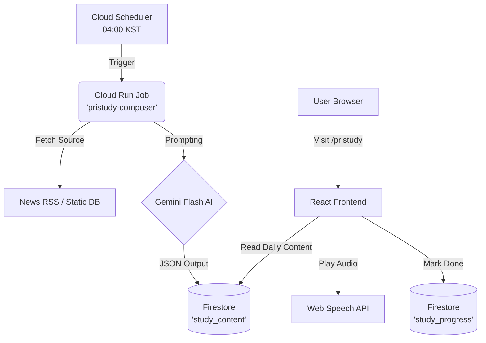

# PriSincera: PriStudy MVP (Phase 1) 개발 계획 및 아키텍처

본 문서는 PriStudy 서비스의 Phase 1 (최소 기능 구현 - MVP) 버전을 성공적으로 론칭하기 위한 구체적인 개발 계획과 데이터베이스, 아키텍처 설계를 다룹니다.

---

## 1. 개요 및 MVP 범위 (Scope)

**목표:** 매일 1개의 "비즈니스/IT 일본어 문장"을 완전 자동화된 파이프라인으로 생성하고, 직장인 사용자가 모바일/웹 환경에서 플래시카드 형태로 학습하며 출석(잔디 심기)을 기록할 수 있는 최소한의 시스템 구축.

**포함되는 기능 (In-Scope):**
*   **백엔드:** Gemini AI를 활용한 매일 1문장(번역, 요미가나, 단어장, 코멘트 포함) 자동 생성 파이프라인.
*   **프론트엔드:** `/pristudy` 전용 페이지, 플래시카드 UI, Web Speech API (또는 GC TTS) 기반 발음 듣기.
*   **사용자 관리:** Firebase Auth 기반 로그인 연동, Firestore를 통한 개별 유저의 일일 학습 완료 기록(Streak) 저장.
*   **관리자 (Admin):** PriStudy 전용 대시보드(학습 지표), 자동 생성된 콘텐츠의 열람 및 수정(Edit) 기능.

**제외되는 기능 (Out-of-Scope - Phase 2 이후):**
*   주간 퀴즈 시스템, 에빙하우스 복습 알림, 자체 고품질 TTS 커스텀 모델, 일본어 외 다른 언어 지원.

---

## 2. 시스템 아키텍처 (Architecture)

기존 PriSignal에서 검증된 **GCP Cloud Run + Cloud Scheduler + Firestore** 기반의 서버리스 아키텍처를 그대로 활용합니다.

---

## 3. 데이터베이스 스키마 설계 (Firestore)

### 3.1 `study_content` 컬렉션 (매일 생성되는 학습 자료)
*   **Document ID:** `YYYY-MM-DD` (예: `2026-05-04`)
*   **Fields:**
    *   `date`: "2026-05-04"
    *   `sentence_jp`: "AIの導入により、業務効率化が急速に進んでいます。"
    *   `sentence_furigana`: "AIの 導入(どうにゅう)により、業務(ぎょうむ) 効率化(こうりつか)が 急速(きゅうそく)に 進(すす)んでいます。"
    *   `sentence_kr`: "AI 도입으로 인해 업무 효율화가 급속히 진행되고 있습니다."
    *   `vocabulary`: Array of Objects
        *   `[{word: "導入", reading: "どうにゅう", meaning: "도입"}]`
    *   `business_context`: "최근 IT 트렌드 회의나 보고서에서 서론으로 자주 쓰이는 매우 정중하고 격식 있는 표현입니다."
    *   `createdAt`: Timestamp

### 3.2 `study_progress` 컬렉션 (유저별 학습 트래킹 - 잔디 심기)
*   **Document ID:** `{userId}` (Firebase Auth UID)
*   **Fields:**
    *   `uid`: "user1234..."
    *   `completed_dates`: Array of Strings `["2026-05-01", "2026-05-02", "2026-05-04"]`
    *   `current_streak`: 1
    *   `longest_streak`: 12
    *   `last_study_date`: "2026-05-04"

---

## 4. 관리자(Admin) 기능 기획 (PriStudy)

최근 개편된 Admin 대시보드의 PriStudy 1Depth 메뉴를 활용하여 다음 관리 기능들을 구축합니다.

### 4.1. 대시보드 (Overview)
*   **학습 참여율 지표:** 일일/주간 활성 학습자(DAU/WAU), 평균 연속 학습 일수(Average Streak).
*   **콘텐츠 적재 현황:** 파이프라인에 의해 자동 생성되어 Firestore에 적재된 학습 콘텐츠 누적 개수.

### 4.2. 콘텐츠 관리 (Content Management)
*   **콘텐츠 열람 및 수정 (CRUD):** AI 파이프라인(`pristudy-composer`)이 자동 생성한 데이터를 조회하고, 오역이나 어색한 표현이 있을 경우 관리자가 직접 수정(Edit)할 수 있는 인터페이스 제공.
*   **수동 발행 (Manual Publishing):** 특정 날짜(예: 연휴, 특별 이벤트)에 관리자가 직접 선정한 문장을 수동으로 등록할 수 있는 기능.

### 4.3. 학습자 현황 (Learner Progress)
*   **우수 학습자 모니터링:** 최장 기간 잔디(Longest Streak)를 유지 중인 유저 목록 조회 기능. 향후 리워드 혹은 리텐션 프로모션 타겟팅에 활용.

---

## 5. 단계별 개발 계획 (Implementation Steps)

### Step 1: 자동화 파이프라인(Backend) 구축
1.  **프롬프트 엔지니어링:** Gemini API에게 비즈니스 일본어 1문장을 요구하는 명확한 JSON 스키마 프롬프트 작성 (`pipeline/src/templates/study-prompt.txt`).
2.  **`study-composer.mjs` 작성:** 
    *   PriSignal의 `composer.mjs`를 복제하여 PriStudy 전용 백엔드 파이프라인 생성.
    *   일본 최신 IT 뉴스 (ex: Nikkei RSS) 크롤링 또는 사전에 준비된 비즈니스 100문장 DB에서 1개를 무작위 선택하여 AI에게 전달.
    *   결과물을 Firestore `study_content` 컬렉션에 저장.
3.  **GCP 배포:** Cloud Run Job(`pristudy-composer`) 생성 및 매일 새벽 4시에 동작하는 Cloud Scheduler 연결.

### Step 2: 플래시카드 및 코어 UI 개발 (Frontend)
1.  **라우트 추가:** `App.jsx`에서 `/pristudy` 라우팅 개방.
2.  **`PriStudyCard.jsx` 컴포넌트:** 
    *   앞면: 일본어 한자 + 후리가나 표기.
    *   뒷면(스와이프/클릭 시): 한국어 해석, 단어장, 에디터 코멘트 노출.
3.  **발음 듣기 (TTS):** 브라우저 내장 `window.speechSynthesis`를 우선 사용하여 일본어 음성(`ja-JP`) 재생 구현 (초기 개발 비용 및 로드 속도 최소화).

### Step 3: 출석체크(잔디 심기) 및 Auth 연동 (Frontend & DB)
1.  **로그인 강제 로직:** PriStudy는 개인의 진도율 저장이 필수이므로, 비로그인 유저가 접속 시 로그인 유도 모달 띄우기.
2.  **'학습 완료' 버튼:** 카드를 뒤집고 학습을 마친 후 [완료하기] 버튼 클릭 시, Firestore `study_progress`에 오늘 날짜(`YYYY-MM-DD`) 추가.
3.  **`ContributionGraph.jsx` 컴포넌트:** GitHub 잔디밭과 동일한 UI를 CSS Grid로 구현. 사용자의 `completed_dates` 배열을 읽어와 이번 달/이번 주 잔디 색상(예: PriSincera Accent Color) 칠하기.

---

## 6. Timeline & Definition of Done (완료 기준)

*   **예상 소요 시간:** 1주 ~ 2주 이내 (기존 PriSincera 생태계 및 인프라를 재활용하므로 속도감 있게 진행 가능)
*   **론칭 조건 (DoD):**
    1.  관리자(Admin)의 수동 조작 없이 매일 새벽에 새로운 일본어 학습 데이터가 DB에 적재되어야 함.
    2.  유저가 접속하여 플래시카드 UI에서 일본어 발음을 정상적으로 들을 수 있어야 함.
    3.  학습 완료 시 잔디밭 캘린더에 색이 칠해지고, 새로고침해도 해당 기록이 유지되어야 함.
    4.  Admin 대시보드에서 전체 유저의 일일 학습 참여 통계를 확인할 수 있어야 함.
