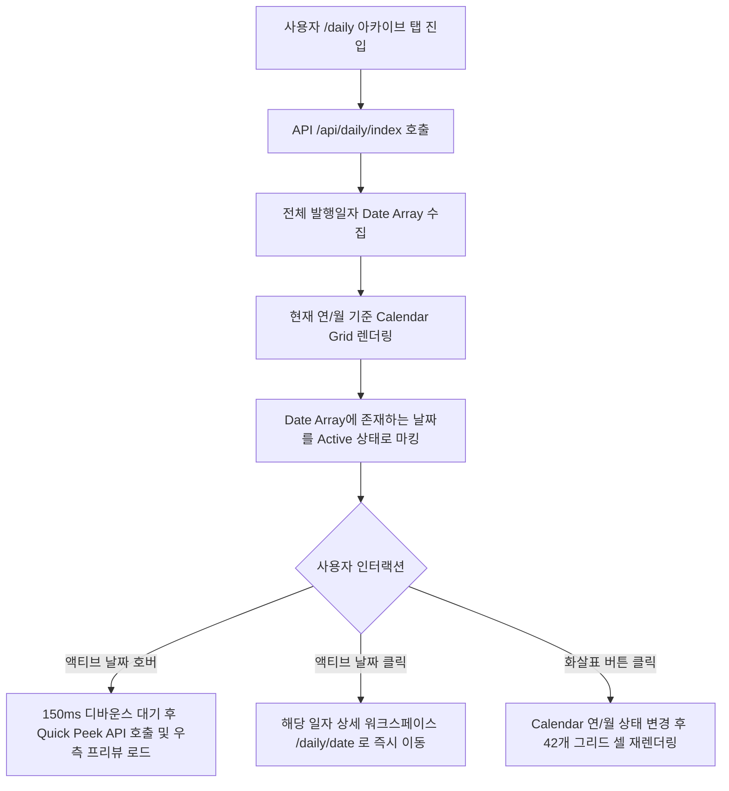

# 📐 Daily Digest UI 명세서 (Chrono-Calendar)

> 🗄️ **[ARCHIVED — ReLearn 통합]** 본 문서가 규정하던 /daily 페이지 UI는 2026-07-20 ReLearn으로 통합·비공개되었습니다. 채널 콘텐츠 규격은 공용 컴포넌트(Signal/Prompt/Japanese/Track)로 승계되어 ReLearn이 소비합니다.

## 📝 Revision History

| Version | Date | Author | Description | Impact Area |
| :--- | :--- | :--- | :--- | :--- |
| v1.0 | 2026-05-21 | AI Agent | 42개 셀 고정 렌더링, 150ms 호버 디바운스, 2-Stage 모바일 UX 및 CLS 방지 사양서 작성 | DailyDigest UI |
| v1.1 | 2026-06-23 | AI Agent | 상세 워크스페이스에 **🛰️ 테크 트랙 탭**(주니어/시니어 트랙 시그널 + 도메인 필터 + Click-to-Orbit) 가산. 트랙 피드 서버 프록시(`GET /api/daily/:date/track/:track`) 및 출처 정책(생성형·URL 없음) 명시 | DailyDigest Tech Track |

본 문서는 일자별 다이제스트 목록을 직관적으로 탐색하고 프리미엄한 아카이브 경험을 전달하기 위해 설계된 **Daily Digest 캘린더 그리드(Chrono-Calendar) 및 0-Lag 퀵 피크(Quick Peek) UI/UX**의 최종 구현 사양서입니다.

2026년 5월 20일 최종 조율을 거쳐 프로덕션 환경에 안정적으로 적용되었으며, 레이아웃 탄력성과 기하학적 종횡비를 보장하는 고성능 사양으로 구축 완료되었습니다.

---

## 1. 배경 및 구현 개요

기존의 단순 수직 그리드 카드 리스트는 다이제스트 누적에 따라 탐색 스크롤이 무한히 늘어나 사용자 피로도를 가중시키는 문제점이 있었습니다. 이를 해결하기 위해 데스크톱 6:4 비율의 좌우 이원화 Bento 레이아웃과 모바일 전용 수직 스택 레이아웃을 도입했습니다.

* **구현 완료 일자**: 2026-05-20
* **구현 컴포넌트**:
  * [DailyCalendar.jsx](file:///d:/prisincera/www/src/components/daily/DailyCalendar.jsx) - KST 기준 동작 제어, 42개 셀 고정 렌더링, 150ms 호버 디바운스.
  * [DailyCalendar.css](file:///d:/prisincera/www/src/components/daily/DailyCalendar.css) - 글래스모피즘 스킨, 네온 아우라 광원(hotspot-glow), 수직 늘어남 방지(`align-self`, `aspect-ratio`).

---

## 2. UI/UX 디자인 핵심 콘셉트

### 1) Bento Chrono-Calendar Layout (달력 그리드)
* **데스크톱 레이아웃**: 좌측에는 데스크톱 전용 **'인터랙티브 캘린더'**를, 우측에는 달력 날짜에 호버/선택된 일자의 주요 소식을 실시간으로 요약해 보여주는 **'퀵 피크(Quick Peek / Featured Card)'** 영역을 배치하여 화면을 좌우 균형 있게 이원화합니다.
* **모바일 레이아웃**: 상단에 압축된 형태의 캘린더 그리드를 배치하고, 하단에 퀵 피크 카드 목록을 수직 배치하여 터치와 스캔을 물 흐르듯 유도합니다.

### 2) Ambient Glow Hotspot (발행일 시각화)
* 다이제스트가 **발행된 날짜(Active Day)**에는 다크모드 배경 위에 은은한 네온 아우라 광원(Ambient Glow)을 투사하여 몰입감을 극대화합니다.
* 날짜를 호버하면 미세한 바운스 물리 효과와 함께 테두리가 보라색(`rgba(167, 139, 250, 0.4)`)으로 빛나며, 내부의 액티브 도트가 확장되고 흰색으로 모핑됩니다.
* 오늘(Today)에 해당하는 날짜는 골드 테두리와 `TODAY` 마이크로 인디케이터 배지로 완벽히 고정 포커스합니다.

### 3) 0-Lag Performance (데이터 경량화 아키텍처)
* 캘린더 화면 전환 시 불필요하게 모든 일자별 상세 데이터를 다 불러오는 대신, `/api/daily/index`가 반환하는 **'발행 일자 목록(Date String Array)'**만 초기에 경량 로드합니다.
* 사용자가 특정 활성 날짜를 호버하는 순간에만 해당 일자의 세부 API(`/api/daily/{date}`)를 지연 로드(Lazy Load)하여 메모리 누수를 방지하고 고성능을 유지합니다.

---

## 3. 인터랙션 및 상태 관리 흐름



---

## 4. 컴포넌트 마크업 실질 구현

프로덕션에 성공적으로 결합된 `DailyCalendar.jsx` 소스 코드입니다.

### 📂 [DailyCalendar.jsx](file:///d:/prisincera/www/src/components/daily/DailyCalendar.jsx)

```jsx
import { useState } from 'react';
import './DailyCalendar.css';

export default function DailyCalendar({ publishedDates = [], onSelectDate, onHoverDate }) {
  const [currentDate, setCurrentDate] = useState(new Date());

  // KST Standard Today String (YYYY-MM-DD)
  const todayKST = new Date(Date.now() + 9 * 60 * 60 * 1000);
  const todayStr = todayKST.toISOString().slice(0, 10);

  const year = currentDate.getFullYear();
  const month = currentDate.getMonth(); // 0-11

  // Navigate to previous month
  const handlePrevMonth = () => {
    setCurrentDate(new Date(year, month - 1, 1));
  };

  // Navigate to next month (block navigating to the future)
  const handleNextMonth = () => {
    const nextMonthDate = new Date(year, month + 1, 1);
    const limitDate = new Date(todayKST.getFullYear(), todayKST.getMonth(), 1);
    if (nextMonthDate <= limitDate) {
      setCurrentDate(nextMonthDate);
    }
  };

  // Check if next month is in the future to disable the navigation button
  const isNextDisabled = () => {
    const nextMonthDate = new Date(year, month + 1, 1);
    const limitDate = new Date(todayKST.getFullYear(), todayKST.getMonth(), 1);
    return nextMonthDate > limitDate;
  };

  // Generate calendar grid cells (Always 42 cells to prevent layout shift)
  const getGridCells = () => {
    const cells = [];
    const firstDayIndex = new Date(year, month, 1).getDay(); // Day of week for 1st day (0-6)
    const totalDays = new Date(year, month + 1, 0).getDate(); // Total days in current month

    // 1. Previous month's padding days
    const prevMonthDays = new Date(year, month, 0).getDate();
    for (let i = firstDayIndex - 1; i >= 0; i--) {
      const prevDay = prevMonthDays - i;
      const prevMonth = month === 0 ? 11 : month - 1;
      const prevYear = month === 0 ? year - 1 : year;
      const dateString = `${prevYear}-${String(prevMonth + 1).padStart(2, '0')}-${String(prevDay).padStart(2, '0')}`;
      cells.push({
        day: prevDay,
        isCurrentMonth: false,
        dateString,
      });
    }

    // 2. Current month's days
    for (let day = 1; day <= totalDays; day++) {
      const dateString = `${year}-${String(month + 1).padStart(2, '0')}-${String(day).padStart(2, '0')}`;
      cells.push({
        day,
        isCurrentMonth: true,
        dateString,
      });
    }

    // 3. Next month's padding days (fill up to 42 cells to prevent layout shifting)
    const remainingCells = 42 - cells.length;
    for (let day = 1; day <= remainingCells; day++) {
      const nextMonth = month === 11 ? 0 : month + 1;
      const nextYear = month === 11 ? year + 1 : year;
      const dateString = `${nextYear}-${String(nextMonth + 1).padStart(2, '0')}-${String(day).padStart(2, '0')}`;
      cells.push({
        day,
        isCurrentMonth: false,
        dateString,
      });
    }

    return cells;
  };

  const gridCells = getGridCells();

  return (
    <div className="chrono-calendar-wrapper">
      <div className="calendar-header">
        <button onClick={handlePrevMonth} className="calendar-nav-btn" aria-label="이전 달">
          <svg width="16" height="16" viewBox="0 0 16 16" fill="none">
            <path d="M10 12L6 8L10 4" stroke="currentColor" strokeWidth="1.5" strokeLinecap="round" strokeLinejoin="round"/>
          </svg>
        </button>
        <h3 className="calendar-month-title">
          <span className="calendar-year">{year}년</span>
          <span className="calendar-month">{String(month + 1).padStart(2, '0')}월</span>
        </h3>
        <button 
          onClick={handleNextMonth} 
          disabled={isNextDisabled()} 
          className={`calendar-nav-btn ${isNextDisabled() ? 'disabled' : ''}`}
          aria-label="다음 달"
        >
          <svg width="16" height="16" viewBox="0 0 16 16" fill="none">
            <path d="M6 4L10 8L6 12" stroke="currentColor" strokeWidth="1.5" strokeLinecap="round" strokeLinejoin="round"/>
          </svg>
        </button>
      </div>

      <div className="calendar-grid">
        {/* Day of Week Headers */}
        {['일', '월', '화', '수', '목', '금', '토'].map((weekday, idx) => (
          <div key={weekday} className={`grid-weekday ${idx === 0 ? 'sun' : idx === 6 ? 'sat' : ''}`}>
            {weekday}
          </div>
        ))}

        {/* Date Grid Cells */}
        {gridCells.map((cell, idx) => {
          const dateStr = cell.dateString;
          const isActive = publishedDates.includes(dateStr);
          const isToday = dateStr === todayStr;
          
          return (
            <button
              key={idx}
              disabled={!isActive}
              onMouseEnter={() => isActive && onHoverDate(dateStr)}
              onClick={() => isActive && onSelectDate(dateStr)}
              className={`calendar-day-cell ${cell.isCurrentMonth ? 'current-month' : 'other-month'} ${isActive ? 'active' : ''} ${isToday ? 'today' : ''}`}
              title={isActive ? `${dateStr} 다이제스트 요약 보기` : dateStr}
            >
              <div className="day-number-container">
                <span className="day-number">{cell.day}</span>
                {isToday && <span className="today-badge">TODAY</span>}
              </div>
              
              {isActive && (
                <div className="hotspot-wrapper">
                  <span className="hotspot-dot" />
                  <span className="hotspot-glow" />
                </div>
              )}
            </button>
          );
        })}
      </div>
    </div>
  );
}
```

---

## 5. Layout Resiliency & Grid Alignment Constraints

캘린더와 우측 퀵 피크 미리보기 영역은 데스크톱에서 하나의 큰 그리드(`.daily-bento-portal`)로 정합하여 동작합니다. 우측 미리보기 영역의 큐레이션 콘텐츠가 대량으로 길어지더라도, **좌측 캘린더 그리드가 세로로 길어지거나 날짜 셀이 붕괴하지 않도록 보장하는 절대적인 CSS 정렬 가이드**를 확립했습니다.

### 1) 수직 늘어남(Stretching) 원천 방지
* **문제점**: CSS Grid나 Flexbox의 기본 수직 정렬 속성은 `stretch`이므로 한쪽 칼럼의 길이가 무한히 확장되면 반대쪽 칼럼 역시 빈 영역을 메우기 위해 강제 확장됩니다. 이 과정에서 캘린더 보디와 날짜 셀이 흉측하게 상하로 늘어납니다.
* **해결책**: 좌측 캘린더 영역을 감싸는 `.bento-calendar-section` 플렉스 컨테이너와 우측 퀵 피크 영역 `.bento-quick-peek-section`에 각각 `align-items: start;` 및 `align-self: start;`를 강제 부여하여 자식 요소들이 자신의 고유 콘텐츠 높이(`fit-content`)만을 가지도록 강하게 조율합니다.

```css
.bento-calendar-section {
  display: flex;
  justify-content: center;
  align-items: start; /* 수직 늘어남(stretch) 방지 */
  width: 100%;
  align-self: start;  /* 그리드 트랙 내 상단 정렬 고수 */
}

.bento-quick-peek-section {
  width: 100%;
  position: sticky;
  top: 120px;
  align-self: start;  /* 스티키 동작 활성화를 위한 수직 상단 제어 */
}
```

### 2) 날짜 셀 1:1 정방형 비율 고수 (`aspect-ratio: 1`)
* **문제점**: 브라우저 렌더러는 수직 `stretch` 인장력이 가해지거나 부모가 늘어날 때 자식 요소의 `aspect-ratio` 지정을 종종 무시합니다.
* **해결책**:
  * 캘린더 전체 외곽을 감싸는 `.chrono-calendar-wrapper`에 `height: fit-content;`를 지정하여 불필요한 높이 팽창을 방지합니다.
  * `.calendar-grid`에 `align-items: start;`를 선언하여 42개 격자 셀(`button.calendar-day-cell`)이 상하 견인력을 받지 않도록 합니다. 이를 통해 모든 날짜 셀은 어떠한 극한의 종단 텍스트 흐름 아래에서도 기하학적인 완벽 정방형 비율을 보장받습니다.

```css
.chrono-calendar-wrapper {
  height: fit-content; /* 세로 팽창 방지 */
}

.calendar-grid {
  display: grid;
  grid-template-columns: repeat(7, 1fr);
  gap: 8px;
  justify-items: stretch;
  align-items: start; /* 셀의 1:1 종횡비를 지키기 위한 절대적 장치 */
}
```

---

## 6. 성능 및 모바일 2-Stage Tap UX Flow 가이드

* **Accidental Navigation (오작동 방지)**:
  * 모바일 기기 터치 시 활성 날짜를 살짝 누르기만 해도 의도치 않게 상세 콘텐츠 화면으로 급작스럽게 화면 전환이 이탈해버리는 UX 피로도를 원천 차단하기 위해 **2단계 검증 플로우**를 설계했습니다.
  * **1단계 (1st Tap)**: 모바일에서 날짜 셀 터치 시 상세 페이지로 다이렉트 이송하지 않고, 날짜 활성화 상태로 마킹한 후 하단에 위치한 **Quick Peek 요약 프리뷰 패널**에 데이터를 바인딩한 후 프리뷰 영역으로 `scrollIntoView({ behavior: 'smooth' })`를 유연히 발동합니다.
  * **2단계 (2nd Tap)**: 사용자가 프리뷰 패널에 노출된 핵심 카테고리 요약을 스캔하고, 의도적으로 **"전체 콘텐츠 상세히 보기 →"** 링크 버튼을 의도적으로 추가 터치했을 때만 최종 상세 화면(`/daily/{date}`)으로 이송합니다.

---

## 7. 테크 트랙 탭 (Tech Track) — v1.1

상세 워크스페이스(`/daily/{date}`)의 세그먼트 탭에 기존 `signal` / `prompt` / `japanese`에 더해 **🛰️ 테크 트랙** 탭을 가산한다. 수준별(주니어/시니어) AI 생성 테크 시그널 카드를 노출하는 자립형 컴포넌트(`TrackSignalFeed.jsx`)이다.

### 1) 데이터 경로
* 서버 프록시 **`GET /api/daily/:date/track/:track`**(`server.mjs`)가 GCS의 `daily/${track}_${date}.json`을 중계한다(클라이언트는 GCS 직접 접근 안 함).
* 탭은 `data.date`가 있을 때만 노출(아카이브/인덱스 뷰에서 `data`가 배열일 때 오작동 방지 가드).

### 2) UI 구성
* **트랙 토글**: `주니어-미드` / `시니어-리더` 세그먼트 전환(전환 시 해당 트랙 피드 재페치, 필터 초기화).
* **관심 도메인 필터 칩**: `전체` + `ai_llm` / `system_design` / `devops` / `tech_lead` — 피드에 존재하는 도메인만 칩 노출.
* **카드**: 도메인 배지 + 태그(`#소문자`) + 제목 + 요약 + `action_challenge`(3 task 미리보기) + **[＋오빗에 추가]** 버튼.

### 3) Click-to-Orbit (배움 → 실행)
* 카드의 **[＋오빗에 추가]** → `POST /api/pacenote/add-orbit`(로그인 필요, 401 시 토큰 갱신 재시도, 409=멱등 성공). 상세는 [pacenote/ui_specification.md](../pacenote/ui_specification.md) §12.

### 4) 콘텐츠 출처 (중요)
* 테크 트랙 카드는 **RSS 수집이 아닌 AI(Gemini) 생성** 콘텐츠로 **원문 URL이 없다.** "원문 읽기" 류 링크를 두지 않으며, 사실성·고지 정책은 [content_sourcing_policy.md](content_sourcing_policy.md)를 따른다. (기존 IT Tech Signal은 실제 RSS 수집·원문 링크 보유)
