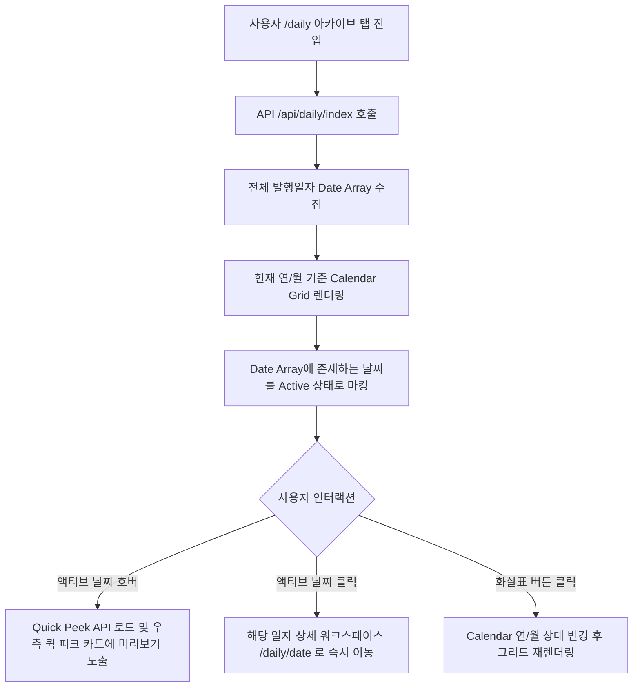

# PriSincera Daily Digest Calendar UI Renewal Proposal

## 1. 배경 및 필요성

현재 Daily Digest 목록 페이지(`/daily`)는 일자별 다이제스트 카드를 순차적으로 쌓아서 리스트 형태로 보여주는 단순 그리드 방식을 취하고 있습니다.
* **현재 상태**: 2026년 5월부터 다이제스트 발행을 시작하여 발행량이 적을 때는 문제가 없으나, 콘텐츠가 누적됨에 따라 하단으로 길어지는 목록은 사용자의 탐색 경로를 늘리고 피로도를 가중시킵니다.
* **개선 방향**: 정보의 "아카이브화" 및 "타임라인 탐색 편의성"을 극대화하기 위해, 직관적이고 감각적인 **인터랙티브 캘린더 UI(Chrono-Calendar & Workspace Portal)**로 전면 개편합니다. 사용자는 과거의 유용한 지식(IT Tech, AI, 일본어)을 날짜별 그리드를 통해 한눈에 스캔하고 빠르게 도달할 수 있게 됩니다.

---

## 2. UI/UX 디자인 핵심 콘셉트

### 1) Bento Chrono-Calendar Layout (달력 그리드)
* **데스크톱 레이아웃**: 좌측에는 데스크톱 전용 **'인터랙티브 캘린더'**를, 우측에는 달력에서 마우스를 올리거나 최신 발행된 일자의 주요 소식을 보여주는 **'퀵 피크(Quick Peek / Featured Card)'** 영역을 배치하여 화면을 좌우 균형 있게 이원화합니다.
* **모바일 레이아웃**: 상단에 압축된 형태의 캘린더 그리드를 배치하고, 하단에 스와이프 가능한 최신 다이제스트 피드 카드 목록을 연결하는 상하 배치 스택(Vertical Stack)으로 대응합니다.

```
[ Desktop Layout Mockup ]
+-------------------------------------------------------------------------+
|                              Daily Digest                               |
|   매일 아침 배달되는 글로벌 트렌드 큐레이션, AI 프롬프트, 비즈니스 어학  |
+------------------------------------+------------------------------------+
|               CALENDAR             |             QUICK PEEK             |
|          <  2026년 05월  >         |       ★ 최신 다이제스트 (05-20)     |
|   일  월  화  수  목  금  토       |  +------------------------------+  |
|   26  27  28  29  30  01  02       |  | 📰 IT Tech Signal (3)        |  |
|   03  04  05  06  07  08  09       |  | 🤖 AI Workstation            |  |
|   10  11  12  13  14  15  16       |  | 🇯🇵 Language Dojo            |  |
|   17  18  19 [20] 21  22  23       |  +------------------------------+  |
|   24  25  26  27  28  29  30       |  | 💡 Insight Preview           |  |
|   31  01  02  03  04  05  06       |  | 어쩌구 저쩌구 미리보기...    |  |
+------------------------------------+------------------------------------+
```

### 2) Ambient Glow Hotspot (발행일 시각화)
* 다이제스트가 **발행된 날짜(Active Day)**에는 다크모드 배경 위에 은은한 네온 아우라 광원(Ambient Glow)을 투사하여 마치 밤하늘의 밝게 빛나는 별들처럼 연출합니다.
* 날짜를 호버하면 미세한 바운스 물리 효과와 함께 당일 다이제스트의 카테고리 테마 색상(IT=Lavender, AI=Cyan, JP=Rose)이 믹싱되어 당일 수록된 콘텐츠 요약 툴팁을 시각적으로 나타냅니다.
* 오늘(Today)에 해당하는 날짜는 골드 테두리와 `TODAY` 초소형 마이크로 인디케이터로 포커스합니다.

### 3) 0-Lag Performance (데이터 경량화 아키텍처)
* 캘린더 화면 전환 시 불필요하게 모든 일자별 상세 데이터를 다 불러오는 대신, `/api/daily/index`가 반환하는 **'발행 일자 목록(String Array)'**만 초기에 빠르게 로드합니다.
* 사용자가 특정 액티브 일자를 클릭하거나 호버(Quick Peek)하는 순간에만 해당 일자의 세부 API(`/api/daily/{date}`)를 지연 로드(Lazy Load)하여 메모리 낭비를 제로화하고 극도로 쾌적한 런타임을 실현합니다.

---

## 3. 인터랙션 및 상태 관리 흐름



---

## 4. 컴포넌트 마크업 설계안

### 📂 `src/components/daily/DailyCalendar.jsx` (신설)
캘린더 제어 및 렌더링 로직을 전담하는 프리미엄 React 컴포넌트를 설계합니다.

```jsx
import { useState } from 'react';
import './DailyCalendar.css';

export default function DailyCalendar({ publishedDates, onSelectDate, onHoverDate }) {
  const [currentDate, setCurrentDate] = useState(new Date());
  
  // 캘린더 그리드 빌드 헬퍼 함수군
  const year = currentDate.getFullYear();
  const month = currentDate.getMonth(); // 0-11
  
  const handlePrevMonth = () => {
    setCurrentDate(new Date(year, month - 1, 1));
  };
  
  const handleNextMonth = () => {
    const today = new Date();
    if (new Date(year, month + 1, 1) <= today) {
      setCurrentDate(new Date(year, month + 1, 1));
    }
  };
  
  // ... grid 계산 로직 수록
  
  return (
    <div className="chrono-calendar-wrapper">
      <div className="calendar-header">
        <button onClick={handlePrevMonth} className="calendar-nav-btn">◀</button>
        <span className="calendar-month-title">{year}년 {month + 1}월</span>
        <button onClick={handleNextMonth} className="calendar-nav-btn">▶</button>
      </div>
      
      <div className="calendar-grid">
        {/* 요일 헤더 */}
        {['일', '월', '화', '수', '목', '금', '토'].map(d => (
          <div key={d} className="grid-weekday">{d}</div>
        ))}
        
        {/* 날짜 셀 */}
        {gridCells.map((cell, idx) => {
          const dateStr = cell.dateString; // YYYY-MM-DD
          const isActive = publishedDates.includes(dateStr);
          const isToday = dateStr === todayStr;
          
          return (
            <button
              key={idx}
              disabled={!isActive}
              onMouseEnter={() => isActive && onHoverDate(dateStr)}
              onClick={() => isActive && onSelectDate(dateStr)}
              className={`calendar-day-cell ${cell.isCurrentMonth ? '' : 'other-month'} ${isActive ? 'active' : ''} ${isToday ? 'today' : ''}`}
            >
              <span className="day-number">{cell.day}</span>
              {isActive && <span className="hotspot-dot" />}
            </button>
          );
        })}
      </div>
    </div>
  );
}
```

---

## 5. 단계별 검증 및 개발 계획

1. **1단계: 아카이브 레이아웃 교체**
   * `/daily` 페이지 하단 `.daily-tab-panel` 영역의 `archive-grid` 카드 목록을 **캘린더-퀵피크 이원화 뷰**로 대체.
2. **2단계: 캘린더 인터랙티브 스타일링**
   * `DailyCalendar.css`를 생성하여 글래스모피즘 캘린더 그리드, 앰비언트 글로우 애니메이션, 액티브 호버 스케일 트랜지션 구축.
3. **3단계: 퀵 피크 dynamic lazy loading 구현**
   * 호버 혹은 셀 선택 시 디바운스(Debounce, 150ms) 처리를 하여 퀵 피크 카드 데이터를 백그라운드 fetch 처리하는 로직 연결.
4. **4단계: 모바일 미디어 쿼리 튜닝**
   * 768px 미만 스크린에서 캘린더 그리드가 깨지지 않도록 터치 그리드 에어리어 조정 및 1열 종대 배치 확인.
5. **5단계: 린트 및 빌드 검증**
   * `cmd /c npm run build` 컴파일 무오류 상태 최종 리포트.

---

## 6. Layout Resiliency & Grid Alignment Constraints

캘린더와 우측 퀵 피크 미리보기 영역은 데스크톱에서 하나의 큰 그리드(`.daily-bento-portal`)로 묶여 동작합니다. 우측 퀵 피크 미리보기의 콘텐츠가 길어져 높이가 무한히 확장되는 경우, 좌측의 캘린더 컴포넌트가 영향을 받아 늘어지거나 깨지는 현상을 차단하기 위해 아래와 같은 CSS 정렬 규칙을 준수합니다.

### 1) 그리드 및 플렉스 Stretching 차단
* **현상**: CSS Grid나 Flex container는 자식 요소를 기본적으로 수직 정렬(`align-items: stretch`) 처리하므로, 한쪽 행이 길어지면 반대쪽도 강제로 같이 늘어납니다.
* **해결책**:
  * 좌측 캘린더 영역을 감싸는 `.bento-calendar-section` 플렉스 컨테이너와 우측 퀵 피크 영역 `.bento-quick-peek-section`에 각각 `align-items: start;` 및 `align-self: start;` 속성을 지정합니다.
  * 이렇게 함으로써 각 칼럼은 자신의 고유 콘텐츠 높이(`fit-content`)만을 가집니다.

```css
.bento-calendar-section {
  display: flex;
  justify-content: center;
  align-items: start; /* 수직 늘어남(stretch) 차단 */
  width: 100%;
  align-self: start;  /* 그리드 트랙 상단 정렬 고수 */
}

.bento-quick-peek-section {
  width: 100%;
  position: sticky;
  top: 120px;
  align-self: start;  /* 스티키 동작을 위해 수직 정렬을 상단으로 제한 */
}
```

### 2) 캘린더 날짜 셀 기하구조 보장 (`aspect-ratio: 1`)
* **현상**: 브라우저는 수직 정렬이 `stretch`일 때 `aspect-ratio`를 무시하고 요소를 늘리는 경향이 있습니다.
* **해결책**:
  * `.chrono-calendar-wrapper`에 `height: fit-content;`를 설정하여 캘린더 전체 틀의 유동성을 강제합니다.
  * `.calendar-grid`에 `align-items: start;`를 설정하여 42개 날짜 셀(`button.calendar-day-cell`)이 상하로 강제 견인되는 힘을 완전히 차단합니다. 이를 통해 날짜 셀의 `aspect-ratio: 1` 정방형 비율이 어떠한 극한 상황에서도 기하학적으로 완벽히 유지됩니다.

```css
.chrono-calendar-wrapper {
  /* ... 기존 속성 */
  height: fit-content; /* 세로 늘어남 방지 */
}

.calendar-grid {
  display: grid;
  grid-template-columns: repeat(7, 1fr);
  gap: 8px;
  justify-items: stretch;
  align-items: start; /* 셀의 1:1 종횡비를 지키기 위한 절대적 장치 */
}
```

