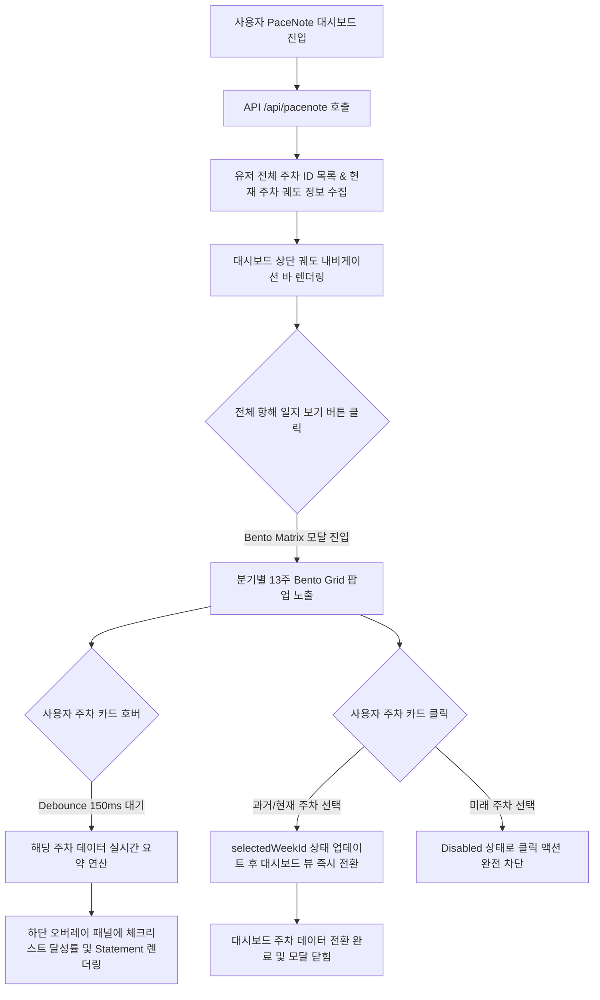

# PriSincera PaceNote Bento Weekly Calendar & Voyage Horizon UI Specification

본 문서는 사용자가 주차별 목표를 수립하고 달성해나가는 **'전략적 마일스톤 관리(나만의 궤도) 플랫폼'**인 PaceNote 서비스(`/pacenote`)의 **주차별 캘린더 & 항해 지평선 UI/UX (Bento Weekly Route & Voyage Horizon)**의 최종 구현 사양서 및 상단 대시보드 내비게이션 영역의 **완전 모달-프리 인라인 분기 탭 크로노 리본(Seamless Chrono-Quarterly Segmented Ribbon) 전면 3차 개편 기획서**입니다.

기존의 평면적인 단순 그리드 모달 내비게이션을 전면 개편하고, Concept A. Chrono-Quarterly Bento Matrix를 기반으로 1차 릴리즈를 완수한 뒤, **모달 팝업창을 100% 원천 배제(Modal-free)**하고 대시보드 페이지 내부에서 끊김 없이(Seamless) 1년 52주 전체를 조망하고 유연하게 탐색할 수 있는 최종 혁신안을 정립 수록합니다.

---

## 1. 배경 및 구현 개요

PaceNote는 일(Day) 단위가 아닌 **주(Week - ISO 8601 기준 `YYYY-Wxx`)** 단위로 운용되는 서비스 특성을 지닙니다. 이에 따라 기존 Gregorian 월 달력과는 완전히 다른 주간 단위의 시간 시각화 레이아웃과 감각적인 성장 궤적 추적이 요구되었습니다.

* **1차 릴리즈 사양**: **Concept A. "Chrono-Quarterly Bento Matrix"** (모달 팝업 기반)
* **2차/최종 혁신 사양**: **모달-프리 인라인 분기 탭 크로노 리본 (Seamless Chrono-Quarterly Segmented Ribbon)**
  * **핵심 지향점**: 화면 전체를 가리는 모달 팝업이나 오버레이를 완전히 걷어내고, 대시보드 상단 공간 내에서 **분기 탭(Q1~Q4) 전환만으로 52주 전체 주차를 매끄럽게 탐색하는 인라인 공간 완결형 UI/UX** 구현.
* **구현 컴포넌트**:
  * [PaceNoteWeeklyCalendar.jsx](file:///d:/prisincera/www/src/components/pacenote/PaceNoteWeeklyCalendar.jsx) - (기존 모달 내장형에서 인라인 드로어 혹은 세그먼트 전환형으로 유연한 통합 준비).
  * [PaceNoteWeeklyCalendar.css](file:///d:/prisincera/www/src/components/pacenote/PaceNoteWeeklyCalendar.css)
* **통합 대상**: `PaceNoteDashboard.jsx` 대시보드 상단 내비게이션 영역 전면 대체.

---

## 2. UI/UX 디자인 핵심 콘셉트 (1차 완료)

### 🚀 Concept A. "Chrono-Quarterly Bento Matrix"
> **"1년 52주를 분기(Q1~Q4) 단위의 Bento 박스로 구조화하여 성장의 매크로 로드맵을 시각화합니다."**

* **구조 및 레이아웃**:
  * 화면을 4개의 큰 **Bento Box(Q1, Q2, Q3, Q4)** 영역으로 양분하여 데스크톱 2x2 그리드로 대칭 배치합니다.
  * 한 분기는 정확히 **13주**로 이루어지므로, 각 Bento Box 내부에 13개의 글래스모피즘 주차 카드를 정교한 격자 그리드(`4 x 3` 및 마지막 `1` 행)로 안정감 있게 배치합니다.
* **디자인 & 상태 비주얼 (Weekly Cell States)**:
  1. **과거 완료 주차 (Past Completed)**: 투명도 높은 글래스모피즘 스킨(`background: rgba(0, 0, 0, 0.25)`, `border: 1px solid rgba(255, 255, 255, 0.06)`). 해당 주차의 실시간 Task 달성도(완료 테스크 / 총 테스크)에 비례한 하단 마이크로 게이지바(`.cell-progress-fill`) 탑재.
  2. **현재 개척 주차 (Current Active)**: 사이버 사이언 네온 아우라 테두리(`#22D3EE`). 2초 주기로 테두리가 부드럽게 펄싱되는 외곽 글로우 애니메이션(`pulseAura`)과 우측 상단 중앙의 맥동 도트 인디케이터(`.pulse-indicator`) 연동.
  3. **미래 대기 주차 (Future Locked)**: 딤드 처리(`opacity: 0.25`), 포인터 및 클릭 차단(`disabled`), 점선 테두리(`border-style: dashed`), 자물쇠 아이콘(`🔒`) 노출.

---

## 3. 인터랙션 및 상태 관리 흐름

PaceNote 캘린더는 불필요한 API 호출을 최소화하고 CPU 및 렌더링 부하를 제어하는 **0-Lag Performance** 사양을 완벽히 충족합니다.



---

## 4. 컴포넌트 마크업 설계 실질 구현 (1차 릴리즈)

신설되어 프로덕션에 완벽히 정합된 `PaceNoteWeeklyCalendar.jsx` 소스 코드 스니펫입니다.

### 📂 [PaceNoteWeeklyCalendar.jsx](file:///d:/prisincera/www/src/components/pacenote/PaceNoteWeeklyCalendar.jsx)

```jsx
import { useState, useMemo, useEffect } from 'react';
import './PaceNoteWeeklyCalendar.css';

export default function PaceNoteWeeklyCalendar({ 
  allWeekIds = [], 
  currentWeekId, 
  selectedWeekId, 
  pastWeeksData = [], // 과거 Task 완성률 정보 매핑용
  currentWeekTasks = [], // 이번 주 실시간 Task
  onSelectWeek 
}) {
  const [hoveredWeekInfo, setHoveredWeekInfo] = useState(null);
  const [hoverTimeoutId, setHoverTimeoutId] = useState(null);
  
  // Clean up timer on unmount
  useEffect(() => {
    return () => {
      if (hoverTimeoutId) clearTimeout(hoverTimeoutId);
    };
  }, [hoverTimeoutId]);

  // 1년의 주차들을 4개 분기(Q1: 1~13, Q2: 14~26, Q3: 27~39, Q4: 40~53)로 그룹핑
  const quarterlyGroups = useMemo(() => {
    const quarters = {
      Q1: { title: "Q1 Voyage (1~13주차)", weeks: [] },
      Q2: { title: "Q2 Voyage (14~26주차)", weeks: [] },
      Q3: { title: "Q3 Voyage (27~39주차)", weeks: [] },
      Q4: { title: "Q4 Voyage (40~53주차)", weeks: [] },
    };

    allWeekIds.forEach(wId => {
      const parts = wId.split('-W');
      if (parts.length !== 2) return;
      const weekNum = parseInt(parts[1], 10);

      if (weekNum >= 1 && weekNum <= 13) quarters.Q1.weeks.push(wId);
      else if (weekNum >= 14 && weekNum <= 26) quarters.Q2.weeks.push(wId);
      else if (weekNum >= 27 && weekNum <= 39) quarters.Q3.weeks.push(wId);
      else if (weekNum >= 40 && weekNum <= 53) quarters.Q4.weeks.push(wId);
    });

    return quarters;
  }, [allWeekIds]);

  // 전체 항해 진척도 동적 연산
  const totalStats = useMemo(() => {
    let totalTasksCount = 0;
    let completedTasksCount = 0;

    pastWeeksData.forEach(pw => {
      if (pw.tasks) {
        totalTasksCount += pw.tasks.length;
        completedTasksCount += pw.tasks.filter(t => t.completed).length;
      }
    });

    if (currentWeekTasks) {
      totalTasksCount += currentWeekTasks.length;
      completedTasksCount += currentWeekTasks.filter(t => t.completed).length;
    }

    const percent = totalTasksCount > 0 ? Math.round((completedTasksCount / totalTasksCount) * 100) : 0;
    return {
      total: totalTasksCount,
      completed: completedTasksCount,
      percent
    };
  }, [pastWeeksData, currentWeekTasks]);

  const handleWeekHover = (wId) => {
    if (hoverTimeoutId) clearTimeout(hoverTimeoutId);

    const timer = setTimeout(() => {
      const timelineWeek = pastWeeksData.find(p => p.weekId === wId);
      const isCurrent = wId === currentWeekId;
      const isFuture = !isCurrent && !timelineWeek;

      if (isFuture) {
        setHoveredWeekInfo({ wId, isFuture: true });
        return;
      }

      let total = 0;
      let completed = 0;
      let statement = "진행된 기록이 있는 항해 경로입니다.";

      if (isCurrent) {
        total = currentWeekTasks.length;
        completed = currentWeekTasks.filter(t => t.completed).length;
        statement = "현재 치열하게 개척 중인 이번 주 궤도입니다.";
      } else if (timelineWeek) {
        total = timelineWeek.tasks ? timelineWeek.tasks.length : 0;
        completed = timelineWeek.tasks ? timelineWeek.tasks.filter(t => t.completed).length : 0;
        statement = timelineWeek.statement || "완료된 기록이 안전하게 저장된 항해 경로입니다.";
      }

      setHoveredWeekInfo({
        wId,
        isFuture: false,
        isCurrent,
        total,
        completed,
        statement
      });
    }, 150); // 150ms debounce

    setHoverTimeoutId(timer);
  };

  const handleWeekLeave = () => {
    if (hoverTimeoutId) clearTimeout(hoverTimeoutId);
    setHoveredWeekInfo(null);
  };

  return (
    <div className="pacenote-weekly-chrono-container">
      {/* ── 상단 통계 헤더 ── */}
      <div className="chrono-weekly-summary">
        <span className="summary-title">⛵ 전체 항해 진척도</span>
        <div className="summary-bar-wrapper">
          <div className="summary-progress-fill" style={{ width: `${totalStats.percent}%` }}></div>
          <span className="summary-percent">{totalStats.percent}% Completed ({totalStats.completed}/{totalStats.total})</span>
        </div>
      </div>

      {/* ── 분기별 Bento Matrix 그리드 ── */}
      <div className="bento-quarterly-grid">
        {Object.entries(quarterlyGroups).map(([qKey, qData]) => {
          if (qData.weeks.length === 0) return null;
          
          return (
            <div key={qKey} className="quarter-bento-box">
              <h4 className="quarter-title">{qData.title}</h4>
              <div className="quarter-weeks-grid">
                {qData.weeks.map(wId => {
                  const parts = wId.split('-W');
                  const wNum = parts[1];
                  
                  const isCurrent = wId === currentWeekId;
                  const isSelected = wId === selectedWeekId;
                  const timelineWeek = pastWeeksData.find(p => p.weekId === wId);
                  const isFuture = !isCurrent && !timelineWeek;

                  let cardClass = "week-matrix-cell";
                  if (isCurrent) cardClass += " current";
                  if (isSelected) cardClass += " selected";
                  if (isFuture) cardClass += " locked";

                  // 완료 비율 계산
                  let pct = 0;
                  if (isCurrent) {
                    pct = currentWeekTasks.length > 0
                      ? Math.round((currentWeekTasks.filter(t => t.completed).length / currentWeekTasks.length) * 100)
                      : 0;
                  } else if (timelineWeek) {
                    pct = timelineWeek.tasks && timelineWeek.tasks.length > 0
                      ? Math.round((timelineWeek.tasks.filter(t => t.completed).length / timelineWeek.tasks.length) * 100)
                      : 0;
                  }

                  return (
                    <button
                      key={wId}
                      className={cardClass}
                      onClick={() => !isFuture && onSelectWeek(wId)}
                      onMouseEnter={() => handleWeekHover(wId)}
                      onMouseLeave={handleWeekLeave}
                      disabled={isFuture}
                    >
                      <div className="cell-top">
                        <span className="week-label">{wNum}주차</span>
                        {isFuture && <span className="lock-icon">🔒</span>}
                        {isCurrent && <span className="pulse-indicator"></span>}
                      </div>

                      {!isFuture && (
                        <div className="cell-progress-track">
                          <div className="cell-progress-fill" style={{ width: `${pct}%` }}></div>
                        </div>
                      )}
                    </button>
                  );
                })}
              </div>
            </div>
          );
        })}
      </div>

      {/* ── 하단 실시간 호버 퀵피크 오버레이 패널 ── */}
      {hoveredWeekInfo && (
        <div className="weekly-hover-peek-panel">
          <div className="peek-panel-arrow"></div>
          <div className="peek-panel-content">
            <span className="peek-week-title">{hoveredWeekInfo.wId} 궤도 정보</span>
            {hoveredWeekInfo.isFuture ? (
              <p className="peek-desc">🔒 미개척 항해 주차입니다. 해당 주간에 궤도가 오픈됩니다.</p>
            ) : (
              <div className="peek-metrics">
                <span className="metric-item">체크리스트 달성률: {hoveredWeekInfo.completed} / {hoveredWeekInfo.total} 완료</span>
                <p className="peek-statement">"{hoveredWeekInfo.statement}"</p>
              </div>
            )}
          </div>
        </div>
      )}
    </div>
  );
}
```

---

## 5. CSS 정밀 스타일링 및 CLS/성능 방어 가이드

PaceNote 주차별 캘린더는 다수의 글래스 카드가 존재하므로, 스크롤 및 호버 시 초당 60프레임(60fps)을 보존하기 위해 하드웨어 GPU 가속을 적극 유도하며 레이아웃 시프트를 사전에 완벽히 방어합니다.

---

## 6. 레이아웃 안정성 및 모바일 리플로우 가이드

---

## 7. 비채택 및 대안 검토 아카이브 (Alternative Concepts Checked)

---

## 8. [최종 결정안] 모달-프리 인라인 분기 탭 크로노 리본 (Seamless Chrono-Quarterly Segmented Ribbon) UI

사용자 경험의 완전한 흐름 보존과 단절 없는 조작성을 실현하기 위해, 화면 전체를 덮어버리는 모달(Modal) 창 방식을 100% 원천 배제합니다. 대시보드 상단 좁은 공간 내에 **분기 세그먼트 버튼과 슬라이딩 리본을 일체화하는 고성능 모달-프리 캘린더 UI**를 설계합니다.

### 8-1. UI/UX 레이아웃 설계 사양

대시보드 상단 영역에 아래 형태의 **'분기 전환형 인라인 캘린더 타임라인'**을 배치합니다.

```
+----------------------------------------------------------------------------------------------------------------+
  [ ⛵ VOYAGE HORIZON ]                                                                    
                                                                                           
  +── QUARTER SELECTOR (인라인 분기 탭) ───────────────────────────────────────────────────────────────────────+
  |  [ Q1 VOYAGE ]   [ * Q2 ACTIVE * ]   [ Q3 FUTURE ]   [ Q4 LOCKED ]                                           |
  +──────────────────────────────────────────────────────────────────────────────────────────────────────────────+
  |  <  [ W19 ]       [ W20 ]       +-------------+       [ W22 ]       [ W23 🔒 ]    >                          |
  |     05/04~05/10   05/11~05/17   |   W21 [★]   |       05/25~05/31   06/01~06/07                              |
  |     [■■■■░] 80%   [■■■░░] 60%   |  [ACTIVE]   |       [░░░░░] 0%    [🔒 Locked]                                 |
  |                                 |   ( 83% )   |                                                              |
  |                                 +-------------+                                                              |
  +──────────────────────────────────────────────────────────────────────────────────────────────────────────────+
+----------------------------------------------------------------------------------------------------------------+
```

* **구조적 혁신 (Two-Layer Inline Navigation)**:
  1. **상단 Layer (Quarter Segment)**: `[ Q1 ] [ Q2 ] [ Q3 ] [ Q4 ]`의 컴팩트한 분기 선택 벨트를 배치합니다. 현재 속해 있는 분기가 활성화됩니다.
  2. **하단 Layer (Chrono Ribbon)**: 선택한 분기에 해당하는 **13주의 주차 카드 리스트**가 가로로 유려하게 펼쳐집니다. 
     * 마우스 휠이나 트랙패드로 가로 스크롤하여 13개 주차를 Seamless하게 유영합니다.
     * 분기 버튼(Q1~Q4)을 원클릭하면 리본 영역이 부드러운 스태거링 페이드(Staggered Fade) 모션과 함께 해당 분기의 13주 카드셋으로 즉각 전환됩니다.
* **기대 효과**: 모달을 여는 불필요한 뎁스를 완전히 제거하고, 상단 80px 내외의 극히 제한된 인라인 공간 내에서 **1년 52주 전체를 완벽하고 직관적으로 조망/탐색**할 수 있는 극단의 사용성을 실현합니다.

### 8-2. 세부 상태 및 인터랙션 토큰
* **분기 탭 (Quarter Segments)**:
  * **액티브 분기**: 테두리가 사이언 네온 글로우로 상시 펄싱하며, 내부에 `ACTIVE` 마이크로 인디케이터가 붙습니다.
  * **미래 분기**: 딤드 처리되어 아직 도달하지 않은 시간임을 시각화합니다.
* **주차 카드 (Chrono Cards)**:
  * 현재 선택된 주차(`selectedWeekId`)는 리본 정중앙에 고정되거나 입체적 하이라이트(`scale(1.08)`, `#22D3EE` 네온 테두리)를 입어 다른 과거 주차들과 명확히 시각 분리됩니다.
  * 카드 하단에 완료 비율 게이지가 은은하게 빛을 내뿜어 성장의 밀도감을 상시 전달합니다.

### 8-3. 신규 모달-프리 컴포넌트 마크업 규격안

새로운 기획에 의거해 신설 및 통합될 `PaceNoteChronoRibbon.jsx` 사양입니다.

#### 📂 [NEW] [PaceNoteChronoRibbon.jsx](file:///d:/prisincera/www/src/components/pacenote/PaceNoteChronoRibbon.jsx)

```jsx
import { useState, useMemo, useRef, useEffect } from 'react';
import './PaceNoteChronoRibbon.css';

export default function PaceNoteChronoRibbon({
  allWeekIds = [],
  currentWeekId,
  selectedWeekId,
  pastWeeksData = [],
  currentWeekTasks = [],
  onSelectWeek
}) {
  const ribbonRef = useRef(null);
  
  // 1. 현재 선택된 주차가 속한 분기 계산 (초기 앵커링)
  const getQuarterFromWeekId = (wId) => {
    if (!wId) return 'Q2';
    const parts = wId.split('-W');
    if (parts.length !== 2) return 'Q2';
    const wNum = parseInt(parts[1], 10);
    if (wNum >= 1 && wNum <= 13) return 'Q1';
    if (wNum >= 14 && wNum <= 26) return 'Q2';
    if (wNum >= 27 && wNum <= 39) return 'Q3';
    return 'Q4';
  };

  const [activeQuarter, setActiveQuarter] = useState(() => getQuarterFromWeekId(selectedWeekId));

  // selectedWeekId가 부모로부터 변경되면 해당 분기로 자동 탭 포커스 갱신
  useEffect(() => {
    setActiveQuarter(getQuarterFromWeekId(selectedWeekId));
  }, [selectedWeekId]);

  // 2. 분기별 13주차 목록 동적 매핑
  const quarterWeeks = useMemo(() => {
    const quarters = { Q1: [], Q2: [], Q3: [], Q4: [] };
    
    allWeekIds.forEach(wId => {
      const parts = wId.split('-W');
      if (parts.length !== 2) return;
      const weekNum = parseInt(parts[1], 10);
      
      if (weekNum >= 1 && weekNum <= 13) quarters.Q1.push(wId);
      else if (weekNum >= 14 && weekNum <= 26) quarters.Q2.push(wId);
      else if (weekNum >= 27 && weekNum <= 39) quarters.Q3.push(wId);
      else if (weekNum >= 40 && weekNum <= 53) quarters.Q4.push(wId);
    });
    
    return quarters;
  }, [allWeekIds]);

  const weeksInView = quarterWeeks[activeQuarter] || [];

  return (
    <div className="pacenote-chrono-ribbon-container">
      {/* ── 1단: 인라인 분기 세그먼트 벨트 ── */}
      <div className="quarter-segment-belt">
        {['Q1', 'Q2', 'Q3', 'Q4'].map(q => {
          const isCurrentQ = getQuarterFromWeekId(currentWeekId) === q;
          const isActiveQ = activeQuarter === q;
          let btnClass = "quarter-segment-btn";
          if (isActiveQ) btnClass += " active";
          if (isCurrentQ) btnClass += " current-voyage";
          
          return (
            <button
              key={q}
              className={btnClass}
              onClick={() => setActiveQuarter(q)}
            >
              <span className="segment-label">{q} Voyage</span>
              {isCurrentQ && <span className="current-dot"></span>}
            </button>
          );
        })}
      </div>

      {/* ── 2단: 선택 분기 13주 가로 스크롤 타임라인 ── */}
      <div className="chrono-ribbon-timeline">
        <button className="ribbon-arrow prev" onClick={() => {
          if (ribbonRef.current) ribbonRef.current.scrollBy({ left: -150, behavior: 'smooth' });
        }}>
          ◀
        </button>

        <div className="ribbon-viewport" ref={ribbonRef}>
          {weeksInView.map(wId => {
            const parts = wId.split('-W');
            const wNum = parts[1];
            
            const isCurrent = wId === currentWeekId;
            const isSelected = wId === selectedWeekId;
            const timelineWeek = pastWeeksData.find(p => p.weekId === wId);
            const isFuture = !isCurrent && !timelineWeek;

            let cardClass = "ribbon-week-card";
            if (isCurrent) cardClass += " current";
            if (isSelected) cardClass += " selected";
            if (isFuture) cardClass += " locked";

            // 완료 비율 계산
            let pct = 0;
            if (isCurrent) {
              pct = currentWeekTasks.length > 0
                ? Math.round((currentWeekTasks.filter(t => t.completed).length / currentWeekTasks.length) * 100)
                : 0;
            } else if (timelineWeek) {
              pct = timelineWeek.tasks && timelineWeek.tasks.length > 0
                ? Math.round((timelineWeek.tasks.filter(t => t.completed).length / timelineWeek.tasks.length) * 100)
                : 0;
            }

            return (
              <button
                key={wId}
                className={cardClass}
                onClick={() => !isFuture && onSelectWeek(wId)}
                disabled={isFuture}
              >
                <div className="ribbon-card-top">
                  <span className="ribbon-card-week-label">{wNum}주차</span>
                  {isFuture && <span className="ribbon-lock-icon">🔒</span>}
                  {isCurrent && <span className="ribbon-pulse-indicator"></span>}
                </div>

                {!isFuture && (
                  <div className="ribbon-progress-track">
                    <div className="ribbon-progress-fill" style={{ width: `${pct}%` }}></div>
                  </div>
                )}
              </button>
            );
          })}
        </div>

        <button className="ribbon-arrow next" onClick={() => {
          if (ribbonRef.current) ribbonRef.current.scrollBy({ left: 150, behavior: 'smooth' });
        }}>
          ▶
        </button>
      </div>
    </div>
  );
}
```

### 8-4. CSS 정밀 스타일 및 공간 레이아웃 제약 사양
* **컨테이너 공간**: `.pacenote-chrono-ribbon-container`
  * 인라인 배치를 위해 고정된 세로 크기(`height: 124px`)와 여백을 확보하여 대시보드 메인 레이아웃과의 비주얼 하모니를 구축합니다.
* **분기 세그먼트 벨트**: `.quarter-segment-belt`
  * `display: flex; gap: 8px; justify-content: center; margin-bottom: 12px;`
  * 글래스모피즘 벨트 스킨 및 세그먼트 버튼 트랜지션 곡선(`cubic-bezier(0.16, 1, 0.3, 1)`) 선언.
* **가로 스크롤 스킨 및 드래그**: `.ribbon-viewport`
  * 가로 스크롤 활성화 및 스크롤바 감춤 처리 (`scrollbar-width: none;`, `::-webkit-scrollbar { display: none; }`).
