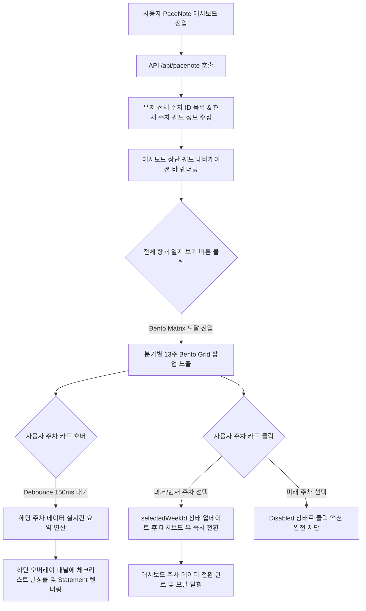

# PriSincera PaceNote Bento Weekly Calendar & Voyage Horizon UI Specification

본 문서는 사용자가 주차별 목표를 수립하고 달성해나가는 **'전략적 마일스톤 관리(나만의 궤도) 플랫폼'**인 PaceNote 서비스(`/pacenote`)의 **주차별 캘린더 & 항해 지평선 UI/UX (Bento Weekly Route & Voyage Horizon)**의 최종 구현 사양서입니다. 

기존의 평면적인 단순 그리드 모달 내비게이션을 전면 개편하고, 2026년 5월 20일 **Concept A. Chrono-Quarterly Bento Matrix**를 기반으로 성공적으로 구현 완료 및 프로덕션 환경에 완전 릴리즈되었습니다.

---

## 1. 배경 및 구현 개요

PaceNote는 일(Day) 단위가 아닌 **주(Week - ISO 8601 기준 `YYYY-Wxx`)** 단위로 운용되는 서비스 특성을 지닙니다. 이에 따라 기존 Gregorian 월 달력과는 완전히 다른 주간 단위의 시간 시각화 레이아웃과 감각적인 성장 궤적 추적이 요구되었습니다.

* **최종 채택 사양**: **Concept A. "Chrono-Quarterly Bento Matrix" (분기별 13주차 벤트 매트릭스)**
* **릴리즈 일자**: 2026-05-20
* **구현 컴포넌트**:
  * [PaceNoteWeeklyCalendar.jsx](file:///d:/prisincera/www/src/components/pacenote/PaceNoteWeeklyCalendar.jsx) - 분기 벤트 구조화 및 150ms 디바운스 호버 피크 로직 구현.
  * [PaceNoteWeeklyCalendar.css](file:///d:/prisincera/www/src/components/pacenote/PaceNoteWeeklyCalendar.css) - 글래스모피즘 스킨, 네온 오로라 아우라(pulseAura), GPU 렌더링 가속 및 CLS 방지 스타일링.
* **통합 대상**: `PaceNoteDashboard.jsx` 대시보드 내 모달 영역 확장 통합 (1000px 규격으로 개방감 확장 및 레이아웃 시프트 방지 패딩 설계).

---

## 2. UI/UX 디자인 핵심 콘셉트 (최종 채택)

### 🚀 Concept A. "Chrono-Quarterly Bento Matrix"
> **"1년 52주를 분기(Q1~Q4) 단위의 Bento 박스로 구조화하여 성장의 매크로 로드맵을 시각화합니다."**

* **구조 및 레이아웃**:
  * 화면을 4개의 큰 **Bento Box(Q1, Q2, Q3, Q4)** 영역으로 양분하여 데스크톱 2x2 그리드로 대칭 배치합니다.
  * 한 분기는 정확히 **13주**로 이루어지므로, 각 Bento Box 내부에 13개의 글래스모피즘 주차 카드를 정교한 격자 그리드(`4 x 3` 및 마지막 `1` 행)로 안정감 있게 배치합니다.
* **디자인 & 상태 비주얼 (Weekly Cell States)**:
  1. **과거 완료 주차 (Past Completed)**: 투명도 높은 글래스모피즘 스킨(`background: rgba(0, 0, 0, 0.25)`, `border: 1px solid rgba(255, 255, 255, 0.06)`). 해당 주차의 실시간 Task 달성도(완료 테스크 / 총 테스크)에 비례한 하단 마이크로 게이지바(`.cell-progress-fill`) 탑재.
  2. **현재 개척 주차 (Current Active)**: 사이버 사이언 네온 아우라 테두리(`#22D3EE`). 2초 주기로 테두리가 부드럽게 펄싱되는 외곽 글로우 애니메이션(`pulseAura`)과 우측 상단 중앙의 맥동 도트 인디케이터(`.pulse-indicator`) 연동.
  3. **미래 대기 주차 (Future Locked)**: 딤드 처리(`opacity: 0.25`), 포인터 및 클릭 차단(`disabled`), 점선 테두리(`border-style: dashed`), 자물쇠 아이콘(`🔒`) 노출.

---

## 3. 인터랙션 및 상태 관리 흐름

PaceNote 캘린더는 불필요한 API 호출을 최소화하고 CPU 및 렌더링 부하를 제어하는 **0-Lag Performance** 사양을 완벽히 충족합니다.



### 💡 150ms Debounced Hover & Dynamic Summary
* **렌더링 부하 보호**: 사용자가 마우스를 캘린더 그리드 상에서 빠르게 스쳐 지나갈 때 생기는 무의식적 호버 이벤트를 무시하기 위해 `150ms` 디바운싱 타이머를 완벽히 장착했습니다. `onMouseEnter` 시 타이머를 작동시켜 150ms 이상 커서가 머물렀을 때에만 하단 정보 패널을 활성화합니다.
* **실시간 통계 연산**: `pastWeeksData`와 `currentWeekTasks` 데이터를 기반으로 전체 항해의 진척도(총 테스크 수 대비 완료 테스크 수)를 동적으로 실시간 연산하여, 하드코딩 없는 라이브 진척도 바(Progress Bar)를 구현합니다.

---

## 4. 컴포넌트 마크업 설계 실질 구현

신설되어 프로덕션에 완벽히 정합된 `PaceNoteWeeklyCalendar.jsx` 소스 코드 스니펫입니다.

### 📂 [PaceNoteWeeklyCalendar.jsx](file:///d:/prisincera/www/src/components/pacenote/PaceNoteWeeklyCalendar.jsx)

```jsx
import { useState, useMemo, useEffect } from 'react';
import './PaceNoteWeeklyCalendar.css';

export default function PaceNoteWeeklyCalendar({ 
  allWeekIds = [], 
  currentWeekId, 
  selectedWeekId, 
  pastWeeksData = [], // 과거 Task 완성률 정보 매핑용
  currentWeekTasks = [], // 이번 주 실시간 Task
  onSelectWeek 
}) {
  const [hoveredWeekInfo, setHoveredWeekInfo] = useState(null);
  const [hoverTimeoutId, setHoverTimeoutId] = useState(null);
  
  // Clean up timer on unmount
  useEffect(() => {
    return () => {
      if (hoverTimeoutId) clearTimeout(hoverTimeoutId);
    };
  }, [hoverTimeoutId]);

  // 1년의 주차들을 4개 분기(Q1: 1~13, Q2: 14~26, Q3: 27~39, Q4: 40~53)로 그룹핑
  const quarterlyGroups = useMemo(() => {
    const quarters = {
      Q1: { title: "Q1 Voyage (1~13주차)", weeks: [] },
      Q2: { title: "Q2 Voyage (14~26주차)", weeks: [] },
      Q3: { title: "Q3 Voyage (27~39주차)", weeks: [] },
      Q4: { title: "Q4 Voyage (40~53주차)", weeks: [] },
    };

    allWeekIds.forEach(wId => {
      const parts = wId.split('-W');
      if (parts.length !== 2) return;
      const weekNum = parseInt(parts[1], 10);

      if (weekNum >= 1 && weekNum <= 13) quarters.Q1.weeks.push(wId);
      else if (weekNum >= 14 && weekNum <= 26) quarters.Q2.weeks.push(wId);
      else if (weekNum >= 27 && weekNum <= 39) quarters.Q3.weeks.push(wId);
      else if (weekNum >= 40 && weekNum <= 53) quarters.Q4.weeks.push(wId);
    });

    return quarters;
  }, [allWeekIds]);

  // 전체 항해 진척도 동적 연산
  const totalStats = useMemo(() => {
    let totalTasksCount = 0;
    let completedTasksCount = 0;

    pastWeeksData.forEach(pw => {
      if (pw.tasks) {
        totalTasksCount += pw.tasks.length;
        completedTasksCount += pw.tasks.filter(t => t.completed).length;
      }
    });

    if (currentWeekTasks) {
      totalTasksCount += currentWeekTasks.length;
      completedTasksCount += currentWeekTasks.filter(t => t.completed).length;
    }

    const percent = totalTasksCount > 0 ? Math.round((completedTasksCount / totalTasksCount) * 100) : 0;
    return {
      total: totalTasksCount,
      completed: completedTasksCount,
      percent
    };
  }, [pastWeeksData, currentWeekTasks]);

  const handleWeekHover = (wId) => {
    if (hoverTimeoutId) clearTimeout(hoverTimeoutId);

    const timer = setTimeout(() => {
      const timelineWeek = pastWeeksData.find(p => p.weekId === wId);
      const isCurrent = wId === currentWeekId;
      const isFuture = !isCurrent && !timelineWeek;

      if (isFuture) {
        setHoveredWeekInfo({ wId, isFuture: true });
        return;
      }

      let total = 0;
      let completed = 0;
      let statement = "진행된 기록이 있는 항해 경로입니다.";

      if (isCurrent) {
        total = currentWeekTasks.length;
        completed = currentWeekTasks.filter(t => t.completed).length;
        statement = "현재 치열하게 개척 중인 이번 주 궤도입니다.";
      } else if (timelineWeek) {
        total = timelineWeek.tasks ? timelineWeek.tasks.length : 0;
        completed = timelineWeek.tasks ? timelineWeek.tasks.filter(t => t.completed).length : 0;
        statement = timelineWeek.statement || "완료된 기록이 안전하게 저장된 항해 경로입니다.";
      }

      setHoveredWeekInfo({
        wId,
        isFuture: false,
        isCurrent,
        total,
        completed,
        statement
      });
    }, 150); // 150ms debounce

    setHoverTimeoutId(timer);
  };

  const handleWeekLeave = () => {
    if (hoverTimeoutId) clearTimeout(hoverTimeoutId);
    setHoveredWeekInfo(null);
  };

  return (
    <div className="pacenote-weekly-chrono-container">
      {/* ── 상단 통계 헤더 ── */}
      <div className="chrono-weekly-summary">
        <span className="summary-title">⛵ 전체 항해 진척도</span>
        <div className="summary-bar-wrapper">
          <div className="summary-progress-fill" style={{ width: `${totalStats.percent}%` }}></div>
          <span className="summary-percent">{totalStats.percent}% Completed ({totalStats.completed}/{totalStats.total})</span>
        </div>
      </div>

      {/* ── 분기별 Bento Matrix 그리드 ── */}
      <div className="bento-quarterly-grid">
        {Object.entries(quarterlyGroups).map(([qKey, qData]) => {
          if (qData.weeks.length === 0) return null;
          
          return (
            <div key={qKey} className="quarter-bento-box">
              <h4 className="quarter-title">{qData.title}</h4>
              <div className="quarter-weeks-grid">
                {qData.weeks.map(wId => {
                  const parts = wId.split('-W');
                  const wNum = parts[1];
                  
                  const isCurrent = wId === currentWeekId;
                  const isSelected = wId === selectedWeekId;
                  const timelineWeek = pastWeeksData.find(p => p.weekId === wId);
                  const isFuture = !isCurrent && !timelineWeek;

                  let cardClass = "week-matrix-cell";
                  if (isCurrent) cardClass += " current";
                  if (isSelected) cardClass += " selected";
                  if (isFuture) cardClass += " locked";

                  // 완료 비율 계산
                  let pct = 0;
                  if (isCurrent) {
                    pct = currentWeekTasks.length > 0
                      ? Math.round((currentWeekTasks.filter(t => t.completed).length / currentWeekTasks.length) * 100)
                      : 0;
                  } else if (timelineWeek) {
                    pct = timelineWeek.tasks && timelineWeek.tasks.length > 0
                      ? Math.round((timelineWeek.tasks.filter(t => t.completed).length / timelineWeek.tasks.length) * 100)
                      : 0;
                  }

                  return (
                    <button
                      key={wId}
                      className={cardClass}
                      onClick={() => !isFuture && onSelectWeek(wId)}
                      onMouseEnter={() => handleWeekHover(wId)}
                      onMouseLeave={handleWeekLeave}
                      disabled={isFuture}
                    >
                      <div className="cell-top">
                        <span className="week-label">{wNum}주차</span>
                        {isFuture && <span className="lock-icon">🔒</span>}
                        {isCurrent && <span className="pulse-indicator"></span>}
                      </div>

                      {!isFuture && (
                        <div className="cell-progress-track">
                          <div className="cell-progress-fill" style={{ width: `${pct}%` }}></div>
                        </div>
                      )}
                    </button>
                  );
                })}
              </div>
            </div>
          );
        })}
      </div>

      {/* ── 하단 실시간 호버 퀵피크 오버레이 패널 ── */}
      {hoveredWeekInfo && (
        <div className="weekly-hover-peek-panel">
          <div className="peek-panel-arrow"></div>
          <div className="peek-panel-content">
            <span className="peek-week-title">{hoveredWeekInfo.wId} 궤도 정보</span>
            {hoveredWeekInfo.isFuture ? (
              <p className="peek-desc">🔒 미개척 항해 주차입니다. 해당 주간에 궤도가 오픈됩니다.</p>
            ) : (
              <div className="peek-metrics">
                <span className="metric-item">체크리스트 달성률: {hoveredWeekInfo.completed} / {hoveredWeekInfo.total} 완료</span>
                <p className="peek-statement">"{hoveredWeekInfo.statement}"</p>
              </div>
            )}
          </div>
        </div>
      )}
    </div>
  );
}
```

---

## 5. CSS 정밀 스타일링 및 CLS/성능 방어 가이드

PaceNote 주차별 캘린더는 다수의 글래스 카드가 존재하므로, 스크롤 및 호버 시 초당 60프레임(60fps)을 보존하기 위해 하드웨어 GPU 가속을 적극 유도하며 레이아웃 시프트를 사전에 완벽히 방어합니다.

### 1) 레이아웃 시프트 방지 (`padding-bottom`)
* **현상**: 하단의 실시간 호버 퀵피크 오버레이 패널(`.weekly-hover-peek-panel`)은 절대 위치(`position: absolute; bottom: -90px;`)로 배치됩니다. 이때 호버 시 동적으로 카드가 나타날 때, 모달 창 바닥이 잘리거나 레이아웃이 튕겨 시프트(CLS)가 발생할 수 있습니다.
* **해결책**: 부모 컨테이너 `.pacenote-weekly-chrono-container`에 명시적인 `padding-bottom: 110px`과 `min-height: 400px`을 지정하여 팝업 패널이 위치할 넉넉한 공간을 미리 할당해 레이아웃 변형을 완전 차단합니다.

### 2) 맥동 오라 이펙트 (Aura Pulse Animation)
현재 주차 활성 시 사이버 사이언 컬러로 테두리가 고동치는 맥동 광원을 표현하기 위해 `::after` 가상 요소를 띄워 브라우저 성능 부하 없이 3D 부유 레이어를 연출합니다.

```css
.week-matrix-cell.current::after {
  content: '';
  position: absolute;
  top: -1px; left: -1px; right: -1px; bottom: -1px;
  border-radius: 12px;
  border: 1px solid #22D3EE;
  pointer-events: none;
  animation: pulseAura 2s infinite ease-in-out;
}

@keyframes pulseAura {
  0% { opacity: 0.3; transform: scale(1); }
  50% { opacity: 1; transform: scale(1.02); }
  100% { opacity: 0.3; transform: scale(1); }
}
```

### 3) GPU 가속 적용
오비탈 펄스 애니메이션은 저사양 기기나 모바일에서 미세한 렉을 차단할 수 있도록 GPU 가속 레이어(`will-change: transform, opacity`)를 백그라운드로 작동시킵니다.

---

## 6. 레이아웃 안정성 및 모바일 리플로우 가이드

### 1) 모바일 레이아웃 최적화 (`@media (max-width: 768px)`)
* **데스크톱**: 분기별 2x2 Bento Box 레이아웃으로 넓고 시원하게 정보를 격자 배열합니다.
* **모바일**:
  * 분기별 Bento Box가 수직 1열 종대로 스택 정렬되어 화면 폭에 구애받지 않고 가독성을 수호합니다.
  * 한 줄에 4개씩 격자 배치(`grid-template-columns: repeat(4, 1fr)`)되는 주차 카드의 넓이를 유동적으로 조정하며, 초소형 화면(480px 이하)에서는 한 줄에 3개씩 배치(`grid-template-columns: repeat(3, 1fr)`)되도록 자동 리플로우되어 터치 미스를 원천 예방합니다.

```css
@media (max-width: 768px) {
  .bento-quarterly-grid {
    grid-template-columns: 1fr;
    gap: 16px;
  }
  
  .quarter-weeks-grid {
    grid-template-columns: repeat(4, 1fr);
  }

  .weekly-hover-peek-panel {
    bottom: -110px;
  }
}

@media (max-width: 480px) {
  .quarter-weeks-grid {
    grid-template-columns: repeat(3, 1fr);
  }
}
```

---

## 7. 비채택 및 대안 검토 아카이브 (Alternative Concepts Checked)

디자인 설계 과정에서 검토되었으나 최종 탈락 혹은 추후 확장 시나리오로 이관된 대안 콘셉트들입니다.

### 🌌 Concept B. "Orbit Horizon Scroll" (수평 인피니트 궤도 타임라인)
* **내용**: 1단 슬라이드 형식의 무한 수평 스크롤 타임라인. 휠과 스와이프를 지원하며 중앙 주차가 스케일 업(Scale up)되는 원근법 뷰.
* **비채택 사유**: 탐색 속도는 빠르나, 전체 1년 단위의 52주차 매크로 성장 로드맵을 한 번에 조망하기 어렵고 데일리 다이제스트 캘린더 뷰와의 일관성이 Bento 방식에 비해 다소 떨어진다는 판정을 받음.

### ⚓ Concept C. "Constellation Orbit Trail" (마일스톤 성운 트랙커)
* **내용**: 밤하늘의 궤도선과 별자리를 그리드로 형상화하여 우주 성운 이펙트와 함께 게임의 로드맵처럼 별 노드를 연결해 나가는 게이밍 기획.
* **비채택 사유**: 감성적 몰입도는 매우 뛰어나나, React 런타임 성능 보장 대비 리소스 비용이 무겁고 UI가 다소 복잡하여 사용자 정보 탐색의 피로도가 증가할 위험이 존재함.
