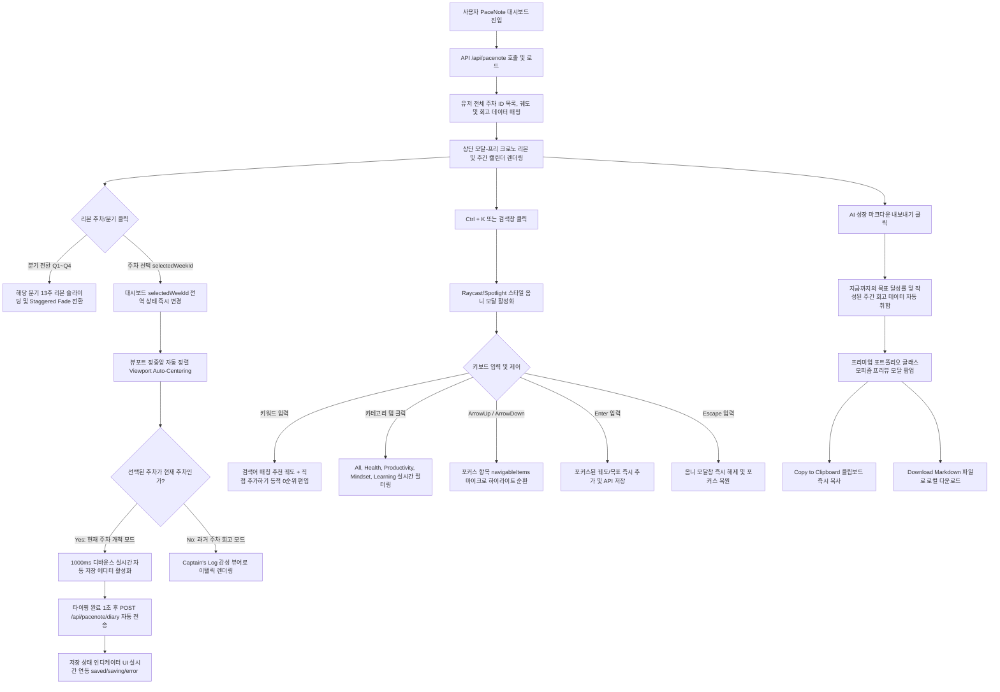

# PriSincera PaceNote Bento Weekly Calendar & Voyage Horizon UI Specification

## 📝 Revision History

| Version | Date | Author | Description | Impact Area |
| :--- | :--- | :--- | :--- | :--- |
| v1.0 | 2026-05-20 | AI Agent | 최초 13주 Bento Grid 캘린더 및 Seamless Chrono-Quarterly Segmented Ribbon 사양 정의 | PaceNote UI |
| v1.1 | 2026-05-21 | AI Agent | Voyage Log(회고) 실시간 자동저장, 옴니 검색 모달, AI 포트폴리오 내보내기 스펙 추가 및 DDD 폴더 이관 | PaceNote Features |
| v1.2 | 2026-05-21 | AI Agent | 2단 스플릿 워크스테이션 그리드 개편, SVG 원형 글자수 카운터, spring 애니메이션, progress 지표 추가 | PaceNote Layout & SVG |
| v1.3 | 2026-05-21 | AI Agent | 실행(나의 궤도)과 회고(항해 일지)를 단일 통합 카드(Consolidated Card)로 결합, 통합 헤더, 수직 디바이더 및 반응형 구조 고도화. 피드백 반영: '⚓ 사색의 기록' 뒤의 영문 괄호 (Weekly Voyage Log) 문구 완전 제거 | PaceNote Layout & Responsive |
| v1.4 | 2026-06-23 | AI Agent | **Click-to-Orbit** 연동(데일리 테크 트랙 카드 → 주간 오빗 주입) 및 오빗 **세부 할 일(subtask) 3단계 중첩 체크리스트** 표시·토글 사양 추가. add-orbit이 주차 미존재 시 기본 주차를 자동 생성. (§Click-to-Orbit 참조) | PaceNote Orbit & Subtasks |

본 문서는 사용자가 주차별 목표를 수립하고 달성해나가는 **'전략적 마일스톤 관리(나만의 궤도) 플랫폼'**인 PaceNote 서비스(`/pacenote`)의 **주차별 캘린더 & 항해 지평선 UI/UX (Bento Weekly Route & Voyage Horizon)**의 최종 구현 사양서 및 상단 대시보드 내비게이션 영역의 **완전 모달-프리 인라인 분기 탭 크로노 리본(Seamless Chrono-Quarterly Segmented Ribbon) 전면 3차 개편 기획서**입니다.

기존의 평면적인 단순 그리드 모달 내비게이션을 전면 개편하고, Concept A. Chrono-Quarterly Bento Matrix를 기반으로 1차 릴리즈를 완수한 뒤, **모달 팝업창을 100% 원천 배제(Modal-free)**하고 대시보드 페이지 내부에서 끊김 없이(Seamless) 1년 52주 전체를 조망하고 유연하게 탐색할 수 있는 최종 혁신안을 정립 수록합니다.

---

## 1. 배경 및 구현 개요

PaceNote는 일(Day) 단위가 아닌 **주(Week - ISO 8601 기준 `YYYY-Wxx`)** 단위로 운용되는 서비스 특성을 지닙니다. 이에 따라 기존 Gregorian 월 달력과는 완전히 다른 주간 단위의 시간 시각화 레이아웃과 감각적인 성장 궤적 추적이 요구되었습니다.

* **1차 릴리즈 사양**: **Concept A. "Chrono-Quarterly Bento Matrix"** (모달 팝업 기반)
* **2차/최종 혁신 사양**: **모달-프리 인라인 분기 탭 크로노 리본 (Seamless Chrono-Quarterly Segmented Ribbon)**
  * **핵심 지향점**: 화면 전체를 가리는 모달 팝업이나 오버레이를 완전히 걷어내고, 대시보드 상단 공간 내에서 **분기 탭(Q1~Q4) 전환만으로 52주 전체 주차를 매끄럽게 탐색하는 인라인 공간 완결형 UI/UX** 구현.
* **구현 컴포넌트**:
  * [PaceNoteWeeklyCalendar.jsx](file:///d:/prisincera/www/src/components/pacenote/PaceNoteWeeklyCalendar.jsx) - (기존 모달 내장형에서 인라인 드로어 혹은 세그먼트 전환형으로 유연한 통합 준비).
  * [PaceNoteWeeklyCalendar.css](file:///d:/prisincera/www/src/components/pacenote/PaceNoteWeeklyCalendar.css)
* **통합 대상**: `PaceNoteDashboard.jsx` 대시보드 상단 내비게이션 영역 전면 대체.

---

## 2. UI/UX 디자인 핵심 콘셉트 (1차 완료)

### 🚀 Concept A. "Chrono-Quarterly Bento Matrix"
> **"1년 52주를 분기(Q1~Q4) 단위의 Bento 박스로 구조화하여 성장의 매크로 로드맵을 시각화합니다."**

* **구조 및 레이아웃**:
  * 화면을 4개의 큰 **Bento Box(Q1, Q2, Q3, Q4)** 영역으로 양분하여 데스크톱 2x2 그리드로 대칭 배치합니다.
  * 한 분기는 정확히 **13주**로 이루어지므로, 각 Bento Box 내부에 13개의 글래스모피즘 주차 카드를 정교한 격자 그리드(`4 x 3` 및 마지막 `1` 행)로 안정감 있게 배치합니다.
* **디자인 & 상태 비주얼 (Weekly Cell States)**:
  1. **과거 완료 주차 (Past Completed)**: 투명도 높은 글래스모피즘 스킨(`background: rgba(0, 0, 0, 0.25)`, `border: 1px solid rgba(255, 255, 255, 0.06)`). 해당 주차의 실시간 Task 달성도(완료 테스크 / 총 테스크)에 비례한 하단 마이크로 게이지바(`.cell-progress-fill`) 탑재.
  2. **현재 개척 주차 (Current Active)**: 사이버 사이언 네온 아우라 테두리(`#22D3EE`). 2초 주기로 테두리가 부드럽게 펄싱되는 외곽 글로우 애니메이션(`pulseAura`)과 우측 상단 중앙의 맥동 도트 인디케이터(`.pulse-indicator`) 연동.
  3. **미래 대기 주차 (Future Locked)**: 딤드 처리(`opacity: 0.25`), 포인터 및 클릭 차단(`disabled`), 점선 테두리(`border-style: dashed`), 자물쇠 아이콘(`🔒`) 노출.

---

## 3. 인터랙션 및 상태 관리 흐름

PaceNote 캘린더는 불필요한 API 호출을 최소화하고 CPU 및 렌더링 부하를 제어하는 **0-Lag Performance** 사양을 완벽히 충족합니다.



---

## 4. 컴포넌트 마크업 설계 실질 구현 (1차 릴리즈)

신설되어 프로덕션에 완벽히 정합된 `PaceNoteWeeklyCalendar.jsx` 소스 코드 스니펫입니다.

### 📂 [PaceNoteWeeklyCalendar.jsx](file:///d:/prisincera/www/src/components/pacenote/PaceNoteWeeklyCalendar.jsx)

```jsx
import { useState, useMemo, useEffect } from 'react';
import './PaceNoteWeeklyCalendar.css';

export default function PaceNoteWeeklyCalendar({ 
  allWeekIds = [], 
  currentWeekId, 
  selectedWeekId, 
  pastWeeksData = [], // 과거 Task 완성률 정보 매핑용
  currentWeekTasks = [], // 이번 주 실시간 Task
  onSelectWeek 
}) {
  const [hoveredWeekInfo, setHoveredWeekInfo] = useState(null);
  const [hoverTimeoutId, setHoverTimeoutId] = useState(null);
  
  // Clean up timer on unmount
  useEffect(() => {
    return () => {
      if (hoverTimeoutId) clearTimeout(hoverTimeoutId);
    };
  }, [hoverTimeoutId]);

  // 1년의 주차들을 4개 분기(Q1: 1~13, Q2: 14~26, Q3: 27~39, Q4: 40~53)로 그룹핑
  const quarterlyGroups = useMemo(() => {
    const quarters = {
      Q1: { title: "Q1 Voyage (1~13주차)", weeks: [] },
      Q2: { title: "Q2 Voyage (14~26주차)", weeks: [] },
      Q3: { title: "Q3 Voyage (27~39주차)", weeks: [] },
      Q4: { title: "Q4 Voyage (40~53주차)", weeks: [] },
    };

    allWeekIds.forEach(wId => {
      const parts = wId.split('-W');
      if (parts.length !== 2) return;
      const weekNum = parseInt(parts[1], 10);

      if (weekNum >= 1 && weekNum <= 13) quarters.Q1.weeks.push(wId);
      else if (weekNum >= 14 && weekNum <= 26) quarters.Q2.weeks.push(wId);
      else if (weekNum >= 27 && weekNum <= 39) quarters.Q3.weeks.push(wId);
      else if (weekNum >= 40 && weekNum <= 53) quarters.Q4.weeks.push(wId);
    });

    return quarters;
  }, [allWeekIds]);

  // 전체 항해 진척도 동적 연산
  const totalStats = useMemo(() => {
    let totalTasksCount = 0;
    let completedTasksCount = 0;

    pastWeeksData.forEach(pw => {
      if (pw.tasks) {
        totalTasksCount += pw.tasks.length;
        completedTasksCount += pw.tasks.filter(t => t.completed).length;
      }
    });

    if (currentWeekTasks) {
      totalTasksCount += currentWeekTasks.length;
      completedTasksCount += currentWeekTasks.filter(t => t.completed).length;
    }

    const percent = totalTasksCount > 0 ? Math.round((completedTasksCount / totalTasksCount) * 100) : 0;
    return {
      total: totalTasksCount,
      completed: completedTasksCount,
      percent
    };
  }, [pastWeeksData, currentWeekTasks]);

  const handleWeekHover = (wId) => {
    if (hoverTimeoutId) clearTimeout(hoverTimeoutId);

    const timer = setTimeout(() => {
      const timelineWeek = pastWeeksData.find(p => p.weekId === wId);
      const isCurrent = wId === currentWeekId;
      const isFuture = !isCurrent && !timelineWeek;

      if (isFuture) {
        setHoveredWeekInfo({ wId, isFuture: true });
        return;
      }

      let total = 0;
      let completed = 0;
      let statement = "진행된 기록이 있는 항해 경로입니다.";

      if (isCurrent) {
        total = currentWeekTasks.length;
        completed = currentWeekTasks.filter(t => t.completed).length;
        statement = "현재 치열하게 개척 중인 이번 주 궤도입니다.";
      } else if (timelineWeek) {
        total = timelineWeek.tasks ? timelineWeek.tasks.length : 0;
        completed = timelineWeek.tasks ? timelineWeek.tasks.filter(t => t.completed).length : 0;
        statement = timelineWeek.statement || "완료된 기록이 안전하게 저장된 항해 경로입니다.";
      }

      setHoveredWeekInfo({
        wId,
        isFuture: false,
        isCurrent,
        total,
        completed,
        statement
      });
    }, 150); // 150ms debounce

    setHoverTimeoutId(timer);
  };

  const handleWeekLeave = () => {
    if (hoverTimeoutId) clearTimeout(hoverTimeoutId);
    setHoveredWeekInfo(null);
  };

  return (
    <div className="pacenote-weekly-chrono-container">
      {/* ── 상단 통계 헤더 ── */}
      <div className="chrono-weekly-summary">
        <span className="summary-title">⛵ 전체 항해 진척도</span>
        <div className="summary-bar-wrapper">
          <div className="summary-progress-fill" style={{ width: `${totalStats.percent}%` }}></div>
          <span className="summary-percent">{totalStats.percent}% Completed ({totalStats.completed}/{totalStats.total})</span>
        </div>
      </div>

      {/* ── 분기별 Bento Matrix 그리드 ── */}
      <div className="bento-quarterly-grid">
        {Object.entries(quarterlyGroups).map(([qKey, qData]) => {
          if (qData.weeks.length === 0) return null;
          
          return (
            <div key={qKey} className="quarter-bento-box">
              <h4 className="quarter-title">{qData.title}</h4>
              <div className="quarter-weeks-grid">
                {qData.weeks.map(wId => {
                  const parts = wId.split('-W');
                  const wNum = parts[1];
                  
                  const isCurrent = wId === currentWeekId;
                  const isSelected = wId === selectedWeekId;
                  const timelineWeek = pastWeeksData.find(p => p.weekId === wId);
                  const isFuture = !isCurrent && !timelineWeek;

                  let cardClass = "week-matrix-cell";
                  if (isCurrent) cardClass += " current";
                  if (isSelected) cardClass += " selected";
                  if (isFuture) cardClass += " locked";

                  // 완료 비율 계산
                  let pct = 0;
                  if (isCurrent) {
                    pct = currentWeekTasks.length > 0
                      ? Math.round((currentWeekTasks.filter(t => t.completed).length / currentWeekTasks.length) * 100)
                      : 0;
                  } else if (timelineWeek) {
                    pct = timelineWeek.tasks && timelineWeek.tasks.length > 0
                      ? Math.round((timelineWeek.tasks.filter(t => t.completed).length / timelineWeek.tasks.length) * 100)
                      : 0;
                  }

                  return (
                    <button
                      key={wId}
                      className={cardClass}
                      onClick={() => !isFuture && onSelectWeek(wId)}
                      onMouseEnter={() => handleWeekHover(wId)}
                      onMouseLeave={handleWeekLeave}
                      disabled={isFuture}
                    >
                      <div className="cell-top">
                        <span className="week-label">{wNum}주차</span>
                        {isFuture && <span className="lock-icon">🔒</span>}
                        {isCurrent && <span className="pulse-indicator"></span>}
                      </div>

                      {!isFuture && (
                        <div className="cell-progress-track">
                          <div className="cell-progress-fill" style={{ width: `${pct}%` }}></div>
                        </div>
                      )}
                    </button>
                  );
                })}
              </div>
            </div>
          );
        })}
      </div>

      {/* ── 하단 실시간 호버 퀵피크 오버레이 패널 ── */}
      {hoveredWeekInfo && (
        <div className="weekly-hover-peek-panel">
          <div className="peek-panel-arrow"></div>
          <div className="peek-panel-content">
            <span className="peek-week-title">{hoveredWeekInfo.wId} 궤도 정보</span>
            {hoveredWeekInfo.isFuture ? (
              <p className="peek-desc">🔒 미개척 항해 주차입니다. 해당 주간에 궤도가 오픈됩니다.</p>
            ) : (
              <div className="peek-metrics">
                <span className="metric-item">체크리스트 달성률: {hoveredWeekInfo.completed} / {hoveredWeekInfo.total} 완료</span>
                <p className="peek-statement">"{hoveredWeekInfo.statement}"</p>
              </div>
            )}
          </div>
        </div>
      )}
    </div>
  );
}
```

---

## 5. CSS 정밀 스타일링 및 CLS/성능 방어 가이드

PaceNote 주차별 캘린더는 다수의 글래스 카드가 존재하므로, 스크롤 및 호버 시 초당 60프레임(60fps)을 보존하기 위해 하드웨어 GPU 가속을 적극 유도하며 레이아웃 시프트를 사전에 완벽히 방어합니다.

---

## 6. 레이아웃 안정성 및 모바일 리플로우 가이드

---

## 7. 비채택 및 대안 검토 아카이브 (Alternative Concepts Checked)

---

## 8. [최종 결정안] 모달-프리 인라인 분기 탭 크로노 리본 (Seamless Chrono-Quarterly Segmented Ribbon) UI

사용자 경험의 완전한 흐름 보존과 단절 없는 조작성을 실현하기 위해, 화면 전체를 덮어버리는 모달(Modal) 창 방식을 100% 원천 배제합니다. 대시보드 상단 좁은 공간 내에 **분기 세그먼트 버튼과 슬라이딩 리본을 일체화하는 고성능 모달-프리 캘린더 UI**를 설계합니다.

### 8-1. UI/UX 레이아웃 설계 사양

대시보드 상단 영역에 아래 형태의 **'분기 전환형 인라인 캘린더 타임라인'**을 배치합니다.

```
+----------------------------------------------------------------------------------------------------------------+
  [ ⛵ VOYAGE HORIZON ]                                                                    
                                                                                           
  +── QUARTER SELECTOR (인라인 분기 탭) ───────────────────────────────────────────────────────────────────────+
  |  [ Q1 VOYAGE ]   [ * Q2 ACTIVE * ]   [ Q3 FUTURE ]   [ Q4 LOCKED ]                                           |
  +──────────────────────────────────────────────────────────────────────────────────────────────────────────────+
  |  <  [ W19 ]       [ W20 ]       +-------------+       [ W22 ]       [ W23 🔒 ]    >                          |
  |     05/04~05/10   05/11~05/17   |   W21 [★]   |       05/25~05/31   06/01~06/07                              |
  |     [■■■■░] 80%   [■■■░░] 60%   |  [ACTIVE]   |       [░░░░░] 0%    [🔒 Locked]                                 |
  |                                 |   ( 83% )   |                                                              |
  |                                 +-------------+                                                              |
  +──────────────────────────────────────────────────────────────────────────────────────────────────────────────+
+----------------------------------------------------------------------------------------------------------------+
```

* **구조적 혁신 (Two-Layer Inline Navigation)**:
  1. **상단 Layer (Quarter Segment)**: `[ Q1 ] [ Q2 ] [ Q3 ] [ Q4 ]`의 컴팩트한 분기 선택 벨트를 배치합니다. 현재 속해 있는 분기가 활성화됩니다.
  2. **하단 Layer (Chrono Ribbon)**: 선택한 분기에 해당하는 **13주의 주차 카드 리스트**가 가로로 유려하게 펼쳐집니다. 
     * 마우스 휠이나 트랙패드로 가로 스크롤하여 13개 주차를 Seamless하게 유영합니다.
     * 분기 버튼(Q1~Q4)을 원클릭하면 리본 영역이 부드러운 스태거링 페이드(Staggered Fade) 모션과 함께 해당 분기의 13주 카드셋으로 즉각 전환됩니다.
* **기대 효과**: 모달을 여는 불필요한 뎁스를 완전히 제거하고, 상단 80px 내외의 극히 제한된 인라인 공간 내에서 **1년 52주 전체를 완벽하고 직관적으로 조망/탐색**할 수 있는 극단의 사용성을 실현합니다.

### 8-2. 세부 상태 및 인터랙션 토큰
* **분기 탭 (Quarter Segments)**:
  * **액티브 분기**: 테두리가 사이언 네온 글로우로 상시 펄싱하며, 내부에 `ACTIVE` 마이크로 인디케이터가 붙습니다.
  * **미래 분기**: 딤드 처리되어 아직 도달하지 않은 시간임을 시각화합니다.
* **주차 카드 (Chrono Cards)**:
  * 현재 선택된 주차(`selectedWeekId`)는 리본 정중앙에 고정되거나 입체적 하이라이트(`scale(1.08)`, `#22D3EE` 네온 테두리)를 입어 다른 과거 주차들과 명확히 시각 분리됩니다.
  * 카드 하단에 완료 비율 게이지가 은은하게 빛을 내뿜어 성장의 밀도감을 상시 전달합니다.

### 8-3. 신규 모달-프리 컴포넌트 마크업 규격안

새로운 기획에 의거해 신설 및 통합될 `PaceNoteChronoRibbon.jsx` 사양입니다.

#### 📂 [NEW] [PaceNoteChronoRibbon.jsx](file:///d:/prisincera/www/src/components/pacenote/PaceNoteChronoRibbon.jsx)

```jsx
import { useState, useMemo, useRef, useEffect } from 'react';
import './PaceNoteChronoRibbon.css';

export default function PaceNoteChronoRibbon({
  allWeekIds = [],
  currentWeekId,
  selectedWeekId,
  pastWeeksData = [],
  currentWeekTasks = [],
  onSelectWeek
}) {
  const ribbonRef = useRef(null);
  
  // 1. 현재 선택된 주차가 속한 분기 계산 (초기 앵커링)
  const getQuarterFromWeekId = (wId) => {
    if (!wId) return 'Q2';
    const parts = wId.split('-W');
    if (parts.length !== 2) return 'Q2';
    const wNum = parseInt(parts[1], 10);
    if (wNum >= 1 && wNum <= 13) return 'Q1';
    if (wNum >= 14 && wNum <= 26) return 'Q2';
    if (wNum >= 27 && wNum <= 39) return 'Q3';
    return 'Q4';
  };

  const [activeQuarter, setActiveQuarter] = useState(() => getQuarterFromWeekId(selectedWeekId));

  // selectedWeekId가 부모로부터 변경되면 해당 분기로 자동 탭 포커스 갱신
  useEffect(() => {
    setActiveQuarter(getQuarterFromWeekId(selectedWeekId));
  }, [selectedWeekId]);

  // 2. 분기별 13주차 목록 동적 매핑
  const quarterWeeks = useMemo(() => {
    const quarters = { Q1: [], Q2: [], Q3: [], Q4: [] };
    
    allWeekIds.forEach(wId => {
      const parts = wId.split('-W');
      if (parts.length !== 2) return;
      const weekNum = parseInt(parts[1], 10);
      
      if (weekNum >= 1 && weekNum <= 13) quarters.Q1.push(wId);
      else if (weekNum >= 14 && weekNum <= 26) quarters.Q2.push(wId);
      else if (weekNum >= 27 && weekNum <= 39) quarters.Q3.push(wId);
      else if (weekNum >= 40 && weekNum <= 53) quarters.Q4.push(wId);
    });
    
    return quarters;
  }, [allWeekIds]);

  const weeksInView = quarterWeeks[activeQuarter] || [];

  return (
    <div className="pacenote-chrono-ribbon-container">
      {/* ── 1단: 인라인 분기 세그먼트 벨트 ── */}
      <div className="quarter-segment-belt">
        {['Q1', 'Q2', 'Q3', 'Q4'].map(q => {
          const isCurrentQ = getQuarterFromWeekId(currentWeekId) === q;
          const isActiveQ = activeQuarter === q;
          let btnClass = "quarter-segment-btn";
          if (isActiveQ) btnClass += " active";
          if (isCurrentQ) btnClass += " current-voyage";
          
          return (
            <button
              key={q}
              className={btnClass}
              onClick={() => setActiveQuarter(q)}
            >
              <span className="segment-label">{q} Voyage</span>
              {isCurrentQ && <span className="current-dot"></span>}
            </button>
          );
        })}
      </div>

      {/* ── 2단: 선택 분기 13주 가로 스크롤 타임라인 ── */}
      <div className="chrono-ribbon-timeline">
        <button className="ribbon-arrow prev" onClick={() => {
          if (ribbonRef.current) ribbonRef.current.scrollBy({ left: -150, behavior: 'smooth' });
        }}>
          ◀
        </button>

        <div className="ribbon-viewport" ref={ribbonRef}>
          {weeksInView.map(wId => {
            const parts = wId.split('-W');
            const wNum = parts[1];
            
            const isCurrent = wId === currentWeekId;
            const isSelected = wId === selectedWeekId;
            const timelineWeek = pastWeeksData.find(p => p.weekId === wId);
            const isFuture = !isCurrent && !timelineWeek;

            let cardClass = "ribbon-week-card";
            if (isCurrent) cardClass += " current";
            if (isSelected) cardClass += " selected";
            if (isFuture) cardClass += " locked";

            // 완료 비율 계산
            let pct = 0;
            if (isCurrent) {
              pct = currentWeekTasks.length > 0
                ? Math.round((currentWeekTasks.filter(t => t.completed).length / currentWeekTasks.length) * 100)
                : 0;
            } else if (timelineWeek) {
              pct = timelineWeek.tasks && timelineWeek.tasks.length > 0
                ? Math.round((timelineWeek.tasks.filter(t => t.completed).length / timelineWeek.tasks.length) * 100)
                : 0;
            }

            return (
              <button
                key={wId}
                className={cardClass}
                onClick={() => !isFuture && onSelectWeek(wId)}
                disabled={isFuture}
              >
                <div className="ribbon-card-top">
                  <span className="ribbon-card-week-label">{wNum}주차</span>
                  {isFuture && <span className="ribbon-lock-icon">🔒</span>}
                  {isCurrent && <span className="ribbon-pulse-indicator"></span>}
                </div>

                {!isFuture && (
                  <div className="ribbon-progress-track">
                    <div className="ribbon-progress-fill" style={{ width: `${pct}%` }}></div>
                  </div>
                )}
              </button>
            );
          })}
        </div>

        <button className="ribbon-arrow next" onClick={() => {
          if (ribbonRef.current) ribbonRef.current.scrollBy({ left: 150, behavior: 'smooth' });
        }}>
          ▶
        </button>
      </div>
    </div>
  );
}
```

### 8-4. CSS 정밀 스타일 및 공간 레이아웃 제약 사양
* **컨테이너 공간**: `.pacenote-chrono-ribbon-container`
  * 인라인 배치를 위해 고정된 세로 크기(`height: 124px`)와 여백을 확보하여 대시보드 메인 레이아웃과의 비주얼 하모니를 구축합니다.
* **분기 세그먼트 벨트**: `.quarter-segment-belt`
  * `display: flex; gap: 8px; justify-content: center; margin-bottom: 12px;`
  * 글래스모피즘 벨트 스킨 및 세그먼트 버튼 트랜지션 곡선(`cubic-bezier(0.16, 1, 0.3, 1)`) 선언.
* **가로 스크롤 스킨 및 드래그**: `.ribbon-viewport`
  * 가로 스크롤 활성화 및 스크롤바 감춤 처리 (`scrollbar-width: none;`, `::-webkit-scrollbar { display: none; }`).

### 8-5. 가로 뷰포트 정중앙 정렬 스펙 (Viewport Auto-Centering Alignment Specification)

사용자가 분기를 전환하거나 특정 주차를 선택했을 때, 뷰포트 범위 밖으로 카드가 벗어나거나 가장자리에 치우쳐 나타나는 시각적 단절을 해소하기 위해 **가로 뷰포트 정중앙 자동 정렬 알고리즘**을 탑재합니다.

* **동적 정렬 대상 판별 로직**:
  1. 현재 선택된 주차(`selectedWeekId`)가 해당 분기 내에 존재할 경우, 해당 주차 카드를 타겟으로 지정합니다.
  2. 선택된 주차가 해당 분기 내에 없을 경우(예: 현재 주차는 Q2에 있으나 유저가 과거 완료 이력을 보기 위해 Q1 Voyage로 탭을 이동한 경우), 뷰포트의 시각적 균형을 지키기 위해 **해당 분기 주차 목록의 정중앙에 위치한 주차 카드**(예: 13주 중 7주차 카드)를 자동으로 타겟팅합니다.
* **좌표 연산 공식 (Coordinate Calculation)**:
  부모 컨테이너의 레이아웃 스타일(예: `position: relative/absolute` 등)에 영향을 받지 않고 절대적인 물리 화면 좌표를 추출하기 위해, 브라우저 뷰포트 기준 좌표인 `getBoundingClientRect()`를 사용해 정렬 오프셋을 산출합니다.
  $$\text{TargetScrollLeft} = (\text{Element.left} - \text{Container.left}) + \text{Container.scrollLeft} - \frac{\text{Container.width}}{2} + \frac{\text{Element.width}}{2}$$
* **스크롤 연동 방식 (Scroll Behavior Branching)**:
  * **최초 진입 시 (Snap)**: 컴포넌트 마운트 첫 시점에는 스크롤 애니메이션 없이 즉각 스냅 스크롤(`behavior: 'auto'`)하여 깜빡임과 로딩 불안감을 제거합니다.
  * **인터랙션 시 (Smooth Scroll)**: 분기 탭을 누르거나 주차를 바꿀 때는 부드러운 글라이딩 스크롤(`behavior: 'smooth'`)을 적용해 화면 전환 피로도를 낮추고 자연스럽게 포커스를 이동시킵니다.
  * **터치 스레드 간섭 방지**: 모바일 뷰포트의 드래그 스크롤과 충돌하거나 스크롤 중복 호출을 막기 위해, 리렌더링 틱과 UI 스레드를 `100ms` 디바운싱 타이머(`setTimeout`)로 격리하여 렌더링 부하를 예방합니다.

---

## 9. [PaceNote UI/UX 4차 고도화] 주간 항해 일지, 옴니 검색 모달 및 AI 포트폴리오 내보내기 스펙

사용자가 삶의 가치와 성장을 기록할 수 있도록 PaceNote 핵심 UI/UX를 4차 고도화하였습니다. 본 단락은 주간 항해 일지(회고록), Raycast 스타일 옴니 모달, 그리고 AI 포트폴리오 내보내기 기능의 최종 UI/UX 사양 및 프론트엔드 연동 규격서입니다.

### 9-1. 주간 항해 일지 (Weekly Voyage Log / Captain's Log)

* **배경**: 단순한 스트릭(Streak)이나 할 일 체크를 넘어, 한 주간의 성장을 인격적이고 감성적으로 기록하고 회고하는 주간 항해 일지 시스템을 탑재합니다.
* **현재 주차 개척 모드 (Active Creator Mode)**:
  * **디바운스 실시간 자동 저장 (Auto-Save)**: 사용자가 회고를 작성할 때 매 타이핑마다 서버에 요청을 전송하지 않고, 입력이 중단된 지 1초(1,000ms) 후에 자동으로 `POST /api/pacenote/diary`를 호출하여 서버에 반영하는 디바운스 로직을 장착했습니다.
  * **저장 상태 인디케이터 (Real-time Status Pulse)**: 저장 중(`saving...`), 저장 완료(`saved`), 에러 발생(`error`) 등 3가지 데이터 싱크로 상태를 실시간 상태 라이트 펄스로 에디터 영역에 우아하게 렌더링합니다.
* **과거 주차 회고 모드 (Read-only Captain's Log Mode)**:
  * 과거의 기록은 수정이 불가능하며, 지나온 길을 조용히 사색할 수 있도록 감성적인 'Captain's Log' 스타일 뷰어로 변환됩니다.
  * 서체를 조지아(Georgia) 이탤릭 폰트로 지정하고, 전용 큰따옴표 문양(`.quote-mark`)과 반투명 흐림 처리를 결합하여 한 편의 항해 일지를 읽는 듯한 따뜻하고 가치 있는 감성을 전달합니다.

### 9-2. Raycast 스타일의 옴니 궤도 검색/추천 모달

* **배경**: 마우스 조작을 배제하고 키보드 단축키만으로 쾌속으로 추천 목표를 확인하고 검색하여 대시보드 궤도에 추가할 수 있는 마우스-프리(Mouse-free) 궤도 생성기입니다.
* **조작 및 단축키 사양 (Mouse-free Keyboard Operations)**:
  * `Ctrl + K` 또는 검색창 클릭 시 모달이 페이드인과 동시에 포커스됩니다.
  * **목록 네비게이션**: 위/아래 방향키(`ArrowUp`, `ArrowDown`)를 입력하여 검색/추천 목록 사이를 실시간으로 유영합니다. 포커스된 항목에는 입체적인 줌 효과와 에메랄드 네온 아우라 테두리(`.focused`)를 둘러 상호작용 피드백을 극대화합니다.
  * **궤도 즉시 추가**: `Enter`를 입력하면 포커스된 목표가 백엔드 API를 거쳐 대시보드 궤도에 즉시 추가됩니다.
  * **모달 해제**: `Escape`를 입력하면 모달창이 흔적 없이 닫히고 기존 대시보드 포커스가 제자리로 복원됩니다.
* **카테고리 퀵 필터 탭 (Category Quick Filters)**:
  * `All`, `Health`, `Productivity`, `Mindset`, `Learning` 카테고리 탭을 모달 상단에 삽입하여 추천 항목을 즉시 필터링할 수 있습니다.
* **단축키 가이드 풋터 (Shortcut Guide Footer)**:
  * 모달 최하단에 `↑↓ Navigate`, `↵ Select`, `ESC Close` 등의 다크 테마 조작 툴팁을 상시 배치하여 직관적인 조작성 인지를 보조합니다.

### 9-3. AI 성장 마크다운 포트폴리오 내보내기 (Export AI Growth Portfolio)

* **배경**: 유저가 달성한 주차별 실적 데이터와 작성한 주간 항해 일지(회고록)를 모아, Notion/GitHub/LinkedIn 등에 즉시 공유하고 저장할 수 있는 고품격 마크다운 포트폴리오를 제공합니다.
* **마크다운 포트폴리오 생성 알고리즘 (Portfolio Generation)**:
  * 사용자가 완료한 주간 궤도 목록, 카테고리별 달성률, 주차별 회고록 텍스트 등을 파싱 및 구조화하여 완결성 있는 하나의 프리미엄 이력서 폼으로 가공해 냅니다.
* **프리미엄 프리뷰 UI**:
  * 대시보드 우측 상단 '내보내기' 버튼 클릭 시, 반투명 백그라운드 블러가 적용된 글래스모피즘 프리뷰 모달 창이 부드럽게 팝업됩니다.
  * **원클릭 복사 (Copy to Clipboard)**: `navigator.clipboard.writeText`를 사용하여 클립보드에 정교한 마크다운 문장을 복제합니다.
  * **마크다운 파일 다운로드**: 클릭 시 `a[download]` 가상 노드를 생성 및 자극하여 `PaceNote_Growth_Portfolio.md` 파일로 유저 로컬 스토리지에 안정적으로 내려받을 수 있게 처리했습니다.

---

## 10. [v1.2 Layout & Interactive Overhaul] Split Workstation & Circular SVG Character Indicator Spec

### 10-1. 2단 스플릿 워크스테이션 레이아웃 (Split Workstation Grid Layout)
대시보드 하단 영역의 사용자 집중도와 인터랙션 편의성을 최대로 끌어올리기 위해 기존 1단 전면 너비 배치를 지양하고, **좌측 '나의 궤도(Task Tracker)'**와 **우측 '주간 항해 일지(Voyage Logbook)'**를 나란히 배치하는 2단 스플릿 디자인 시스템을 도입했습니다.

* **그리드 사양**:
  * 데스크톱 환경에서 `display: grid; grid-template-columns: 1.2fr 1fr; gap: 28px;` 구조로 설계되어, 궤도 관리와 사색 일지 작성을 동시에 일목요연하게 조작할 수 있는 **워크스테이션 데스크**의 시각적 안정감을 제공합니다.
  * 태블릿 및 모바일 반응형 대응을 위해 미디어 쿼리(`max-width: 1024px`) 조건 하에서 단일 열 `1fr` 배칭으로 유연한 상하 스태킹 리플로우를 수행합니다.

### 10-2. 다이내믹 원형 SVG 글자수 진행 링 (Circular SVG Progress Ring)
에디터 하단에 정량적으로 텍스트 한계(최대 1000자)를 지시하기 위해 브라우저 기본 글자수 라벨을 탈피하고, 실시간으로 차오르는 **원형 SVG Progress Indicator**를 장착했습니다.

* **수학적 연산 공식**:
  * 원의 반지름 $R = 9\text{px}$로 정의할 때, 원주(Circumference) $C$는 다음과 같이 도출됩니다.
    $$C = 2 \times \pi \times R \approx 56.548\text{px}$$
  * 현재 작성한 일지 글자수 길이를 $L$ ($0 \le L \le 1000$)이라 할 때, SVG의 `strokeDashoffset` 속성은 다음 선형 비례 관계식에 따라 계산되어 링의 차오름을 표현합니다.
    $$\text{strokeDashoffset} = C \times \left(1 - \frac{\min(L, 1000)}{1000}\right)$$
* **경보 상태별 임계점**:
  * **Safe 영역 ($L \le 700$)**: 부드러운 그린 에메랄드 테마 컬러(`stroke: #10B981`)
  * **Warning 영역 ($700 < L \le 900$)**: 주의 환기용 골드 앰버 테마 컬러(`stroke: #F59E0B`)
  * **Danger 영역 ($L > 900$)**: 한계 임박을 시각화하는 경고 로즈 테마 컬러 (`stroke: #EF4444`)

### 10-3. 체크박스 탄성 애니메이션 및 글래스모피즘 세로 바 스킨
* **Spring 체크 애니메이션**:
  * 태스크 달성 체크 시 사용자의 쾌감และ 몰입을 돕기 위해, 부드러운 베지에 곡선을 활용한 **탄성(Spring) 팝 스케일 모션**을 내장했습니다.
  * `@keyframes popSpring`을 정의하여 체크박스 체크 동작 즉시 `0% { scale(1) } -> 50% { scale(1.25) } -> 100% { scale(1) }` 흐름으로 동작하며, `cubic-bezier(0.34, 1.56, 0.64, 1)` 곡선을 적용해 쫀득하고 생동감 있는 물리 필링을 선사합니다.
* **카테고리별 다이내믹 세로 바 (Dynamic Category Accent Bar)**:
  * 각 태스크는 컴포넌트 레벨에서 스타일 속성 `--category-theme`에 카테고리 컬러를 바인딩하며, CSS 내 `border-left: 4px solid var(--category-theme)`를 활용하여 개별 카드에 세련된 컬러 바 데코레이션을 동적으로 입힙니다.


## 11. [v1.3 Consolidated Card UI/UX Revision] Unified Growth Bento Card & Workstation Layout

PaceNote의 목표 실행과 회고/사색의 유기적 흐름을 극대화하기 위해, 기존의 개별 분리된 '목표 트래커 카드'와 '항해 일지 카드'를 단일 통합형 글래스모피즘 벤토 카드(`.consolidated-pace-card`)로 결합합니다.

### 11-1. 통합 헤더 레이아웃 사양
* **구조**: 좌우 Flex Row 형태로 배치하여 여백과 상단 공간을 대폭 정돈합니다.
  * **좌측**: 통합 타이틀(`이번 주 나의 궤도 & 항해 일지`)과 통합 설명글이 위치합니다.
  * **우측**: 마일스톤 완료율 배지(`🎯 완료율`), 실시간 저장 알림 인디케이터, AI 포트폴리오 내보내기 버튼, 주차 배지(`2026-W21`)를 인라인 배치하여 가로 방향 복잡성을 최소화합니다.
* **디바이더 수평 진행 바**: 헤더 하단에 단일 수평 진행도 게이지 바(`.pacenote-progress-track-header`)를 배치하여, 한 주간의 실행 진척도를 시각적 디바이더로 기능시킵니다.

### 11-2. 스플릿 인테리어 사양 (Split Workstation)
* **좌측 패널 (`.consolidated-left-panel`)**: '🏃 실행의 궤도' 서브타이틀 아래에 목표 체크리스트 및 옴니바 트리거를 배치합니다.
* **수직 디바이더 (`.consolidated-vertical-divider`)**: 좌/우 패널 사이에 `1px` 너비의 그라데이션 라인을 삽입하여 공간을 명확하고 미려하게 구분합니다.
* **우측 패널 (`.consolidated-right-panel`)**: '⚓ 사색의 기록' 서브타이틀 아래에 일지 작성용 에디터 및 글자 수 카운터 SVG, 혹은 read-only blockquote 뷰어를 배치합니다. (피드백 반영: 기존에 존재하던 가독성 저해 요소인 영문 괄호 `(Weekly Voyage Log)` 명칭 완전 제거 및 디자인 정돈)

### 11-3. 반응형 디바이스 리플로우 규격
* **데스크톱 해상도 (`width > 1024px`)**: 가로형 그리드 분할 `1.2fr auto 1fr` 및 수직 그라데이션 디바이더가 온전히 렌더링됩니다.
* **태블릿/모바일 해상도 (`width <= 1024px`)**:
  * 그리드 구도가 단일 열 `1fr`로 전환되어 두 영역이 세로로 자동 스태킹됩니다.
  * 수직 디바이더는 `display: none`으로 처리되며, 두 패널의 경계에 은은한 상하 여백과 라인이 동적으로 조정되어 모바일에 완벽히 정합되는 하이엔드 반응형 스킨을 완성합니다.

---

## 12. Click-to-Orbit & 세부 할 일(Subtask) — v1.4

데일리 다이제스트의 **테크 트랙 카드**(`TrackSignalFeed.jsx`)에서 시작되는 "배움 → 실행" 전환 장치이다. 사업계획서 1.1 성장 플라이휠의 Input→Action 연결.

### 12-1. 오빗 주입 (Click-to-Orbit)
* **트리거**: 테크 트랙 카드 하단 **[＋오빗에 추가]** 버튼 → `POST /api/pacenote/add-orbit` (`{ action_challenge }`, 로그인 필요).
* **결과**: 이번 주 `currentPace`에 **부모 오빗 1개**(`id: orbit-<ac.id>`, 제목 = 챌린지 제목, 스마트 카테고리 자동 매핑)가 주입된다.
* **자동 주차 생성**: 이번 주 PaceNote를 한 번도 열지 않아 주차 문서가 없으면 **기본 주차(default 5개)를 자동 생성**한 뒤 오빗을 얹는다(404 제거). `GET /`과 동일한 `buildDefaultWeek` 헬퍼 사용.
* **멱등성**: 동일 오빗 재추가 시 409 → 프론트는 `✓ 오빗에 추가됨`으로 동일 처리.

### 12-2. 세부 할 일(Subtask) 3단계 체크리스트
* **데이터**: 주입된 오빗에는 `subtasks: [{seq, text, completed}×3]`가 가산된다(일반 task에는 없음).
* **렌더**: 오빗 카드(`.pacenote-task-item`) **아래 중첩 체크리스트**로 3개 세부 할 일을 노출한다. 부모 `<label>` **밖 형제**로 배치하여 세부 항목 클릭이 부모 오빗 완료를 토글하지 않도록 격리한다.
* **토글**: 각 세부 항목 체크박스 → `POST /api/pacenote/toggle-subtask` (`{ taskId, seq }`, 낙관적 업데이트·실패 시 롤백). 완료 시 취소선 + 초록(`#10B981`).
* **하위호환**: `subtasks`가 없는 일반/기본 task는 기존과 100% 동일하게 렌더(가산 설계).
* **데스크톱**: 동일 형상을 IPC `add_orbit_from_signal` / `toggle_subtask`로 보장 — [data_contract_v2.md](../data_contract_v2.md) §2.2.

