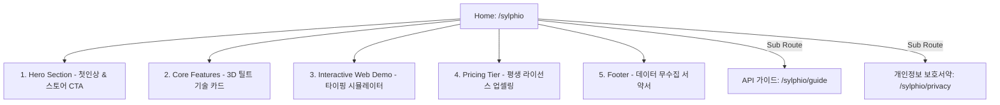

# 📐 Sylphio 웹 랜딩 기획 명세서

## 📝 Revision History

| Version | Date | Author | Description | Impact Area |
| :--- | :--- | :--- | :--- | :--- |
| v1.0 | 2026-06-02 | Maker | 실피오 통합 랜딩 페이지(Web Landing Plan) 표준 기획 최초 정의 | docs/sylphio/ |
| v1.1 | 2026-06-16 | Maker | 영어/한국어 무료 지원 및 타 다국어 Pro 라이선스 잠금 정책 반영 | docs/sylphio/ |

---

본 문서는 실시간 온디바이스 AI 통역 에이전트 **Sylphio(실피오)**를 글로벌 사용자들에게 소개하고, 기존 도메인 파워를 결합해 빠른 검색엔진 인덱싱과 다운로드 전환율(CTA) 및 Pro 라이선스 결제 전환을 극대화하기 위한 **통합 랜딩 페이지 기획 및 UI 디자인 명세서**입니다.

---

## 🎯 1. 웹사이트 개요 및 비즈니스 목표

1. **기존 도메인 시너지 (prisincera.com)**:
   - 이미 안정적인 트래픽과 도메인 파워를 가진 기존 웹사이트 `prisincera.com`의 하위 경로로 자연스럽게 편입하여 빠른 검색엔진(SEO) 색인 및 사용자 유입을 실현합니다.
2. **Mac App Store 다운로드 전환율 극대화**:
   - 투명 글래스모피즘 자막 바와 오로라 에너지 코어 등 매력적인 시각 자료(비디오/GIF)를 전면에 배치하여 1초 만에 앱의 독보적 가치를 각인시킵니다.
3. **평생 라이선스 (BYOK) 업셀링**:
   - 매월 나가는 AI 구독료 없이 개인 API Key를 등록하여 원가로 고성능 번역을 누리는 **BYOK (Bring Your Own Key)**의 평생 소장 소유 가치를 명확히 전달하여 결제 저항을 붕괴시킵니다.

---

## 🎨 2. 디자인 시스템 & 톤앤매너 (Tone & Manner)

클라이언트 앱의 프리미엄 디테일을 웹에 완벽히 계승하여, 방문자에게 **"세계 최고의 Mac 네이티브 프리미엄 앱"**이라는 인상을 직관적으로 제공합니다.

### ❖ Harmonic Color Palette ( harmonies of light and glass )
* **Primary Ambient (배경)**: Deep Navy Dark Core (`#060814` to `#0B0E26`) - 반투명 글래스모피즘 카드가 돋보이도록 하는 우주적 깊이감
* **Sylph Aurora Blue (주조색)**: HSL tailored Blue (`#1E80FF`, `rgb(30, 128, 255)`) - 에테르 정령의 푸른 광원
* **Lingo Mint / Active Neon (보조색)**: HSL Emerald (`#00F2FE` to `#4FACFE`) - 다국어 번역이 활성화된 스마트 상태를 은유
* **Glass Card (글래스 표면)**: White Opal (`rgba(255, 255, 255, 0.03)` with `backdrop-filter: blur(20px)`)

### ❖ Typography & Standard
* **Fonts**: Google Fonts `Outfit` (현대적이고 스타일리시한 헤드라인용) & `Inter` (탁월한 가독성을 제공하는 본문 및 설명용)
* **Visual FX**: 
  - 스크롤 이동에 따라 투명도와 함께 요소가 서서히 솟아오르는 **인터랙티브 페이드온(Scroll-Reveal)** 효과
  - 마우스 무브먼트의 좌표에 반응해 배경의 은은한 푸른빛 안개가 실시간으로 출렁이는 **CSS Gradient Fog** 탑재

---

## 🗺 3. 웹사이트 정보 구조 및 Sitemap (React Router 기반)

기존 React 기반의 싱글 페이지 라우팅 시스템에 단정하게 통합됩니다.



* **`/sylphio` (Main Landing Page)**: 메인 제품 랜딩 페이지. (소개, 5대 기능, 가상 데모, 가격 모델)
* **`/sylphio/guide` (API Key Tutorial)**: OpenAI 및 Google Gemini API Key를 발급받고 적용하는 3단계 시각 가이드 페이지. (`docs/sylphio/api_key_guide.md` 연계)
* **`/sylphio/privacy` (Privacy Policy)**: App Store 심사 완벽 통과 및 신뢰 획득을 위한 **"100% 로컬 데이터 무수집"** 서약 페이지.

---

## 📝 4. 랜딩 페이지 핵심 섹션별 세부 기획 (Section by Section)

### ❖ Section 1: Hero (시네마틱 첫인상 & 스토어 CTA)
* **헤드카피**: *"소리 없이 흐르는 지적인 통역 정령, Sylphio"*
* **시각 연출**: 
  - 화면 중앙에 실시간으로 회전하는 3D **오로라 에너지 코어(Energy Core)**를 렌더링하고, 마우스 호버 시 오로라 입자가 화려하게 흩어지는 비주얼 효과 적용.
  - 뒤이어 Zoom, 유튜브, 디스코드 화면 위에 Sylphio의 투명 글래스 자막바가 무결하게 동작하며 번역 자막을 뿌려주는 **고화질 루프 재생 비디오(Autoplay Loop Video)** 오버레이.
* **CTA (Call to Action)**:
  - 📥 **`[Mac App Store에서 무료 다운로드]`** (Apple 공식 배지 디자인 차용) - 메인 버튼
  - 💡 **`[API Key 발급 가이드 보기]`** - 보조 고스트 버튼

### ❖ Section 2: Features (가장 완벽한 기술 5대장 3D 카드)
마우스 호버 시 3D 자이로스코프 공간감을 주며 기우는 Tilt 카드를 사용하여 Sylphio의 5대 압도적 무기를 각인시킵니다.

1. **🎙 AirPods Max & Bluetooth 동적 락온**
   - 윈도우/맥을 넘나들며 음성 캡처 실패를 유발하던 에어팟 및 블루투스 마이크를 startup 단계에서 진짜 실명('광식의 AirPods Max')으로 동적 스캔하여 실시간 100% 매핑합니다.
2. **🛡 100% 로컬 온디바이스 STT 엔진**
   - 애플 클라우드 ASR 서버의 60초 통신 차단 제한 및 네트워크 장애 시 발생하는 침묵 장애(Silent Hang)를 완전 박멸했습니다. 기기 내부 로컬 신경망 엔진을 강제 가동하여 0ms 레이턴시 무제한 무중단 STT를 제공합니다.
3. **💻 시스템 & 마이크 듀얼 캡처**
   - 화상회의(Zoom, Teams), 유튜브, 시스템 사운드를 가로채는 ScreenCaptureKit 아키텍처와 실제 내장 마이크의 동시 수집 파이프라인을 자랑합니다.
4. **🧠 AI PRO 번역 및 Keychain 보안 저장소**
   - 유저가 발급한 API Key를 macOS Secure Keychain에 완벽히 암호화 보관하고, Gemini/GPT-4o-mini 엔진을 통한 다국어 정밀 통역을 실행합니다.
5. **📊 마크다운 회의록 & AI Executive Summary**
   - 대화 로그를 타임라인 테이블과 주요 Action Items 체크리스트가 결합된 최고급 마크다운 보고서로 즉시 요약 보존합니다.

### ❖ Section 3: Interactive Web Simulator (가상 데모)
* **인터랙션 기획**: 
  - 랜딩 페이지 내에 실제 실피오 클라이언트와 완전히 동일하게 구현된 **"가상 글래스모피즘 자막 바"**를 렌더링해 둡니다.
  - 사용자가 "영어", "일본어" 음성 오디오 샘플 재생 버튼을 누르면, 가상 자막 바 위에 실시간 타이핑 효과(Typing Animation)로 다국어 자막이 찍히며 한국어 번역 텍스트가 칼정렬선에 맞춰 스크롤링되는 기막힌 사전 조작 체험을 제공합니다.

### ❖ Section 4: Pricing (결제 저항 붕괴 및 평생 라이선스 요약)
* **무료 버전 (Free)**: 
  - 평생 무료 다운로드. 영어(English) 및 한국어(Korean)에 대한 100% 로컬 온디바이스 STT 및 실시간 번역 자막 무제한 제공. (무료 지원 언어 외 타 다국어 번역 및 세션 종료 후 AI 요약본 생성 미지원)
* **Pro 평생 라이선스 (BYOK - $9.99)**: 
  - *"커피 두 잔 값으로 매월 나가는 AI 구독료를 평생 끊어보세요."* 
  - 단 1회 결제 시 영구 평생 소장 라이선스 제공. 12개 다국어(일본어, 중국어 등) 번역 기능 잠금 전면 해제, 개인 API Key 연동 잠금 해제, 그리고 AI 실시간 회의록 자동 요약 및 Markdown 파일 생성 기능 완벽 지원.

---

## 🛠 5. 검색엔진 최적화 (SEO Best Practices) & 마케팅 규정

개발 시 웹 표준 검색엔진 로봇이 Sylphio를 맥 최고의 동시통역 앱 키워드로 인식하도록 다음과 같은 메타 태그 및 시맨틱 마크업 가이드라인을 강제합니다.

### ❖ SEO 메타 태그 명세
```html
<title>Sylphio (실피오) - macOS용 실시간 온디바이스 AI 동시통역 정령 에이전트</title>
<meta name="description" content="맥OS 완벽 호환, 에어팟 실명 락온, 100% 로컬 온디바이스 STT 무제한 발화, Gemini 및 GPT AI 동시통역과 마크다운 회의록 자동 요약본을 제공하는 프리미엄 번역 비서 Sylphio를 다운로드하세요.">
<meta name="keywords" content="실피오, Sylphio, 맥북 번역, macOS 동시통역, 실시간 자막, 에어팟 마이크 번역, 온디바이스 STT, AI 회의록 요약, Gemini 번역, OpenAI gpt 번역">
<meta property="og:title" content="Sylphio - macOS Real-time AI Translation Assistant">
<meta property="og:image" content="https://sylphio.prisincera.com/assets/og_aurora_core.png">
```

### ❖ 시맨틱 마크업 및 마케팅 트래킹 규칙
- 단 하나의 `<h1>` 타이틀을 Hero 영역에 배치하고, 각 섹션의 헤더는 `<section>` 태그 내의 `<h2>` 구조로 격리하여 스크롤 접근성을 극대화합니다.
- 웹사이트 내 다운로드 및 상세 가이드 등 모든 상호작용 요소에 테스트용 고유 식별 ID(`id="btn-download-mac"`, `id="link-apikey-guide"`)를 100% 강제 적용하여 마케팅 트래킹 및 전환율 분석을 무결하게 수행합니다.
