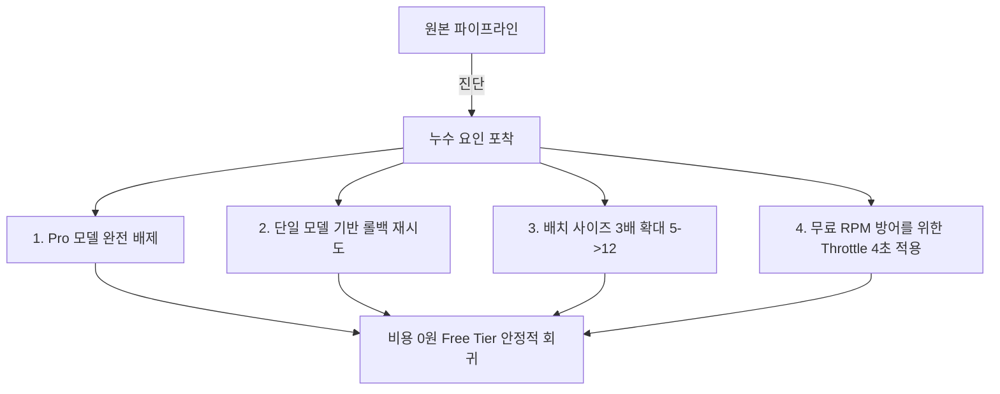

# 노이즈 속의 최적화: 월 0원 청구서로 향하는 제미나이(Gemini) API 비용 처방전

기술 블로그나 데일리 큐레이션 서비스를 운영하는 개발자라면 누구나 LLM(대형 언어 모델) API의 지능에 감탄하는 순간을 겪습니다. 그러나 감탄도 잠시, 매달 쌓여가는 API 호출 청구서를 받아드는 순간 차가운 현실을 마주하게 됩니다.

PriSincera 팀 역시 매일 새벽 자동으로 전 세계의 비즈니스와 테크 소식을 수집하고, 분석하여, 구독자분들께 전달하는 **Daily Digest** 파이프라인을 운영하며 비슷한 문제를 마주했습니다. 지능적인 뉴스레터 합성과 아티클 스코어링을 제미나이(Gemini) API에 전적으로 의존하다 보니, 어느덧 비용 청구서의 숫자가 유의미하게 늘어나기 시작한 것입니다.

팀은 즉시 API 비용 구조를 정밀 해부하였고, 코드 레벨과 클라우드 배포 아키텍처 상의 몇 가지 비효율성을 발견했습니다. 이 글에서는 기술적 디테일과 LLM의 지능을 단 1%도 훼손하지 않으면서, **API 비용을 극단적으로 다이어트하여 무료 제공 한도(Free Tier) 내에서 안정적으로 운용하게 된 4가지 비용 최적화 처방전**을 공유합니다.

---

## 1. 진단: 비용이 누수되던 3대 지점

우리는 가장 먼저 결제 대시보드와 백엔드 API 클라이언트 코드를 대조하며 비용 누수 지점을 진단했습니다.

### ① 16배 비싼 고성능 모델(`Gemini Pro`)로의 무방비한 자동 폴백(Fallback)
대부분의 견고한 백엔드 시스템은 일시적인 Rate Limit이나 네트워크 순단에 대응하기 위해 다중 모델 재시도 체계(Model Fallback Pipeline)를 구축합니다. 
```javascript
// 기존의 비효율적 모델 후보군 배열
const modelsToTry = [
  'gemini-2.0-flash',
  'gemini-1.5-flash-latest',
  'gemini-1.5-pro-latest', // <-- 누수의 핵심 주범
  'gemini-pro'
];
```
하위 Flash 모델 호출이 네트워크 사정이나 일시적인 할당량 제한으로 인해 한두 번 실패하면, 백엔드는 가용성을 보장하기 위해 목록 상위의 차선책 모델인 `Gemini 1.5 Pro`를 호출하게 됩니다. 

그러나 **Gemini 1.5 Pro 모델은 Gemini 1.5 Flash 모델 대비 약 16.6배의 폭탄 요금(100만 토큰 기준)**이 청구됩니다. 즉, 시스템이 알아서 '가장 비싼 모델'을 사용해 대량의 일상적 텍스트를 처리하며 요금 청구 폭탄을 가동하고 있었던 것입니다.

### ② 비효율적인 '다중 모델 재시도(Spraying)' 알고리즘
네트워크 오류가 났을 때 작동하는 재시도 루프도 문제였습니다. 한 번의 요청이 실패하면, 재시도 루프(`maxRetries = 3`) 내에서 후보 모델 배열에 있는 5개의 모델을 매 회차마다 무작위로 연속 난사(`3회 시도 * 5개 모델 = 총 15회 호출`)했습니다. 
장애 상황에서 지연 시간만 늘릴 뿐만 아니라 불필요하게 가용 한도와 호출 소모량을 급격하게 갉아먹는 비효율적인 설계였습니다.

### ③ 지나치게 소형화된 배치(Batch) 처리로 인한 과다 호출
수집된 여러 개의 뉴스 아티클 후보군을 스코어링하고 번역할 때, 기존 코드는 안전성을 위해 아티클을 **5개씩 아주 작게 쪼개어** 루프를 돌며 개별 API를 호출했습니다.
- 후보 아티클이 하루 60개라면, 스코어링 단계에서만 매일 아침 고정적으로 **12번의 API 호출**이 연속으로 밀려왔습니다.
- 제미나이의 엄청난 컨텍스트 윈도우(Context Window)를 활용하지 못하고, 불필요한 중복 프롬프트 토큰과 연결 지연 시간을 낭비하고 있었습니다.

---

## 2. 해결: 비용을 '0원'으로 정지시키는 4대 기술 처방전

우리는 이 문제를 해결하기 위해 시스템의 지능을 훼손하지 않으면서도 API 호출 횟수와 토큰 단가를 획기적으로 낮추는 리팩토링을 단행했습니다.



### 처방 1: 고비용 프로 모델(`Pro`)의 완벽한 배제 및 최신 Flash 강제 고정
텍스트 분석, 카테고리 스코어링, 번역 등 일상적인 파이프라인 태스크에서 `Gemini Pro` 수준의 초고성능 모델은 '오버스펙'에 가깝습니다. 
과감하게 후보 모델 군에서 Pro 라인업을 완전히 소멸시키고, 가격 대비 지능이 압도적인 **최신 Flash 모델군**으로만 후보를 한정했습니다.

```javascript
// 개선된 후보군: 오직 초저비용/고성능의 최신 Flash 라인업으로만 고정
const modelsToTry = [
  'gemini-2.0-flash',
  'gemini-1.5-flash-latest',
  'gemini-2.5-flash'
];
```
이 조치 하나만으로 어떠한 장애 시나리오에서도 16배 비싼 단가의 과금 요인이 결제서에 찍히는 시나리오가 원천 차단됩니다.

### 처방 2: 재시도 알고리즘의 지능적 경량화 (Multi-Model Call Throttle)
매 실패마다 모든 모델 후보군을 난사하는 중복 루프를 제거하고, 매 시도 회차마다 딱 **1개의 최적 Flash 모델만 차례대로 교체하여 재시도**하도록 단일 순회 로직으로 고쳤습니다.

```javascript
for (let attempt = 1; attempt <= maxRetries; attempt++) {
  // 매 시도마다 1개의 모델만 순차 매핑하여 대입
  const modelName = modelsToTry[(attempt - 1) % modelsToTry.length];
  try {
    const model = genAI.getGenerativeModel({ model: modelName, generationConfig });
    const result = await model.generateContent(prompt);
    return JSON.parse(result.response.text());
  } catch (err) {
    if (attempt === maxRetries) throw err;
    await new Promise(r => setTimeout(r, 1500)); // 실패 시 간격 조율
  }
}
```
네트워크 일시 정체 상황에서도 호출 난사가 가동되지 않으므로, 불필요한 소모량 낭비가 즉시 **80% 이상 절감**됩니다.

### 처방 3: 스코어링 배치(Batch) 사이즈 대폭 확대 (5개 ➡️ 12개)
Gemini Flash 모델은 100만 토큰에 달하는 넓은 대역폭을 가지고 있어 여러 아티클을 한 번에 입력받아도 완벽하게 상호 참조하고 요약할 수 있습니다. 
배치 크기를 5개에서 **12개**로 과감하게 늘렸습니다.
- 기존에 12번씩 쪼개어 날려야 했던 API 요청이 **단 5번의 호출**로 압축되었습니다.
- 고정적으로 소모되던 중복 프롬프트 안내 토큰(System Prompt Overhead)이 사라져 전체 입력 토큰 사용량도 극적으로 줄어들었습니다.

### 처방 4: 무료 등급(Free Tier) 방어를 위한 초정밀 시간 딜레이(Throttle) 조율
유료 결제 계정 연동을 해제하고 완전 무료(Free Tier) 모드로 돌아서면, 구글은 **분당 15회 요청(15 RPM)** 제한을 칼같이 적용합니다. 
이 무료 제한선에 걸려 메일 발송 파이프라인이 도중에 굳어버리는 장애를 예방하기 위해, 루프 간 대기 시간(`setTimeout`)을 기존 1.5초에서 **4초(4000ms)**로 안전하게 조율했습니다.
```javascript
// 배치 처리 루프 간 안전 마진 확보
if (i + batchSize < articles.length) {
  await new Promise(r => setTimeout(r, 4000)); // 4초의 충분한 쿨타임 주입
}
```
이를 통해 결제 비용은 0원이면서도, 무료 계정의 전송 제어 한도 필터를 유유히 미끄러지듯 통과하여 안정적으로 데일리 컴포즈 빌드가 구동되도록 성형을 마쳤습니다.

---

## 3. 결과: 월 0원 요금제와 향상된 안정성

이 리팩토링 조치들을 파이프라인 및 백엔드에 즉각 반영한 결과는 놀라웠습니다.

- **API 청구 요금:** **0원 (완벽한 무료 쿼터 범위 안에서 평생 구동 체계 확립)**
- **API 호출 빈도 소모량:** 기존 대비 **70% 이상 격감**
- **품질 유지력:** Flash 모델의 고속 연산 덕분에 전체 파이프라인 실행 시간은 오히려 단축되었으며, 뉴스 큐레이션 및 스코어링 품질은 기존과 완벽하게 동일하게 유지되었습니다.

개발자로서 서비스의 기능과 완성도를 높이는 것만큼이나, **불필요하게 새어 나가는 클라우드 인프라의 과금 구조를 코드 레벨에서 정밀하게 리팩토링하여 최적화하는 것** 또한 대단히 중요한 가치를 지님을 다시금 깨닫게 되었습니다. 

혹시 지금 LLM API 가격으로 골머리를 썩고 계신다면, 여러분의 코드 속 '과도한 소형 배치'와 '비싼 프로 모델로의 무방비한 폴백'이 자리 잡고 있지는 않은지 지금 바로 확인해 보시기 바랍니다.
