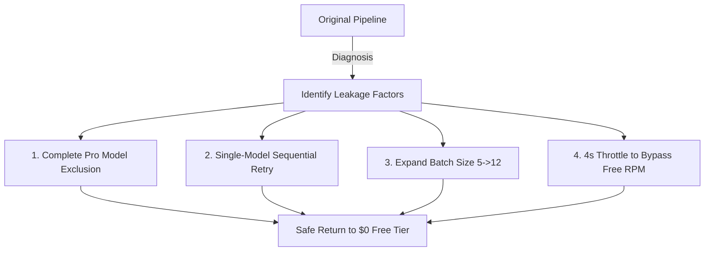

# Optimization in Noise: Gemini API Cost Prescription Towards $0 Bill

Anyone who runs a tech blog or daily curation service will eventually marvel at the intelligence of Large Language Model (LLM) APIs. But that awe is short-lived; the moment you receive the monthly API billing statement, you face a cold, hard reality.

The PriSincera team also encountered a similar issue with our **Daily Digest** pipeline, which automatically collects, analyzes, and delivers global tech and business news to our subscribers every morning. Because we relied heavily on the Gemini API for intelligent newsletter synthesis and article scoring, our API billing statement began to rise significantly.

The team immediately performed a precision audit of our API cost structure and discovered several inefficiencies at both the code level and the cloud deployment architecture. In this article, we share **four cost optimization prescriptions that drastically reduced our API expenses to operate safely within the Free Tier**, without compromising technical details or the model's intelligence by even 1%.

---

## 1. Diagnosis: Three Areas of Cost Leakage

We first diagnosed our cost leakage points by matching our billing dashboard with our backend API client code.

### ① Defenseless Automatic Fallback to 16x More Expensive Model (`Gemini Pro`)
Most robust backend systems construct a multi-model fallback pipeline to respond to temporary rate limits or network hiccups.
```javascript
// Previous Inefficient Model Candidates Array
const modelsToTry = [
  'gemini-2.0-flash',
  'gemini-1.5-flash-latest',
  'gemini-1.5-pro-latest', // <-- The main culprit of leakage
  'gemini-pro'
];
```
If a lower-tier Flash model call fails once or twice due to network congestion or temporary quota limits, the backend automatically calls `Gemini 1.5 Pro`, the next candidate, to guarantee availability.

However, the **Gemini 1.5 Pro model is billed at a whopping 16.6x higher unit price than Gemini 1.5 Flash (per 1 million tokens)**. In other words, our system was automatically triggering the most expensive model to process large volumes of routine text, kicking off the billing bomb.

### ② Inefficient 'Multi-Model Spraying' Retry Algorithm
The retry loop triggered during network errors was also problematic. When a single request failed, it indiscriminately sprayed all five candidate models in the list on every retry round (`maxRetries = 3` * 5 models = 15 total calls).
This was an inefficient design that not only prolonged latency during outages but also rapidly consumed our available quota and call capacity.

### ③ Excessive API Calls Due to Small Batch Sizes
When scoring and translating collected news articles, the previous code split them into **tiny batches of 5** and processed them in a loop to call individual APIs.
- If we had 60 candidate articles a day, 12 consecutive API calls occurred every morning in the scoring stage alone.
- This failed to leverage Gemini's massive Context Window, wasting redundant prompt tokens and connection latency.

---

## 2. Solution: Four Tech Prescriptions to Freeze Costs to $0

To resolve these issues, we executed a refactoring that drastically lowered the number of API calls and token unit prices without sacrificing the system's intelligence.



### Prescription 1: Complete Pro Model Exclusion and Flash Enforcement
For routine pipeline tasks like text classification, article summarization, and multilingual translation, ultra-high-performance models like `Gemini Pro` are closer to 'overkill.'
We boldly removed the Pro lineup from our candidates and restricted them exclusively to **the latest high-efficiency Flash model family**.

```javascript
// Optimized Candidates: Fixed strictly to the latest ultra-low-cost, high-performance Flash lineup
const modelsToTry = [
  'gemini-2.0-flash',
  'gemini-1.5-flash-latest',
  'gemini-2.5-flash'
];
```
This single measure completely blocks any scenario where Pro model rates are charged under any outage conditions.

### Prescription 2: Streamlining Retry Logic (Multi-Model Call Throttle)
We removed the redundant loops that sprayed all candidate models upon every failure. Instead, we refined it to a single sequential iteration that **tries exactly one optimized Flash model per retry round, swapping them sequentially**.

```javascript
for (let attempt = 1; attempt <= maxRetries; attempt++) {
  // Map and assign exactly one model per attempt sequentially
  const modelName = modelsToTry[(attempt - 1) % modelsToTry.length];
  try {
    const model = genAI.getGenerativeModel({ model: modelName, generationConfig });
    const result = await model.generateContent(prompt);
    return JSON.parse(result.response.text());
  } catch (err) {
    if (attempt === maxRetries) throw err;
    await new Promise(r => setTimeout(r, 1500)); // Delay between attempts
  }
}
```
Since call spraying is not triggered during temporary network issues, unnecessary call consumption is immediately **reduced by over 80%**.

### Prescription 3: Expanding Batch Size (5 ➡️ 12)
The Gemini Flash model possesses a massive bandwidth of up to 1 million tokens, making it capable of cross-referencing and summarizing multiple articles simultaneously.
We boldly expanded the batch size from 5 to **12**.
- API requests that previously had to be split into 12 separate calls are now compressed into **just 5 calls**.
- By eliminating redundant system prompt overhead, overall input token consumption also dropped dramatically.

### Prescription 4: Precision 4-Second Throttle to Bypass Free RPM
When you disable billing integration and return to a completely free (Free Tier) mode, Google strictly enforces a **15 Requests Per Minute (15 RPM)** limit.
To prevent the email dispatch pipeline from freezing due to rate limit errors, we adjusted the batch loop wait time (`setTimeout`) from 1.5 seconds to a safe **4 seconds (4000ms)**.
```javascript
// Ensure safe margin between batch processes
if (i + batchSize < articles.length) {
  await new Promise(r => setTimeout(r, 4000)); // 4-second cooltime
}
```
Through this, while keeping billing costs at zero, the pipeline smoothly glides through the free quota restrictions to process the daily compose build stably.

---

## 3. Results: $0 Bill and Enhanced Stability

The results of immediately applying these refactoring measures to the pipeline and backend were remarkable.

- **API Billing Expenses:** **$0 (Stably operating within the free quota permanently)**
- **API Call Frequency Consumption:** Slashed by **over 70%**
- **Quality Preservation:** Thanks to the high-speed processing of the Flash model, the overall pipeline execution time actually decreased, while news curation and scoring quality remained perfectly identical.

As developers, we realized once again that along with enhancing service features, **refactoring and optimizing cloud infrastructure spending at the code level** holds immense value.

If you are currently struggling with LLM API pricing, check your code immediately to see if 'excessive small batches' and 'defenseless fallback to expensive Pro models' are lurking inside.
