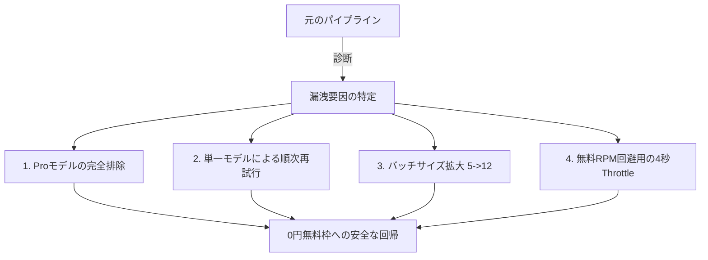

# ノイズの中の最適化：月0円請求書に向かうGemini APIコスト処方箋

技術ブログやデイリーキュレーションサービスを運営する開発者なら誰でも、大規模言語モデル（LLM）APIのインテリジェンスに感嘆する瞬間を経験するでしょう。しかし、その感嘆も束の間、毎月届くAPI呼び出し請求書の数字を目にした瞬間、冷酷な現実に直面することになります。

PriSinceraチームも同様に、毎朝自動で全世界のビジネスとテックニュースを収集・分析し、購読者の皆様にお届けする**Daily Digest**パイプラインを運営する中で、これと似た問題に直面しました。インテリジェントなニュースレター合成と記事のスコアリングをGemini APIに全面的に依存していたため、いつの間にかAPI請求書の金額が無視できないほどに膨れ上がっていたのです。

チームは直ちにAPIコスト構造の精密な分析を行い、コードレベルおよびクラウドデプロイアーキテクチャ上でいくつかの非効率な部分を発見しました。この記事では、技術的なディテールやモデルの知性を1%も損なうことなく、**APIコストを劇的に削減し、無料枠（Free Tier）の範囲内で安定して運用できるようになった4つのコスト最適化処方箋**を共有します。

---

## 1. 診断：コストが漏洩していた3つの要因

私たちはまず、課金ダッシュボードとバックエンドのAPIクライアントコードを突き合わせ、コスト漏洩のポイントを診断しました。

### ① 16倍高価な高性能モデル（`Gemini Pro`）への無防備な自動フォールバック（Fallback）
堅牢なバックエンドシステムの多くは、一時的なRate Limitやネットワーク瞬断に対応するため、複数モデルによるフォールバックパイプライン（Model Fallback Pipeline）を構築しています。
```javascript
// 従来の非効率な候補モデル配列
const modelsToTry = [
  'gemini-2.0-flash',
  'gemini-1.5-flash-latest',
  'gemini-1.5-pro-latest', // <-- コスト漏洩の元凶
  'gemini-pro'
];
```
下位のFlashモデルがネットワーク混雑や一時的なクォータ制限で1、2回失敗すると、バックエンドは可用性を保証するため、自動的に次の候補モデルである`Gemini 1.5 Pro`を呼び出します。

しかし、**Gemini 1.5 Proモデルは、Gemini 1.5 Flashモデルと比較して約16.6倍という爆発的な単価（100万トークン換算）**が設定されています。つまり、システムが良かれと思って「最も高価なモデル」を使用して大量のテキストを処理し、課金爆弾に火をつけていたのです。

### ② 非効率な「複数モデルへの同時再試行（Spraying）」アルゴリズム
ネットワークエラー時にトリガーされる再試行ループも問題でした。単一のリクエストが失敗すると、再試行ループ（`maxRetries = 3`）の中で、配列内の5つのモデルすべてを再試行ごとに無差別に連続乱射していました（`3回試行 * 5モデル = 計15回呼び出し`）。
これは、障害発生時のレイテンシを長引かせるだけでなく、使用可能なクォータと呼び出し容量を急速に食いつぶす非効率な設計でした。

### ③ 極小のバッチサイズによる過剰なAPI呼び出し
収集したニュース記事のスコアリングと翻訳を行う際、従来のコードは安全性のために記事を**5件ずつの極小バッチ**に分割し、ループで個別のAPIを呼び出していました。
- 1日に60件の候補記事がある場合、スコアリング段階だけで毎朝12回連続でAPI呼び出しが発生していました。
- これはGeminiの強大である「100万トークン」のContext Windowを活かせず、重複するプロンプトトークンと接続遅延を無駄にしていました。

---

## 2. 解決：コストを「0円」に抑え込む4つの技術処方箋

これらの問題を解決するため、私たちはシステムの知性を一切損なうことなく、API呼び出し回数とトークン単価を劇的に削減するリファクタリングを断行しました。



### 処方箋 1：高価格なProモデルの完全排除と最新Flashへの強制固定
テキスト分類、記事要約、多言語翻訳などの日常的なパイプラインタスクにおいて、`Gemini Pro`レベルの超高性能モデルは「オーバーキル」に近いものです。
私たちは候補モデル群からProラインアップを完全に排除し、価格対性能比が圧倒的な**最新のFlashモデル群**のみに候補を限定しました。

```javascript
// 最適化された候補：超低コスト・高性能の最新Flashラインアップのみに厳密に固定
const modelsToTry = [
  'gemini-2.0-flash',
  'gemini-1.5-flash-latest',
  'gemini-2.5-flash'
];
```
この単一の措置により、いかなる障害条件下でもProモデルの料金が請求されるシナリオが根本的に遮断されます。

### 処方箋 2：再試行ロジックのスマートな軽量化（Multi-Model Call Throttle）
失敗するたびにすべての候補モデルを乱射する冗長なループを削除しました。代わりに、**再試行ラウンドごとに最適化されたFlashモデルを1つだけ試行し、それらを順次入れ替える**単一の順次反復にリファインしました。

```javascript
for (let attempt = 1; attempt <= maxRetries; attempt++) {
  // 再試行ごとに1つのモデルのみを順次マッピングして代入
  const modelName = modelsToTry[(attempt - 1) % modelsToTry.length];
  try {
    const model = genAI.getGenerativeModel({ model: modelName, generationConfig });
    const result = await model.generateContent(prompt);
    return JSON.parse(result.response.text());
  } catch (err) {
    if (attempt === maxRetries) throw err;
    await new Promise(r => setTimeout(r, 1500)); // 試行間の遅延
  }
}
```
一時的なネットワークの問題が発生しても呼び出し乱射がトリガーされないため、無駄な呼び出し消費は直ちに**80%以上削減**されます。

### 処方箋 3：バッチサイズの拡大（5 ➡️ 12）
Gemini Flashモデルは最大100万トークンの巨大な帯域幅を持っており、複数の記事を同時にクロスリファレンスして要約する能力を備えています。
私たちはバッチサイズを5から**12**に大胆に拡大しました。
- 以前は12回の別々の呼び出しに分割しなければならなかったAPIリクエストが、現在は**わずか5回の呼び出し**に圧縮されました。
- 重複するシステムプロンプトのオーバーヘッドを排除したことで、全体の入力トークン消費量も劇的に減少しました。

### 処方箋 4：無料RPM制限を回避するための高精度4秒Throttle
課金連携を無効にして完全に無料（Free Tier）モードに戻ると、Googleは**1分あたり15リクエスト（15 RPM）**の制限を厳密に適用します。
レート制限エラーによるメール配信パイプラインのフリーズを防ぐため、バッチループの待機時間（`setTimeout`）を1.5秒から安全な**4秒（4000ms）**に調整しました。
```javascript
// バッチ処理間の安全なマージンを確保
if (i + batchSize < articles.length) {
  await new Promise(r => setTimeout(r, 4000)); // 4秒のクールタイム
}
```
これにより、課金コストをゼロに抑えながら、パイプラインは無料枠の制限をスムーズにすり抜けて、日次のコンポーズビルドを安定して処理します。

---

## 3. 結果：月0円の請求書と向上した安定性

パイプラインとバックエンドにこれらのリファクタリング措置を直ちに適用した結果は驚くべきものでした。

- **API課金費用:** **0円（無料クォータの範囲内で永久に安定稼働）**
- **API呼び出し頻度消費:** **70%以上削減**
- **品質の維持:** Flashモデルの高速処理のおかげで、パイプライン全体の実行時間はむしろ短縮され、ニュースキュレーションとスコアリングの品質は完全に同一に保たれました。

開発者として、機能の向上と並んで、**コードレベルでのクラウドインフラ支出のリファクタリングと最適化**が極めて重要な価値を持つことを再認識しました。

現在LLM APIの価格設定に苦労している方は、今すぐコードをチェックして、「過剰な小分けバッチ」と「高価なProモデルへの無防備なフォールバック」が潜んでいないか確認してみてください。
